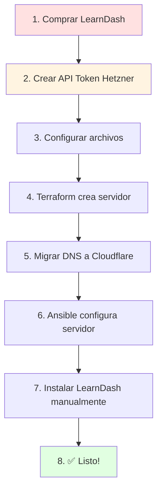

# Guía Rápida de Deployment - Versión Simple

**Para personas neurodivergentes:** Esta guía usa pasos numerados claros, sin información extra.

## ✅ ¿Qué necesito PAGAR?

### OBLIGATORIO (para empezar)
1. **LearnDash:** $199 USD → Comprar en https://learndash.com/pricing/
2. **Hetzner Cloud:** €5.39/mes → Se cobra automáticamente cuando creas el servidor

**TOTAL MÍNIMO: ~$210 USD para empezar**

### OPCIONAL pero RECOMENDADO
3. **Transferir dominio a Cloudflare:** €9-10 (incluye +1 año renovación)
   - **AHORRO REAL:** GoDaddy cobra €21.99/año vs Cloudflare €9/año
   - **Ahorro anual: ~€13/año**
   - Todo en un proveedor
   - Puedes hacerlo ahora o después

**TOTAL RECOMENDADO: ~$220 USD si transfieres dominio**

### NO necesitas pagar
- ❌ Cloudflare DNS/CDN/SSL (gratis)
- ❌ SSL/Certificados (gratis)
- ❌ WordPress Core (gratis)

---

## 📝 Pasos del Deployment (En Orden)



---

## 1️⃣ ANTES de empezar

### Comprar LearnDash
1. Ir a https://learndash.com/pricing/
2. Comprar licencia ($199 USD)
3. Descargar el archivo `.zip`
4. **GUARDAR** el archivo y la license key

### Obtener API Token de Hetzner
1. Ir a https://console.hetzner.cloud
2. Crear cuenta (tarjeta de crédito requerida)
3. Crear proyecto "wordpress-production"
4. Ir a: Security → API Tokens
5. Click "Generate API Token"
6. **COPIAR** el token (solo se muestra una vez)

---

## 2️⃣ Configurar archivos (tu máquina local)

### Paso 1: Crear archivo `.env`

```bash
# En la carpeta del proyecto
nano .env
```

**Copiar esto y cambiar TUS valores:**

```bash
export HCLOUD_TOKEN="pega-aqui-tu-token-de-hetzner"
export TF_VAR_hcloud_token="${HCLOUD_TOKEN}"
export TF_VAR_ssh_public_key="$(cat ~/.ssh/id_ed25519.pub)"
export TF_VAR_admin_username="malpanez"
export TF_VAR_ssh_allowed_ips='["TU.IP.AQUI/32"]'
```

**Para saber tu IP:**
```bash
curl -4 ifconfig.me
# Resultado ejemplo: 203.0.113.42
# Usar como: ["203.0.113.42/32"]
```

### Paso 2: Crear passwords fuertes

```bash
# Generar 3 passwords diferentes
openssl rand -base64 32
openssl rand -base64 32
openssl rand -base64 32
```

### Paso 3: Editar secrets

```bash
nano ansible/inventory/group_vars/all/secrets.yml
```

**Pegar los 3 passwords generados:**

```yaml
---
vault_grafana_admin_password: "password-1-aqui"
vault_mariadb_root_password: "password-2-aqui"
vault_wordpress_db_password: "password-3-aqui"
```

### Paso 4: Cifrar secrets

```bash
ansible-vault encrypt ansible/inventory/group_vars/all/secrets.yml
# Te pedirá una contraseña → GUARDARLA en lugar seguro
```

### Paso 5: Configurar Terraform

```bash
nano terraform/environments/production/terraform.tfvars
```

**Cambiar estos valores:**

```hcl
server_name     = "wordpress-prod"
admin_username  = "malpanez"
ssh_allowed_ips = ["TU.IP.AQUI/32"]  # Usar tu IP real
allow_http      = true
allow_https     = true
volume_size     = 0  # 0 = sin disco extra (ahorra €2.40/mes)
```

---

## 3️⃣ Crear servidor con Terraform

```bash
# Cargar variables
source .env

# Ir a carpeta terraform
cd terraform/environments/production

# Inicializar
terraform init

# Ver qué se va a crear
terraform plan

# Crear servidor (SE COBRARÁ €5.39)
terraform apply
# Escribir: yes

# GUARDAR la IP del servidor
terraform output server_ip
# Ejemplo: 203.0.113.42
```

**⏱️ Tiempo: 2-3 minutos**

---

## 4️⃣ Configurar DNS en Cloudflare

**Tienes 2 opciones: Solo DNS o Migración completa del dominio**

### OPCIÓN A: Transferir Dominio a Cloudflare (RECOMENDADO ✅)

**Migrar el dominio completo de GoDaddy → Cloudflare**

**¿Por qué transferir y no solo DNS?**
- ✅ Renovación más barata (Cloudflare cobra al costo, sin markup)
- ✅ Todo en un proveedor (dominio + DNS + CDN + SSL)
- ✅ Si haces upgrade a Cloudflare Pro, todo está integrado
- ✅ API unificada (Terraform gestiona todo)
- ✅ Menos puntos de fallo
- ⏱️ Tarda más: 5-7 días (vs 2-6 horas solo nameservers)

**Paso 1: Preparar dominio en GoDaddy**

1. Ir a https://account.godaddy.com
2. My Products → Domains → tu dominio
3. Click "Manage"
4. **Desbloquear dominio:**
   - Settings → Domain Lock → OFF
5. **Obtener código de autorización:**
   - Settings → Transfer Domain → Get Authorization Code
   - **COPIAR** el código (lo necesitarás en Cloudflare)

**Paso 2: Iniciar transferencia en Cloudflare**

1. Ir a https://dash.cloudflare.com
2. Click "Domain Registration" → "Transfer Domains"
3. Introducir tu dominio
4. Introducir el Authorization Code de GoDaddy
5. **Pagar transferencia:** ~€9-10
   - ⚠️ NO es un fee de transferencia
   - Es el pago por +1 año de renovación
   - Se AÑADE a tu tiempo restante en GoDaddy
   - Ejemplo: Si expira en Jun 2025 → nueva expiración Jun 2026
6. Confirmar pago
7. Aprobar email de confirmación que llega a tu email registrado

**⏱️ Esperar: 5-7 días para transferencia completa**

**💰 Costo total de transferencia:**
- Pago único: ~€9-10 (renovación por 1 año)
- No hay fees ocultos
- **Renovaciones futuras: €9/año en Cloudflare vs €21.99/año en GoDaddy**
- **AHORRO: ~€13/año**

**Paso 3: Mientras tanto, configurar DNS temporalmente**

Mientras se completa la transferencia (5-7 días), puedes:
- Cambiar nameservers a Cloudflare (2-6 horas) para empezar a usar DNS
- O esperar a que termine la transferencia

**Paso 4: Obtener API Token de Cloudflare (CRÍTICO)**

⚠️ **IMPORTANTE:** NO uses la "Global API Key", necesitas crear un "API Token" específico.

**Pasos EXACTOS:**

1. Ir a https://dash.cloudflare.com/profile/api-tokens
2. Click botón azul **"Create Token"**
3. Buscar template **"Edit zone DNS"** → Click "Use template"
4. En **"Zone Resources":**
   - Cambiar de "All zones" a:
   - **Include** → **Specific zone** → Seleccionar **tu dominio** del dropdown
5. En **"Account Resources":**
   - Dejar como está (opcional)
6. **TTL:** Dejar en "Forever" (o poner fecha futura)
7. Click **"Continue to summary"**
8. Click **"Create Token"**
9. **COPIAR el token AHORA** (solo se muestra UNA vez)
   - Empieza con algo como: `cloudflare_token_XXXXXXXXXXXXX`
10. **GUARDAR** el token en lugar seguro

**✅ Verificar que el token funciona:**

```bash
# Test del token (opcional pero recomendado)
curl -X GET "https://api.cloudflare.com/client/v4/user/tokens/verify" \
  -H "Authorization: Bearer TU_TOKEN_AQUI" \
  -H "Content-Type:application/json"

# Debe retornar: "status":"active"
```

**Paso 5: Configurar Terraform**

```bash
# Añadir a .env
echo 'export CLOUDFLARE_API_TOKEN="tu-token-aqui"' >> .env
echo 'export TF_VAR_cloudflare_api_token="${CLOUDFLARE_API_TOKEN}"' >> .env
source .env

# Editar terraform.tfvars
nano terraform/environments/production/terraform.tfvars
```

**Añadir estas líneas:**
```hcl
domain              = "tudominio.com"
enable_cloudflare   = true
```

**Paso 6: Terraform crea DNS automáticamente**

```bash
terraform apply
# Terraform creará:
# - Registro A: @ (root)
# - Registro A: www
# - Reglas WAF para WordPress
# - Configuración SSL/TLS
# - Rate limiting en login
```

**✅ Listo! Dominio transferido y DNS configurado automáticamente**

---

### OPCIÓN B: Solo Cambiar Nameservers (Más rápido pero menos recomendado)

**El dominio queda en GoDaddy, solo DNS en Cloudflare**

**Paso 1: Añadir sitio en Cloudflare**

1. Ir a https://dash.cloudflare.com
2. Click "Add a Site"
3. Escribir tu dominio
4. Elegir plan **Free**
5. Cloudflare te da 2 nameservers

**Paso 2: En GoDaddy cambiar nameservers**

1. Ir a https://account.godaddy.com
2. My Products → Domains → tu dominio
3. Manage DNS → Nameservers → Custom
4. Pegar los 2 nameservers de Cloudflare
5. Guardar

**⏱️ Esperar: 2-6 horas**

**Paso 3: Configurar Terraform (mismo proceso que Opción A)**

(Ver pasos 4-6 de Opción A arriba)

---

### OPCIÓN C: DNS Manual (Sin Terraform, sin transferencia)

**En Cloudflare → DNS → Records:**

Crear **3 registros A**:

| Tipo | Nombre | IP | Proxy |
|------|--------|-----|-------|
| A | @ | TU.IP.DEL.SERVIDOR | ✅ ON |
| A | www | TU.IP.DEL.SERVIDOR | ✅ ON |
| A | monitoring | TU.IP.DEL.SERVIDOR | ❌ OFF |

**En Cloudflare → SSL/TLS:**
- Overview: **Full (strict)**
- Always Use HTTPS: **On**

---

**✅ Verificar DNS (ambas opciones):**
```bash
dig tudominio.com +short
# Debe mostrar una IP
```

---

## 5️⃣ Configurar servidor con Ansible

### Opción A: Inventario Dinámico (automático)

```bash
cd ansible

# Crear variables de WordPress
mkdir -p inventory/group_vars/env_production
nano inventory/group_vars/env_production/wordpress.yml
```

**Contenido:**
```yaml
---
wordpress_domain: "tudominio.com"
wordpress_title: "Mi Plataforma LMS"
wordpress_admin_email: "admin@tudominio.com"
wordpress_db_name: "wordpress_prod"
wordpress_db_user: "wordpress"
grafana_domain: "monitoring.tudominio.com"
ansible_user: malpanez
ansible_ssh_private_key_file: ~/.ssh/id_ed25519
```

**Ejecutar:**
```bash
ansible-playbook -i inventory/hetzner.yml playbooks/site.yml --ask-vault-pass
# Introducir la contraseña del vault
```

### Opción B: Inventario Estático (manual)

```bash
cd ansible
nano inventory/production/hosts.yml
```

**Contenido (cambiar IP):**
```yaml
---
all:
  children:
    wordpress_servers:
      hosts:
        wordpress-prod:
          ansible_host: 203.0.113.42  # TU IP AQUI
          ansible_user: malpanez
          ansible_ssh_private_key_file: ~/.ssh/id_ed25519
      vars:
        wordpress_domain: "tudominio.com"
        wordpress_title: "Mi Plataforma LMS"
        wordpress_admin_email: "admin@tudominio.com"
        wordpress_db_name: "wordpress_prod"
        wordpress_db_user: "wordpress"
        grafana_domain: "monitoring.tudominio.com"
```

**Ejecutar:**
```bash
ansible-playbook -i inventory/production/hosts.yml playbooks/site.yml --ask-vault-pass
```

**⏱️ Tiempo: 15-25 minutos**

---

## 6️⃣ Instalar LearnDash (MANUAL)

1. Ir a `https://tudominio.com/wp-admin/install.php`
2. Crear usuario admin
3. Login en WordPress
4. Ir a: Plugins → Add New → Upload Plugin
5. Subir el archivo `learndash-xxx.zip` que descargaste
6. Click "Install Now"
7. Click "Activate"
8. Ir a: LearnDash LMS → Settings → LMS License
9. Introducir tu license key
10. Click "Update License"

---

## ✅ Verificar que todo funciona

### WordPress
```bash
# Abrir en navegador
https://tudominio.com
```
**Debe mostrar:** Sitio WordPress funcionando

### Grafana Monitoring
```bash
# Abrir en navegador
https://monitoring.tudominio.com
```
**Debe mostrar:** Página de login Grafana

### SSH al servidor
```bash
ssh malpanez@tudominio.com
```
**Debe conectar** y pedir TOTP (código Google Authenticator)

---

## 🆘 Problemas Comunes

### "No puedo conectar por SSH"
- ✅ Verificar que tu IP está en `ssh_allowed_ips`
- ✅ Esperar 5 minutos después de `terraform apply`

### "WordPress no carga"
- ✅ Verificar DNS: `dig tudominio.com`
- ✅ Esperar propagación DNS (hasta 6 horas)

### "Ansible falla con vault"
- ✅ Verificar contraseña del vault
- ✅ Verificar que secrets.yml está cifrado

---

## 📊 Qué instala automáticamente Ansible

### ✅ SE INSTALA SOLO
- WordPress Core
- Nginx (web server)
- PHP-FPM
- MariaDB (database)
- Prometheus + Grafana (monitoring)
- UFW Firewall
- Fail2ban
- Auditd (logs de seguridad)

### ❌ DEBES INSTALAR MANUAL
- LearnDash Plugin ($199 - OBLIGATORIO)
- Wordfence Security (gratis - recomendado)
- UpdraftPlus Backups (gratis - recomendado)
- Otros plugins según necesidad

---

## 💰 Resumen de Gastos

### Hoy (para empezar)
| Concepto | Costo | Obligatorio |
|----------|-------|-------------|
| LearnDash | $199 USD | ✅ SÍ |
| Hetzner mes 1 | €5.39 | ✅ SÍ |
| Transferir dominio a Cloudflare | €9-10 | ⚠️ RECOMENDADO |
| **TOTAL MÍNIMO** | **~$210 USD** | Si NO transfieres |
| **TOTAL RECOMENDADO** | **~$220 USD** | Si transfieres dominio |

### Cada mes
- Hetzner CX22: €5.39/mes

### Cada año (renovaciones)
| Concepto | Si dominio en GoDaddy | Si dominio en Cloudflare |
|----------|----------------------|-------------------------|
| LearnDash | $199 USD | $199 USD |
| Dominio | **€21.99/año** | **€9/año** |
| **TOTAL/AÑO** | **~€86/año** | **~€74/año** |

**💡 Ahorro con Cloudflare:** **~€13/año** (más integración y simplicidad)

---

## 🔑 Información Importante

### SSH Keys
- ✅ Puedes usar tu clave existente `~/.ssh/id_ed25519`
- ✅ NO necesitas crear claves nuevas
- ✅ La misma clave funciona para GitHub + Codeberg + Hetzner

### Usuario
- ✅ Usar `malpanez` (no obvio, fácil de recordar)
- ❌ NO usar `admin`, `root`, `administrator`, `miguel`

### Puerto SSH
- ✅ Mantener puerto 22 (estándar)
- ✅ Ya está protegido con IP filtering + 2FA

### Cloudflare
- ✅ Plan Free es suficiente
- ❌ NO necesitas Cloudflare Pro ($20/mes)

---

## 📞 Siguiente Paso

Después de completar todos los pasos, tu sitio estará en:
- **WordPress:** https://tudominio.com
- **Admin:** https://tudominio.com/wp-admin
- **Monitoring:** https://monitoring.tudominio.com

**¡Listo para crear cursos con LearnDash! 🎓**

---

**Nota:** Si algo no funciona, revisa [DEPLOYMENT_GUIDE.md](DEPLOYMENT_GUIDE.md) para más detalles.
