# Yubikey Complete Setup Guide

> **Guía completa para configurar Yubikey como SSH Key (FIDO2) + TOTP backup**

## Table of Contents

- [Arquitectura de Autenticación](#arquitectura-de-autenticación)
- [Requisitos Previos](#requisitos-previos)
- [Parte 1: SSH Key FIDO2 en Yubikey](#parte-1-ssh-key-fido2-en-yubikey)
- [Parte 2: TOTP en Yubikey](#parte-2-totp-en-yubikey)
- [Parte 3: Configuración del Servidor](#parte-3-configuración-del-servidor)
- [Workflow Completo](#workflow-completo)
- [Troubleshooting](#troubleshooting)

---

## Arquitectura de Autenticación

### Tu Setup Ideal con Yubikey

#### Arquitectura de Autenticación Multi-Factor


#### Flujo de Login SSH

```mermaid
sequenceDiagram
    actor User as 👤 Usuario
    participant Terminal as 💻 Terminal
    participant SSH as 🔐 SSH Client
    participant Yubikey as 🔑 Yubikey
    participant Server as 🖥️ Server

    User->>Terminal: ssh user@server
    Terminal->>SSH: Iniciar conexión
    SSH->>SSH: Leer ~/.ssh/id_ed25519_sk
    SSH->>User: 👆 "Confirm user presence"
    User->>Yubikey: Tocar Yubikey
    Yubikey-->>SSH: ✅ Firma criptográfica
    SSH->>Server: Autenticar con public key
    Server-->>SSH: ✅ Key aceptada
    Server->>User: 🔢 "Verification code:"

    alt Yubikey TOTP
        User->>Terminal: ykman oath accounts code
        Yubikey-->>User: 123456
    else App Móvil
        User->>User: Abrir Google Auth
        User->>User: Leer código: 123456
    end

    User->>SSH: Ingresar 123456
    SSH->>Server: Enviar TOTP
    Server-->>User: ✅ LOGIN EXITOSO

    Note over User,Server: ✨ Autenticación Multi-Factor Completa
```



---

## Requisitos Previos

### Hardware

- ✅ **Yubikey 5 Series** (5 NFC, 5C NFC, 5Ci, Security Key)
  - Soporte FIDO2/U2F
  - Soporte OATH-TOTP (32 cuentas)
  - USB-A, USB-C, o NFC según modelo

### Software

**Windows (WSL2):**
```powershell
# PowerShell como Administrador
# Instalar Yubikey Manager
winget install Yubico.YubikeyManager

# O descargar de: https://www.yubico.com/support/download/yubikey-manager/
```

**Linux/WSL2:**
```bash
# Instalar dependencias
sudo apt update
sudo apt install -y libpam-u2f pcscd yubikey-manager

# Verificar Yubikey detectada
ykman info
```

---

## Parte 1: SSH Key FIDO2 en Yubikey

### ¿Qué es SSH Key FIDO2 (`sk`)?

- **Llave SSH especial** que requiere hardware security key (Yubikey)
- **Private key** almacenada en disco (~/.ssh/id_ed25519_sk)
- **Requiere Yubikey presente y tocada** para usar la llave
- **Más seguro** que SSH keys normales (protección hardware)

### Paso 1: Generar SSH Key FIDO2

**En Windows (PowerShell):**
```powershell
# Navegar a .ssh
cd ~\.ssh

# Generar llave SSH FIDO2
ssh-keygen -t ed25519-sk -C "your-email@example.com"

# Prompts:
# Enter file: id_ed25519_sk (dejar default)
# Passphrase: (opcional, recomendado)
# Tocar Yubikey cuando prompt

# Resultado:
# ~/.ssh/id_ed25519_sk       (private key)
# ~/.ssh/id_ed25519_sk.pub   (public key)
```

**En Linux/WSL2:**
```bash
cd ~/.ssh

# Generar llave
ssh-keygen -t ed25519-sk -C "your-email@example.com"

# Tocar Yubikey cuando se solicite
```

### Paso 2: Verificar la Llave

```bash
# Listar llaves
ls -la ~/.ssh/id_ed25519_sk*

# Ver public key
cat ~/.ssh/id_ed25519_sk.pub
# Output: sk-ssh-ed25519@openssh.com AAAAGnNr... your-email@example.com
#         ^^^ Nota el "sk-" prefix (security key)
```

### Paso 3: Agregar a SSH Agent (Opcional)

**Windows:**
```powershell
# Iniciar ssh-agent
Start-Service ssh-agent

# Agregar llave
ssh-add ~\.ssh\id_ed25519_sk
# Prompt: Tocar Yubikey
```

**Linux/WSL2:**
```bash
# Iniciar ssh-agent
eval "$(ssh-agent -s)"

# Agregar llave
ssh-add ~/.ssh/id_ed25519_sk
# Prompt: Tocar Yubikey
```

### Paso 4: Desplegar Public Key al Servidor

**Opción A: Con Terraform (Recomendado)**

```bash
# En tu máquina local
export TF_VAR_ssh_public_key="$(cat ~/.ssh/id_ed25519_sk.pub)"

cd terraform/environments/production
tofu apply
```

**Opción B: ssh-copy-id (Temporal, para testing)**

```bash
# Solo funciona si ya tienes acceso con otra llave
ssh-copy-id -i ~/.ssh/id_ed25519_sk.pub user@server
```

**Opción C: Manual**

```bash
# Copiar contenido de public key
cat ~/.ssh/id_ed25519_sk.pub

# SSH al servidor (con llave antigua o password)
ssh user@server

# Agregar a authorized_keys
mkdir -p ~/.ssh
chmod 700 ~/.ssh
echo "PEGAR_CONTENIDO_AQUI" >> ~/.ssh/authorized_keys
chmod 600 ~/.ssh/authorized_keys
```

### Paso 5: Probar SSH con Yubikey

```bash
# Conectar al servidor
ssh -i ~/.ssh/id_ed25519_sk user@server

# Proceso:
# 1. SSH lee la llave privada
# 2. Prompt: "Confirm user presence for key..."
# 3. TOCAR YUBIKEY (luz parpadeará)
# 4. Autenticación exitosa
```

---

## Parte 2: TOTP en Yubikey

### ¿Por qué TOTP en Yubikey?

- **Backup** si pierdes acceso a SSH key
- **Segundo factor** para autenticación
- **Todo en un dispositivo** (no necesitas app móvil)
- **Hasta 32 cuentas TOTP** en una Yubikey

### Opción A: TOTP en Yubikey (Recomendado)

#### Paso 1: Generar TOTP Secret en el Servidor

```bash
# SSH al servidor (usando tu Yubikey SSH key)
ssh -i ~/.ssh/id_ed25519_sk user@server

# Ejecutar script de configuración 2FA
sudo /usr/local/bin/setup-2fa-yubikey.sh $USER

# Output mostrará:
# ┌──────────────────────────────────────────────┐
# │ TOTP Configuration                           │
# ├──────────────────────────────────────────────┤
# │ Secret: JBSWY3DPEHPK3PXP                     │
# │ QR Code: [ASCII art]                         │
# │                                              │
# │ Backup codes:                                │
# │ 12345678                                     │
# │ 23456789                                     │
# │ 34567890                                     │
# └──────────────────────────────────────────────┘

# IMPORTANTE: Guardar el secret y backup codes!
```

#### Paso 2: Agregar TOTP a Yubikey

**En Windows (PowerShell):**
```powershell
# Listar cuentas existentes
ykman oath accounts list

# Agregar cuenta TOTP
ykman oath accounts add "hetzner-server-ssh" "JBSWY3DPEHPK3PXP"
#                          ^^^^^^^^^^^^^^^^  ^^^^^^^^^^^^^^^^^^^
#                          Nombre descriptivo    Secret del servidor

# Verificar
ykman oath accounts list
# Output: hetzner-server-ssh

# Generar código TOTP (requiere tocar Yubikey)
ykman oath accounts code "hetzner-server-ssh"
# Output:
# hetzner-server-ssh  123456
#                     ^^^^^^ Este código ingresarás en SSH
```

**En Linux/WSL2:**
```bash
# Mismo proceso
ykman oath accounts add "hetzner-server-ssh" "JBSWY3DPEHPK3PXP"
ykman oath accounts code "hetzner-server-ssh"
```

#### Paso 3: Configurar Yubikey Authenticator (GUI - Opcional)

**Windows:**
```powershell
# Descargar Yubikey Authenticator
# https://www.yubico.com/products/yubico-authenticator/

# O instalar con winget
winget install Yubico.Authenticator

# Abrir app, insertar Yubikey, ver códigos TOTP
```

### Opción B: TOTP en App Móvil (Backup)

También puedes escanear el QR code con:
- Google Authenticator
- Microsoft Authenticator
- Authy
- 1Password

**Ventaja:** Funciona sin Yubikey
**Desventaja:** Dependes de tu teléfono

---

## Parte 3: Configuración del Servidor

### Lo que ya hace el playbook de Ansible

El rol `ssh-2fa` ya configura:

1. ✅ SSH para aceptar llaves FIDO2 (`sk-*`)
2. ✅ PAM para requerir TOTP
3. ✅ Permisos para `/dev/hidraw*` (Yubikey)
4. ✅ Script de configuración `/usr/local/bin/setup-2fa-yubikey.sh`

### Verificar Configuración SSH

```bash
# SSH al servidor
ssh -i ~/.ssh/id_ed25519_sk user@server

# Verificar configuración SSH
sudo cat /etc/ssh/sshd_config | grep -E "(PubkeyAuthentication|ChallengeResponse|AuthenticationMethods)"

# Debe mostrar:
# PubkeyAuthentication yes
# ChallengeResponseAuthentication yes
# AuthenticationMethods publickey,keyboard-interactive
```

### Verificar PAM

```bash
sudo cat /etc/pam.d/sshd | grep google_authenticator

# Debe mostrar:
# auth required pam_google_authenticator.so
```

---

## Workflow Completo

### Login Diario

**1. Abrir terminal (PowerShell/WSL2)**

**2. Generar código TOTP de Yubikey:**
```powershell
# En otra ventana/tab
ykman oath accounts code "hetzner-server-ssh"
# Output: hetzner-server-ssh  123456
```

**3. SSH al servidor:**
```bash
ssh -i ~/.ssh/id_ed25519_sk user@server

# Prompt 1: "Confirm user presence for key..."
# Acción: TOCAR YUBIKEY (luz parpadea)

# Prompt 2: "Verification code:"
# Acción: Ingresar 123456 (del paso 2)

# ✅ Login exitoso
```

### Automatización (Opcional)

**Script para facilitar login:**

**login-server.sh:**
```bash
#!/bin/bash
# Login script con TOTP de Yubikey

SERVER="user@your-server-ip"
TOTP_ACCOUNT="hetzner-server-ssh"

# Generar código TOTP
echo "Generating TOTP code from Yubikey..."
CODE=$(ykman oath accounts code "$TOTP_ACCOUNT" | awk '{print $2}')

echo "Touch Yubikey when prompted..."
echo "TOTP Code ready: $CODE"
echo ""

# Conectar (usuario debe tocar Yubikey y pegar código)
ssh -i ~/.ssh/id_ed25519_sk "$SERVER"
```

**Uso:**
```bash
chmod +x login-server.sh
./login-server.sh

# Touch Yubikey cuando prompt
# Luego ingresar código mostrado
```

---

## Troubleshooting

### Problema: "Confirm user presence for key" nunca aparece

**Solución:**
```bash
# Verificar que la llave es tipo SK
cat ~/.ssh/id_ed25519_sk.pub | grep "sk-ssh"

# Si no aparece "sk-", regenerar llave:
ssh-keygen -t ed25519-sk -C "your-email@example.com"
```

### Problema: Yubikey no detectada en WSL2

**Solución:**
```bash
# En WSL2, instalar usbipd
# Ver: https://learn.microsoft.com/en-us/windows/wsl/connect-usb

# Windows PowerShell (como Admin):
winget install usbipd

# Listar dispositivos USB
usbipd list

# Adjuntar Yubikey a WSL
usbipd attach --wsl --busid X-Y

# En WSL2:
lsusb | grep Yubico
ykman info
```

### Problema: "Verification code" incorrecto

**Causas comunes:**

1. **Tiempo desincronizado:**
```bash
# Windows PowerShell (Admin):
w32tm /resync

# Linux/WSL2:
sudo ntpdate pool.ntp.org
```

2. **Código expirado** (30 segundos):
```bash
# Generar código nuevo
ykman oath accounts code "hetzner-server-ssh"
```

3. **Cuenta incorrecta:**
```bash
# Listar todas las cuentas
ykman oath accounts list

# Verificar nombre exacto
```

### Problema: "Enter PIN for sk-ecdsa..." en Windows

**Solución:**
```powershell
# Configurar SSH para no pedir PIN
# Crear/editar: %USERPROFILE%\.ssh\config

Host *
    IdentityFile ~/.ssh/id_ed25519_sk
    PasswordAuthentication no
```

### Problema: Permission denied (publickey,keyboard-interactive)

**Soluciones:**

1. **Verificar llave pública en servidor:**
```bash
ssh user@server "cat ~/.ssh/authorized_keys | grep sk-ssh"
```

2. **Verificar permisos:**
```bash
ssh user@server "ls -la ~/.ssh/authorized_keys"
# Debe ser: -rw------- (600)
```

3. **Ver logs del servidor:**
```bash
ssh user@server "sudo tail -f /var/log/auth.log"
# Intentar login en otra ventana
```

---

## Backup y Recuperación

### Backup de SSH Key

```bash
# Hacer backup de llaves
cp ~/.ssh/id_ed25519_sk ~/.ssh/id_ed25519_sk.backup
cp ~/.ssh/id_ed25519_sk.pub ~/.ssh/id_ed25519_sk.pub.backup

# Guardar en lugar seguro (USB encriptado, password manager, etc.)
```

### Backup de TOTP Secrets

**Opción 1: Guardar secret**
```bash
# El secret que te dio el servidor:
# JBSWY3DPEHPK3PXP

# Guardar en password manager (1Password, Bitwarden, etc.)
```

**Opción 2: Backup codes**
```bash
# Los códigos de respaldo del servidor:
# 12345678, 23456789, etc.

# Guardar en papel en lugar seguro
```

### Si pierdes la Yubikey

**Opción A: Usar backup codes**
```bash
ssh -i ~/.ssh/id_ed25519_sk user@server
# Tocar Yubikey de backup (si tienes)
# O ingresar backup code cuando pida TOTP
```

**Opción B: Usar Hetzner Console**
```bash
# Login vía web console
# Deshabilitar 2FA temporalmente:
sudo sed -i 's/^auth required pam_google_authenticator.so/#&/' /etc/pam.d/sshd
sudo systemctl restart sshd

# Generar nueva SSH key
# Configurar nueva Yubikey
# Re-habilitar 2FA
```

---

## Múltiples Yubikeys (Recomendado)

### Configurar Yubikey Backup

```bash
# 1. Generar SSH key con segunda Yubikey
ssh-keygen -t ed25519-sk -C "your-email@example.com" -f ~/.ssh/id_ed25519_sk_backup

# 2. Agregar public key al servidor
cat ~/.ssh/id_ed25519_sk_backup.pub >> ~/.ssh/authorized_keys

# 3. Agregar mismo TOTP secret a segunda Yubikey
ykman oath accounts add "hetzner-server-ssh" "JBSWY3DPEHPK3PXP"

# Ahora tienes 2 Yubikeys que funcionan:
# - Yubikey principal (uso diario)
# - Yubikey backup (guardar en lugar seguro)
```

---

## Recursos Adicionales

- [Yubico SSH Key Guide](https://developers.yubico.com/SSH/)
- [OpenSSH FIDO/U2F Keys](https://www.openssh.com/txt/release-8.2)
- [Yubikey Manager CLI](https://docs.yubico.com/software/yubikey/tools/ykman/)

---

**Resumen:**
1. ✅ SSH key FIDO2 en Yubikey (factor 1: algo que tienes)
2. ✅ TOTP en Yubikey (factor 2: algo que sabes)
3. ✅ Todo en un dispositivo
4. ✅ Backup codes como respaldo
5. ✅ Segunda Yubikey recomendada
