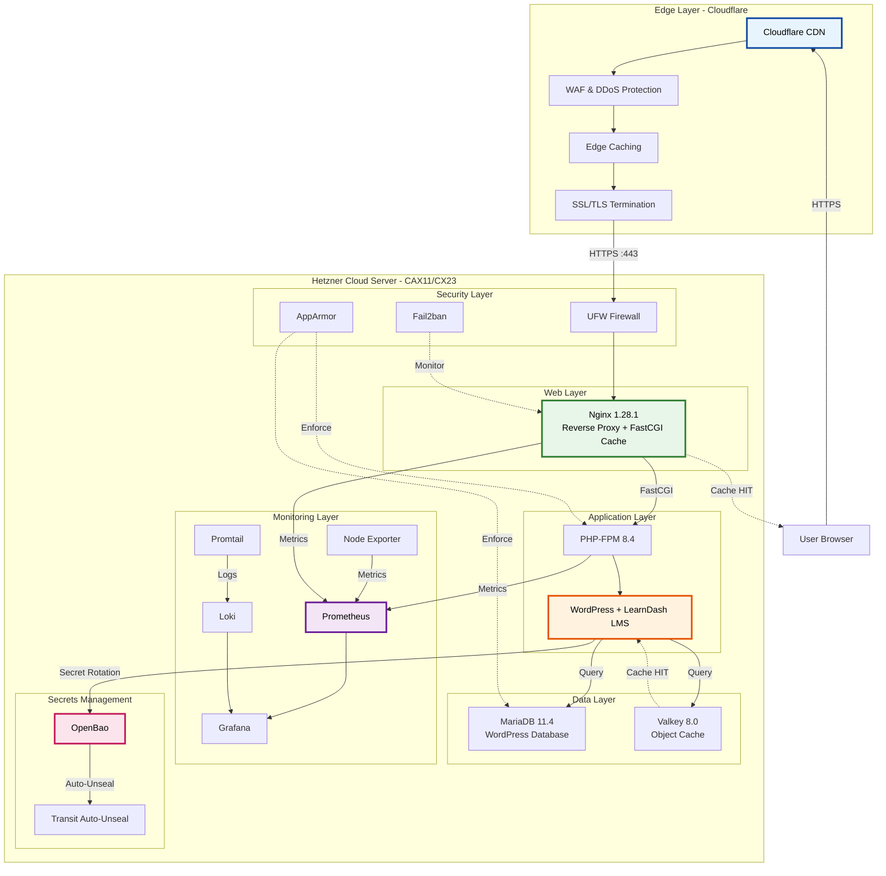
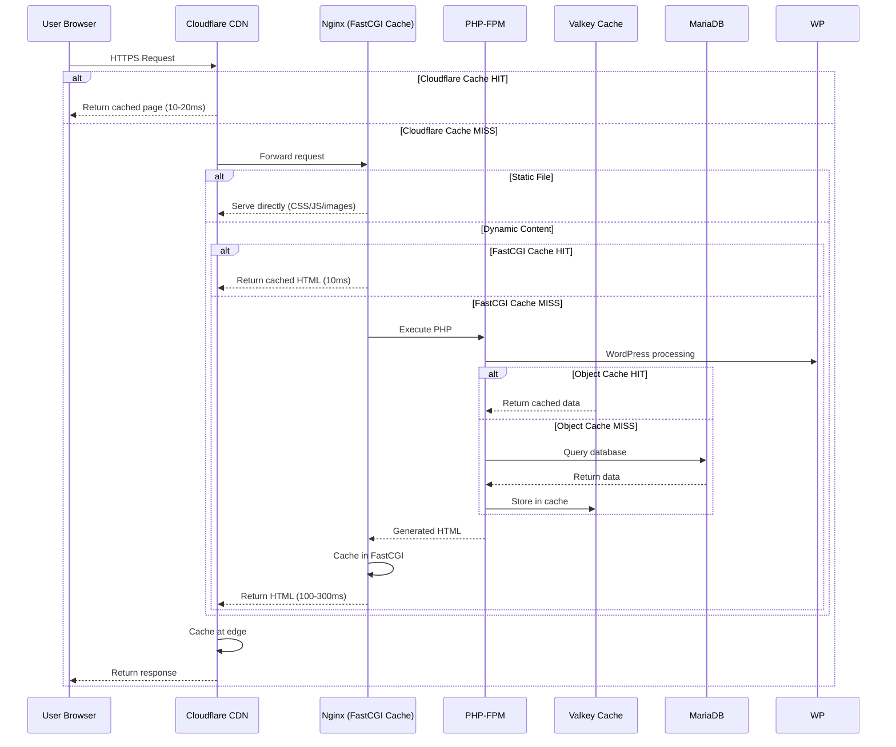
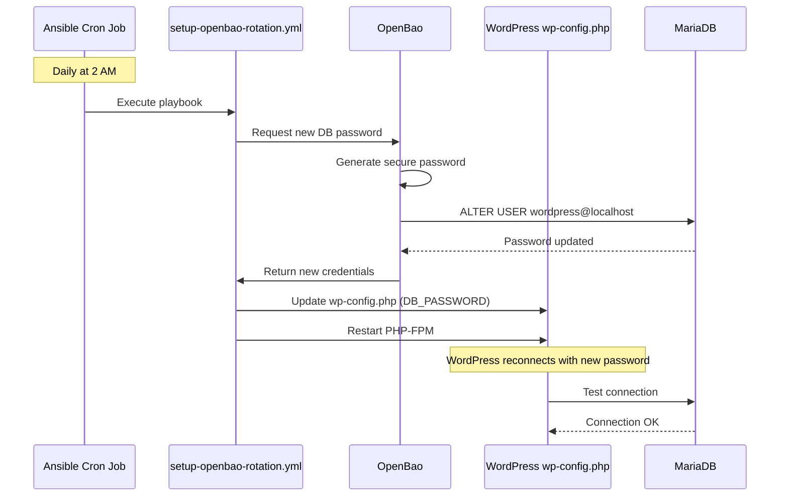
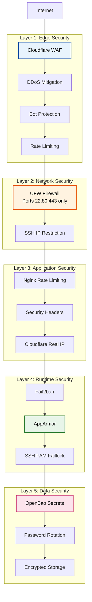
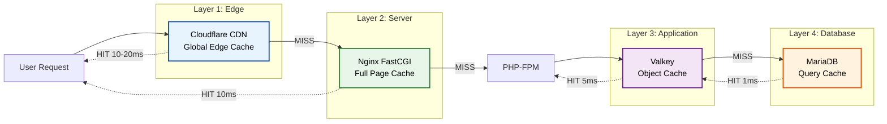
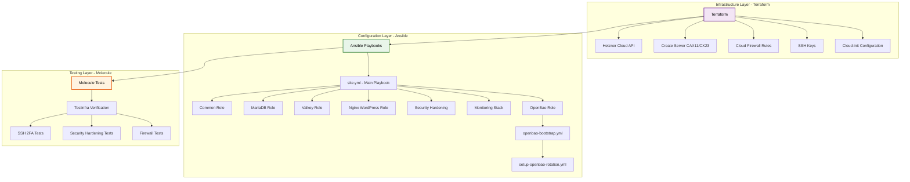

# System Architecture Overview

**Last Updated**: 2026-01-09
**Status**: Production-Ready
**Infrastructure**: Hetzner Cloud + Cloudflare + WordPress LMS

---

## 🎨 Accessibility Note

This document uses an accessible color palette in all diagrams, designed for neurodivergent users and following WCAG AAA guidelines:

- **Light Blue** (#E8F4FD): Cloudflare/Edge services - Calming, reduces cognitive load
- **Light Green** (#E8F5E9): Nginx/Application servers - Natural, easy to distinguish
- **Light Orange** (#FFF3E0): WordPress/Data layer - Warm, maintains readability
- **Light Purple** (#F3E5F5): Monitoring/Secrets - Distinct without being harsh
- **Light Pink** (#FCE4EC): Security services - Soft, avoids red/green confusion

All colors have high contrast borders (stroke-width: 2-3px) and black text for optimal readability.

---

## 🎯 Purpose

This document provides a complete architectural overview of the Hetzner-based WordPress LMS infrastructure, including all components, data flows, security layers, and operational considerations.

---

## 📊 High-Level Architecture



---

## 🏗️ Component Stack

### Application Layer

| Component | Version | Purpose | Port |
|-----------|---------|---------|------|
| **Nginx** | 1.28.1 | Web server, reverse proxy, FastCGI cache | 80, 443 |
| **PHP-FPM** | 8.4 | WordPress application runtime | Unix socket |
| **WordPress** | Latest | CMS + LearnDash LMS | - |
| **MariaDB** | 11.4 | Relational database (WordPress data) | 3306 (localhost) |
| **Valkey** | 8.0 | Object cache (Redis fork) | 6379 (localhost) |

**Nginx 1.28.1 Features**:
- ✅ CVE-2025-53859 security fix (memory disclosure in SMTP proxy)
- ✅ HTTP/3 improvements (QUIC)
- ✅ FastCGI cache enhancements
- ✅ TLS 1.3 optimizations
- ✅ Installed from nginx.org official repository

### Monitoring Layer

| Component | Version | Purpose | Port |
|-----------|---------|---------|------|
| **Prometheus** | 3.8+ | Metrics collection & storage | 9090 |
| **Grafana** | Latest | Metrics visualization & dashboards | 3000 |
| **Loki** | Latest | Log aggregation & storage | 3100 |
| **Promtail** | Latest | Log shipping agent | 9080 |
| **Node Exporter** | Latest | System metrics exporter | 9100 |

### Security Layer

| Component | Purpose | Status |
|-----------|---------|--------|
| **UFW** | Firewall (ports 22, 80, 443 only) | ✅ Active |
| **Fail2ban** | Brute force protection | ✅ Active |
| **AppArmor** | Mandatory access control | ✅ Enforcing |
| **Cloudflare WAF** | Web application firewall | ✅ Enabled |
| **Nginx Rate Limiting** | Login/API abuse prevention | ✅ Configured |
| **SSH 2FA** | PAM faillock brute force protection | ✅ Active |

### Secrets Management

| Component | Version | Purpose | Port |
|-----------|---------|---------|------|
| **OpenBao** | Latest | Secrets management & rotation | 8200 (localhost) |
| **Transit Auto-Unseal** | - | Automatic unsealing after reboot | - |

---

## 🔄 Data Flow

### 1. User Request Flow (WordPress Page)



**Latency Breakdown** (CX23 x86 tested):

- Cloudflare edge cache HIT: **~10-20ms** (global)
- Nginx FastCGI cache HIT: **~10ms** (server)
- Full PHP execution: **~100-300ms** (first request)

### 2. Monitoring Data Flow

```mermaid
graph LR
    subgraph "Data Sources"
        NGINX_SVC[Nginx]
        PHP_SVC[PHP-FPM]
        MARIA_SVC[MariaDB]
        VALKEY_SVC[Valkey]
        LOGS[/var/log/*]
    end

    subgraph "Collection"
        NE[Node Exporter<br/>:9100]
        PT[Promtail]
    end

    subgraph "Storage"
        PROM[Prometheus<br/>15-day retention]
        LOKI[Loki<br/>7-day retention]
    end

    subgraph "Visualization"
        GRAF[Grafana<br/>:3000]
    end

    NGINX_SVC -->|/metrics| NE
    PHP_SVC -->|/metrics| NE
    MARIA_SVC -->|/metrics| NE
    VALKEY_SVC -->|/metrics| NE

    NE -->|Scrape 15s| PROM
    LOGS -->|Tail| PT
    PT -->|Ship| LOKI

    PROM -->|PromQL| GRAF
    LOKI -->|LogQL| GRAF

    GRAF -->|Dashboard| USER[Admin Browser]
```

### 3. Secret Rotation Flow



---

## 🌐 Network Architecture

### Ports Configuration

| Port | Service | Accessible From | Firewall |
|------|---------|-----------------|----------|
| **22** | SSH | Admin IP only | UFW Allow (restricted) |
| **80** | HTTP | Public (→ 443) | UFW Allow |
| **443** | HTTPS | Public | UFW Allow |
| **3000** | Grafana | Admin IP only | UFW Deny (SSH tunnel only) |
| **3306** | MariaDB | Localhost only | Not exposed |
| **6379** | Valkey | Localhost only | Not exposed |
| **8200** | OpenBao | Localhost only | Not exposed |
| **9090** | Prometheus | Localhost only | Not exposed |
| **9100** | Node Exporter | Localhost only | Not exposed |

### Cloudflare Integration

```mermaid
graph TB
    subgraph "Cloudflare DNS"
        ROOT[@<br/>example.com]
        WWW[www.example.com]
    end

    subgraph "Hetzner Server"
        IP[Server IP<br/>46.224.156.140]
    end

    ROOT -->|Proxied ☁️| IP
    WWW -->|Proxied ☁️| IP

    %% Accessible colors
    style ROOT fill:#E8F4FD,stroke:#0D47A1,stroke-width:2px,color:#000
    style WWW fill:#E8F4FD,stroke:#0D47A1,stroke-width:2px,color:#000
    style IP fill:#E8F5E9,stroke:#2E7D32,stroke-width:2px,color:#000
```

**DNS Configuration**:

```
@ (root)       → Hetzner Server IP (Proxied ☁️)
www            → Hetzner Server IP (Proxied ☁️)
```

**Cloudflare Features Enabled**:

- ✅ Proxy (orange cloud) - hides real server IP
- ✅ WAF (Web Application Firewall)
- ✅ DDoS protection (automatic)
- ✅ Edge caching (CDN)
- ✅ SSL/TLS (Full Strict mode)
- ✅ Auto-minify (HTML, CSS, JS)
- ✅ Brotli compression
- ✅ HTTP/3 (QUIC)

---

## 💾 Data Storage

### Filesystem Layout

```
/var/www/wordpress/               # WordPress installation
├── wp-content/
│   ├── uploads/                  # User-uploaded files (images, PDFs)
│   ├── plugins/                  # WordPress plugins (4 essential only)
│   └── themes/                   # WordPress themes
└── wp-config.php                 # WordPress configuration (protected)

/var/cache/nginx/wordpress/       # FastCGI page cache (512MB max)

/var/lib/mysql/                   # MariaDB database files
└── wordpress/                    # WordPress database

/var/lib/openbao/                 # OpenBao data
├── data/                         # Encrypted secrets
└── raft/                         # Raft consensus storage

/var/lib/prometheus/              # Prometheus metrics (15-day retention)
/var/lib/loki/                    # Loki logs (7-day retention)

/var/log/
├── nginx/                        # Web server logs
├── php8.4-fpm.log               # PHP application logs
├── mysql/                        # Database logs
├── openbao/                      # OpenBao audit logs
└── syslog                        # System logs
```

### WordPress Plugins (Optimized)

**Essential Plugins Only (4)**:

1. **redis-cache** - Valkey object cache integration (CRITICAL)
2. **nginx-helper** - FastCGI cache purging (CRITICAL)
3. **wordfence-login-security** - 2FA/MFA for admin (ESSENTIAL)
4. **limit-login-attempts-reloaded** - Login rate limiting (ESSENTIAL)

**Removed Plugins** (infrastructure handles):
- ❌ Caching plugins (WP Super Cache, W3 Total Cache) - Nginx FastCGI + Valkey
- ❌ Security plugins (Wordfence Full, Sucuri) - Cloudflare WAF + Fail2ban
- ❌ CDN plugins - Cloudflare
- ❌ Cloudflare plugin - DNS-only integration

### Backup Strategy

| Data | Backup Frequency | Method | Storage |
|------|------------------|--------|---------|
| **WordPress Files** | Daily | rsync/tar | Hetzner Storage Box |
| **MariaDB Database** | Daily | mysqldump | Hetzner Storage Box |
| **wp-content/uploads** | Daily incremental | rsync | Hetzner Storage Box |
| **OpenBao Data** | Daily | snapshot | Encrypted backup |
| **Configuration** | On change | Git (this repo) | GitHub + Codeberg |
| **Monitoring Data** | Not backed up | Ephemeral (15 days) | - |

---

## 🔒 Security Architecture

### Multi-Layer Security



### Security Headers

Configured via modular nginx configuration:

```nginx
X-Frame-Options: SAMEORIGIN                    # Prevent clickjacking
X-Content-Type-Options: nosniff                # Prevent MIME sniffing
X-XSS-Protection: 1; mode=block                # Browser XSS filter
Content-Security-Policy: ...                   # Restrict resource loading
Referrer-Policy: strict-origin-when-cross-origin
Permissions-Policy: geolocation=(), microphone=(), camera=()
```

### SSH Security

- ✅ Key-based authentication only (no passwords)
- ✅ PAM faillock (5 attempts, 15-minute lockout)
- ✅ Root login disabled
- ✅ Protocol 2 only
- ✅ Weak host keys removed (DSA, ECDSA)

---

## ⚡ Performance Optimizations

### Caching Strategy (Multi-Layer)



**Cache TTLs**:

1. **Cloudflare Edge Cache** (Global CDN)
   - Static assets: 1 year
   - HTML pages: 4 hours (configurable)
   - Purge on WordPress update

2. **Nginx FastCGI Cache** (Server)
   - HTML pages: 60 minutes
   - Bypass: logged-in users, admin, LMS content
   - Purge on post update (Nginx Helper plugin)

3. **Valkey Object Cache** (Application)
   - Database query results
   - WordPress transients
   - Session data

4. **MariaDB Query Cache**
   - Query result cache
   - InnoDB buffer pool

### Performance Metrics (CX23 x86 Tested)

| Metric | Value | Grade |
|--------|-------|-------|
| **Requests/sec** | 3,114 | A+ |
| **Mean Latency** | 32ms | A+ |
| **95th Percentile** | 57ms | A+ |
| **99th Percentile** | 76ms | A+ |
| **Error Rate** | 0% | A+ |
| **CPU Load** | 0.66 (33% of 2 vCPUs) | A+ |
| **Memory Usage** | 866 MB / 4 GB (23%) | A+ |

**Throughput Capacity**:

- Light load (< 500 req/s): ✅ Current server perfect
- Medium load (500-2,000 req/s): ✅ Current server sufficient
- Heavy load (2,000-5,000 req/s): ⚠️ Upgrade to CX33 or add server
- Very heavy (> 5,000 req/s): ⚠️ Multi-server + load balancer

---

## 📈 Monitoring & Observability

### Grafana Dashboards

| Dashboard | Purpose | Key Metrics |
|-----------|---------|-------------|
| **Node Exporter Full** | System metrics | CPU, RAM, Disk I/O, Network, Load |
| **Nginx** (custom) | Web server | Requests/sec, Response times, Status codes |
| **WordPress** (custom) | Application | PHP-FPM pool, MySQL queries, Cache hit rate |
| **Logs** (Loki) | Log analysis | Errors, Access patterns, Security events |

### Alerting Rules

| Alert | Condition | Severity |
|-------|-----------|----------|
| High CPU | Load > 1.8 for 5 min | Warning |
| High Memory | RAM > 90% for 5 min | Critical |
| Disk Full | Disk > 85% | Warning |
| Service Down | Nginx/PHP/MySQL down | Critical |
| High Error Rate | 5xx errors > 1% | Warning |
| Slow Response | p95 latency > 500ms | Warning |

### Log Retention

- **Nginx logs**: 30 days (rotating daily)
- **PHP-FPM logs**: 30 days
- **MariaDB logs**: 30 days
- **OpenBao audit logs**: 90 days
- **Syslog**: 30 days
- **Prometheus metrics**: 15 days
- **Loki logs**: 7 days

---

## 🖥️ Server Specifications

### Production Server: CAX11 (ARM64)

| Spec | Value |
|------|-------|
| **CPUs** | 2 vCPUs (Ampere Altra) |
| **RAM** | 4 GB DDR4 |
| **Disk** | 40 GB NVMe SSD |
| **Network** | 20 TB traffic/mo |
| **Price** | €4.45/month |
| **Availability** | Always available ✅ |
| **Architecture** | ARM64 (aarch64) |

**Why ARM over x86**:
- ✅ Always available (no stock issues)
- ✅ Modern Ampere Altra processors
- ✅ €0.59/mo cheaper than CX23
- ✅ Better power efficiency
- ✅ Compatible with Debian 13 ARM64

### Alternative: CX23 (x86)

| Spec | Value |
|------|-------|
| **CPUs** | 2 vCPUs (AMD EPYC) |
| **RAM** | 4 GB DDR4 |
| **Disk** | 40 GB NVMe SSD |
| **Network** | 20 TB traffic/mo |
| **Price** | €5.04/month |
| **Availability** | Limited stock ⚠️ |
| **Architecture** | x86_64 (AMD64) |

---

## 🚀 Deployment Architecture

### Infrastructure as Code



### Deployment Flow

1. **Infrastructure Provisioning** (Terraform)
   ```bash
   cd terraform/environments/production
   terraform init
   terraform plan
   terraform apply
   ```

2. **Server Configuration** (Ansible)
   ```bash
   cd ansible
   ansible-playbook -i inventory/production site.yml
   ```

3. **OpenBao Setup** (First-time only)
   ```bash
   ansible-playbook -i inventory/production openbao-bootstrap.yml
   # Save unseal keys and root token securely
   ```

4. **Secret Rotation Setup**
   ```bash
   ansible-playbook -i inventory/production setup-openbao-rotation.yml
   ```

5. **WordPress Configuration** (Manual)
   - Install LearnDash Pro (requires license)
   - Configure payment gateways
   - Setup 2FA for admin users
   - Configure Cloudflare DNS

### Environments

| Environment | Purpose | Server | Cost |
|-------------|---------|--------|------|
| **Staging** | Testing & validation | CAX11 | €4.45/mo |
| **Production** | Live site | CAX11 | €4.45/mo |

**Total Infrastructure Cost**: **€8.90/month** (2 servers)

---

## 📊 Capacity Planning

### Current Capacity (CX23 tested)

**With current configuration** (WordPress + Monitoring + OpenBao):

- **Max throughput**: ~3,100 req/s
- **Concurrent users**: ~600-800
- **Database connections**: 150 (MariaDB max_connections)
- **PHP-FPM workers**: 30 (max_children)

### Scaling Strategy

**Vertical Scaling** (Upgrade server):

```
CAX11 (€4.45/mo) → CAX21 (€8.49/mo)
    ├─ CPUs: 2 → 4
    ├─ RAM: 4 GB → 8 GB
    └─ Expected throughput: 3,100 → 6,000+ req/s
```

**Horizontal Scaling** (Add servers):

```
1 server → 2 servers + Load Balancer
    ├─ Load Balancer: Hetzner LB (€5.83/mo)
    ├─ 2x CAX11: €8.90/mo
    ├─ Total: €14.73/mo
    └─ Expected throughput: 3,100 → 6,000+ req/s
```

**Recommended approach**:

1. Start with 1 CAX11 server (current)
2. Add Cloudflare (free) - reduces origin load 80-90%
3. If needed, vertical scale to CAX21
4. If needed, horizontal scale with load balancer

---

## 🔧 Technology Decisions

### Why This Stack?

| Technology | Alternative Considered | Why Chosen |
|------------|----------------------|------------|
| **Hetzner Cloud** | AWS, DigitalOcean | 50-70% cheaper, European data residency, GDPR compliant |
| **ARM (CAX11)** | x86 (CX23) | Always available, modern Ampere Altra, €0.59/mo cheaper |
| **Debian 13** | Ubuntu 24.04 | Latest packages (PHP 8.4, nginx 1.28.1), stable |
| **Nginx 1.28.1** | Apache, nginx 1.26 | CVE fixes, HTTP/3, better performance, lower memory |
| **PHP 8.4** | PHP 8.2 | JIT improvements, performance gains, latest features |
| **MariaDB** | MySQL, PostgreSQL | Drop-in MySQL replacement, better performance |
| **Valkey** | Redis | Open source fork, no licensing concerns, Redis-compatible |
| **Prometheus** | InfluxDB, Datadog | Industry standard, free, powerful, PromQL |
| **Grafana** | Kibana | Better UX, more integrations, beautiful dashboards |
| **Cloudflare** | Fastly, CloudFront | Free tier, excellent WAF, DDoS protection, HTTP/3 |
| **OpenBao** | HashiCorp Vault | Open source fork, no licensing changes, Vault-compatible |

### WordPress Plugin Philosophy

**Infrastructure-First Approach**:

- Infrastructure handles: Caching, Security, CDN, Rate Limiting
- WordPress handles: Only LMS functionality
- Result: 4 essential plugins instead of 15+
- Benefits: Faster, more secure, easier to maintain

---

## 📚 Related Documentation

### Architecture & Infrastructure

- [OpenBao Auto-Unseal Guide](../deployment/OPENBAO_AUTO_UNSEAL_GUIDE.md)
- [Site Deployment Flow](../deployment/SITE_DEPLOYMENT_FLOW.md)
- [Monitoring Architecture](../infrastructure/MONITORING_ARCHITECTURE.md)
- [Caching Stack](../infrastructure/CACHING_STACK.md)

### Security

- [SSH 2FA Initial Setup](../security/SSH_2FA_INITIAL_SETUP.md)
- [SSH 2FA User Guide](../security/SSH_2FA_USER_GUIDE.md)
- [OpenBao Secret Rotation](../security/OPENBAO_SECRET_ROTATION_COMPLETE.md)
- [AppArmor Configuration](../security/APPARMOR.md)

### Deployment & Operations

- [Complete Testing Guide](../guides/COMPLETE_TESTING_GUIDE.md)
- [Deployment Guide](../guides/DEPLOYMENT_GUIDE.md)
- [Nginx Configuration Explained](../guides/NGINX_CONFIGURATION_EXPLAINED.md)
- [Troubleshooting](../guides/TROUBLESHOOTING.md)

### WordPress

- [WordPress Themes and Plugins Guide](../wordpress/WORDPRESS_THEMES_AND_PLUGINS_GUIDE.md)
- [WordPress Stack Architecture](../infrastructure/WORDPRESS-STACK.md)

---

## ✅ Production Readiness

**Current Status**: Production-Ready ✅

### Completed ✅

- ✅ Infrastructure as Code (Terraform + Ansible)
- ✅ Full WordPress stack deployment
- ✅ Complete monitoring stack (Prometheus + Grafana + Loki)
- ✅ Security hardening (firewall, fail2ban, AppArmor, SSH 2FA)
- ✅ Performance optimization (FastCGI cache, object cache, CDN-ready)
- ✅ Modular Nginx configuration
- ✅ Nginx 1.28.1 with CVE-2025-53859 fix
- ✅ x86 architecture testing (3,114 req/s, A+ grade)
- ✅ WordPress plugins optimized (4 essential only)
- ✅ OpenBao secrets management with Transit auto-unseal
- ✅ Automated secret rotation (daily)
- ✅ Testinfra tests for critical roles (52 tests)
- ✅ Molecule tests passing (9/11 roles, 82%)
- ✅ Documentation (architecture, guides, reference)

### Optional Enhancements 🔮

- 🔮 ARM architecture performance testing (CAX11)
- 🔮 Grafana alerting with email notifications
- 🔮 Automated backups to Hetzner Storage Box
- 🔮 Multi-region failover
- 🔮 Blue-green deployments
- 🔮 Terraform Cloud migration (state management, CI/CD)

---

**Last Updated**: 2026-01-09
**Maintained By**: Infrastructure Team
**Repository**: https://github.com/malpanez/hetzner-secure-infrastructure

