# Guía Completa de Deployment - WordPress LMS en Hetzner Cloud

Esta guía proporciona instrucciones detalladas paso a paso para desplegar la infraestructura completa de WordPress con LearnDash en Hetzner Cloud.

> **📊 Nota sobre Diagramas Mermaid:**
> Esta guía incluye múltiples diagramas interactivos en formato Mermaid para facilitar la comprensión visual.
>
> - ✅ **GitHub:** Renderiza Mermaid nativamente
> - ✅ **Codeberg:** Soporta Mermaid desde 2023 ([Gitea 1.19+](https://blog.gitea.com/release-of-1.19.0/))
> - ✅ **VSCode:** Instala extensión "Markdown Preview Mermaid Support"
> - ⚠️ **Navegador local:** Si abres el .md sin extensión, verás código en lugar de diagramas
>
> **Cómo ver los diagramas en Codeberg:**
> Simplemente abre este archivo en la interfaz web de Codeberg y los diagramas se renderizarán automáticamente.

## 📋 Tabla de Contenidos

1. [Requisitos Previos](#requisitos-previos)
2. [Costos Estimados](#costos-estimados)
3. [Configuración Inicial](#configuración-inicial)
4. [Proceso de Deployment](#proceso-de-deployment)
5. [Configuración Manual Requerida](#configuración-manual-requerida)
6. [Verificación y Testing](#verificación-y-testing)
7. [Mantenimiento](#mantenimiento)

---

## Requisitos Previos

### Hardware/Infraestructura

#### Servidor Local de Desarrollo

- Sistema operativo: Linux, macOS, o WSL2 en Windows
- RAM mínima: 4 GB
- Espacio en disco: 20 GB disponibles
- Docker Desktop instalado (para testing con Molecule)

#### Conectividad

- Conexión a internet estable
- IP estática o dinámica conocida para acceso SSH seguro

### Software Requerido

```mermaid
graph TD
    A[Máquina Local] --> B[Terraform 1.9.0+]
    A --> C[Ansible 2.16.3+]
    A --> D[Python 3.10+]
    A --> E[Git 2.30+]
    A --> F[SSH Client]

    C --> G[ansible-vault]
    D --> H[pipx para Molecule]
    F --> I[SSH Key ED25519]

    style A fill:#e1f5ff
    style B fill:#ffe1e1
    style C fill:#ffe1e1
    style D fill:#ffe1e1
    style E fill:#ffe1e1
    style F fill:#ffe1e1
```

#### Instalación de Dependencias

**Debian/Ubuntu:**

```bash
# Instalar dependencias del sistema
sudo apt update
sudo apt install -y \
  python3 python3-pip python3-venv \
  git curl wget \
  gnupg software-properties-common

# Instalar Terraform
wget -O- https://apt.releases.hashicorp.com/gpg | sudo gpg --dearmor -o /usr/share/keyrings/hashicorp-archive-keyring.gpg
echo "deb [signed-by=/usr/share/keyrings/hashicorp-archive-keyring.gpg] https://apt.releases.hashicorp.com $(lsb_release -cs) main" | sudo tee /etc/apt/sources.list.d/hashicorp.list
sudo apt update && sudo apt install terraform

# Instalar Ansible
python3 -m pip install --user ansible==2.16.3

# Instalar Molecule (opcional, para testing)
python3 -m pip install --user pipx
pipx install molecule[docker]
```

**macOS (Homebrew):**

```bash
brew install terraform ansible python@3.10 git
pipx install molecule[docker]
```

### Cuentas y Credenciales Necesarias

```mermaid
flowchart LR
    A[Cuentas Requeridas] --> B[Hetzner Cloud]
    A --> C[Cloudflare]
    A --> D[Dominio DNS]
    A --> E[LearnDash License]
    A --> F[Email SMTP]

    B --> B1[API Token]
    B --> B2[SSH Key]

    C --> C1[API Key]
    C --> C2[Zone ID]

    D --> D1[Acceso DNS]

    E --> E1[License Key]
    E --> E2[~$199/año]

    F --> F1[SMTP Credentials]

    style A fill:#fff4e1
    style E fill:#ffe1e1
```

#### 1. Cuenta Hetzner Cloud

- **URL:** <https://console.hetzner.cloud>
- **Requisito:** Tarjeta de crédito o PayPal
- **Verificación:** Email + verificación de identidad
- **Necesitarás generar:**
  - API Token con permisos de lectura/escritura
  - SSH Key para acceso a servidores

#### 2. Cuenta Cloudflare (Opcional pero Recomendado)

- **URL:** <https://dash.cloudflare.com>
- **Plan:** Free tier es suficiente
- **Necesitarás:**
  - Transferir nameservers de tu dominio
  - Generar API Token para DNS

#### 3. Dominio

- Registrado en cualquier registrar (GoDaddy, Namecheap, Cloudflare, etc.)
- Apuntando a nameservers de Cloudflare (recomendado)

#### 4. Licencia LearnDash

- **URL:** <https://www.learndash.com>
- **Costo:** $199/año (licencia básica)
- **Incluye:** 1 sitio, actualizaciones y soporte

#### 5. Servicio SMTP (Opcional)

- SendGrid (100 emails/día gratis)
- Mailgun (5,000 emails/mes gratis primeros 3 meses)
- Amazon SES (~$0.10 por 1,000 emails)

### Claves SSH y Seguridad

#### ¿Necesito generar claves SSH nuevas?

**Respuesta corta: NO, puedes reutilizar tus claves existentes.**

```mermaid
flowchart TD
    A[Tus SSH Keys Actuales] --> B{¿Ya tienes ed25519?}
    B -->|Sí| C[✓ Reutilizar para Hetzner]
    B -->|No| D[Generar nueva ed25519]

    A --> E{¿Tienes YubiKey SK?}
    E -->|Sí| F[✓ Reutilizar para servidor]
    E -->|No| G[Opcional: Generar SK]

    C --> H[Usar MISMA clave para:<br/>GitHub + Codeberg + Hetzner]
    F --> I[YubiKey como 2FA SSH]

    style A fill:#e1f5ff
    style C fill:#e1ffe1
    style H fill:#e1ffe1
```

**Claves que ya tienes (WSL2 Ubuntu):**

```bash
# Ver tus claves existentes
ls -la ~/.ssh/

# Probablemente tienes:
# id_ed25519 (GitHub/Codeberg)
# id_ed25519_sk (YubiKey)
```

**Recomendación: REUTILIZAR claves existentes**

- ✅ **Ventaja:** Una sola clave para GitHub + Codeberg + Hetzner = más simple
- ✅ **Seguro:** Las claves ED25519 son resistentes a ataques
- ✅ **Práctic:** No necesitas gestionar múltiples claves
- ❌ **Desventaja teórica:** Si alguien roba la clave, accede a todo
- ✅ **Mitigación:** Tu clave está protegida con passphrase + YubiKey como backup

**Decisión recomendada:**

```bash
# Opción 1: REUTILIZAR clave existente (RECOMENDADO)
# No hacer nada, usar ~/.ssh/id_ed25519 para todo

# Opción 2: Crear clave dedicada solo para Hetzner (más seguro pero complejo)
ssh-keygen -t ed25519 -C "hetzner-servers-only" -f ~/.ssh/hetzner_ed25519
```

**Para este proyecto, vamos con Opción 1 (reutilizar).**

#### Configuración de Usuario Admin

**¿Qué nombre de usuario usar?**

```mermaid
flowchart TD
    A[Elegir Usuario] --> B{Ofuscación?}
    B -->|Máxima seguridad| C[Usuario aleatorio<br/>ej: svc_prod_47x]
    B -->|Balance| D[Usuario personal<br/>ej: malpanez]
    B -->|Simple| E[Usuario común<br/>ej: admin]

    C --> C1[✓ Más difícil adivinar<br/>✗ Difícil de recordar]
    D --> D1[✓ Fácil de recordar<br/>✓ No es obvio<br/>✓ RECOMENDADO]
    E --> E1[✗ Muy obvio<br/>✗ Target de ataques]

    style D fill:#e1ffe1
    style D1 fill:#e1ffe1
```

**Recomendación: Usar tu nombre `malpanez` (o variante)**

**Razones:**

1. ✅ **No es obvio** - No es `root`, `admin`, `administrator`, `user`
2. ✅ **Fácil de recordar** - Es tu nombre
3. ✅ **SSH ya filtrado por IP** - Solo tu IP puede conectar (variable ssh_allowed_ips)
4. ✅ **2FA activado** - Requiere TOTP + YubiKey opcional
5. ✅ **Fail2ban activo** - 3 intentos = ban automático

**Usuarios a EVITAR:**

- ❌ `admin` - Primer target de bots
- ❌ `administrator` - Segundo target
- ❌ `root` - Deshabilitado por defecto
- ❌ `user` - Muy común
- ❌ `ubuntu` / `debian` - Nombres por defecto

**Usuarios OK:**

- ✅ `malpanez` - No obvio, fácil de recordar (RECOMENDADO)
- ✅ `malpanez_admin` - Variante
- ✅ Nombre aleatorio: `svc_adm_92x` (si quieres máxima ofuscación)

#### ¿Ofuscar el puerto SSH a 2222?

```mermaid
flowchart TD
    A[Puerto SSH] --> B{¿Cambiar de 22?}
    B -->|Sí → 2222| C[Pros y Contras]
    B -->|No → 22| D[Pros y Contras]

    C --> C1[✓ Reduce scans automáticos 95%]
    C --> C2[✓ Menos ruido en logs]
    C --> C3[✗ Debes recordar: ssh -p 2222]
    C --> C4[✗ Security by obscurity]
    C --> C5[⚠️ Puede complicar scripts]

    D --> D1[✓ Puerto estándar, fácil]
    D --> D2[✓ Scripts funcionan sin modificar]
    D --> D3[✗ Más scans en logs]
    D --> D4[✓ Con IP filtering + 2FA es seguro]

    style C fill:#fff4e1
    style D fill:#e1ffe1
```

**Análisis de seguridad:**

| Configuración | Scans/día | Impacto Real | Complejidad |
|--------------|-----------|--------------|-------------|
| **Puerto 22 + IP filtering** | ~50-100 | ❌ Ninguno (bloqueados) | ✅ Simple |
| **Puerto 2222 + IP filtering** | ~5-10 | ❌ Ninguno (bloqueados) | ⚠️ Media |
| **Puerto 22 SIN filtering** | ~1000+ | ⚠️ PELIGROSO | ✅ Simple |
| **Puerto 2222 SIN filtering** | ~100+ | ⚠️ Menos pero inseguro | ⚠️ Media |

**Recomendación: Mantener puerto 22**

**Razones:**

1. ✅ **IP filtering ya activo** - Solo tu IP puede conectar (ssh_allowed_ips)
2. ✅ **2FA activado** - TOTP requerido
3. ✅ **Fail2ban activo** - Ban automático tras 3 intentos
4. ✅ **Keys solo** - No se permiten passwords
5. ✅ **Más simple** - No necesitas `-p 2222` en cada conexión
6. ✅ **Scripts estándar** - Todo funciona sin modificar

**Security by obscurity NO es seguridad real.**

**Si AÚN quieres cambiar a 2222:**

```hcl
# terraform/environments/production/terraform.tfvars
ssh_port = 2222  # Cambiar de 22 a 2222
```

```yaml
# ansible/inventory/production/hosts.yml
wordpress-prod:
  ansible_port: 2222  # Añadir esta línea
```

```bash
# Conectar después
ssh -p 2222 malpanez@tudominio.com
```

#### Configuración Final Recomendada

**Variables Terraform:**

```hcl
# terraform/environments/production/terraform.tfvars
admin_username = "malpanez"        # No obvio, fácil de recordar
ssh_port       = 22               # Puerto estándar (RECOMENDADO)
# ssh_port     = 2222             # Descomenta si quieres ofuscar

ssh_allowed_ips = ["TU.IP/32"]   # CRÍTICO: Solo tu IP
```

**SSH Config Local (~/.ssh/config):**

```bash
# Para facilitar conexión
Host hetzner-prod
    HostName tudominio.com
    User malpanez
    Port 22                                    # o 2222 si cambiaste
    IdentityFile ~/.ssh/id_ed25519           # Tu clave existente
    IdentitiesOnly yes

# Conectar simplemente con:
# ssh hetzner-prod
```

#### Resumen de Claves SSH

**¿Cuál clave usar para qué?**

```mermaid
graph TB
    A[Claves SSH en WSL2] --> B[id_ed25519]
    A --> C[id_ed25519_sk YubiKey]

    B --> B1[GitHub]
    B --> B2[Codeberg]
    B --> B3[Hetzner Terraform cloud-init]
    B --> B4[Hetzner SSH acceso diario]

    C --> C1[Hetzner 2FA SSH<br/>Requiere YubiKey física]

    style A fill:#e1f5ff
    style B fill:#e1ffe1
    style C fill:#fff4e1
```

**Configuración:**

1. **Terraform (cloud-init):** Usa `~/.ssh/id_ed25519.pub`
2. **Ansible SSH:** Usa `~/.ssh/id_ed25519`
3. **YubiKey (opcional):** Añadir `~/.ssh/id_ed25519_sk.pub` al servidor para 2FA

---

## Costos Estimados

### 💰 Gastos: ¿Qué es OBLIGATORIO y Qué es OPCIONAL?

#### Resumen Ejecutivo

```mermaid
flowchart TD
    A[Gastos para Deployment] --> B[OBLIGATORIOS<br/>$210 USD / €191]
    A --> C[OPCIONALES<br/>€0 - €infinito]

    B --> B1[LearnDash: $199]
    B --> B2[Hetzner CX22: €5.39/mes]
    B --> B3[Dominio: €0 ya tienes]
    B --> B4[Cloudflare Free: €0]

    C --> C1[Hetzner Volume: +€2.40/mes]
    C --> C2[Hetzner Backup: +€1.08/mes]
    C --> C3[Cloudflare Pro: +$20/mes]
    C --> C4[Plugins WP: €0-€200/año]
    C --> C5[SMTP Pro: +€10/mes]

    style B fill:#ffe1e1
    style B1 fill:#ffe1e1
    style B2 fill:#ffe1e1
    style C fill:#e1ffe1
```

#### Tabla de Gastos OBLIGATORIOS vs OPCIONALES

| Servicio | Obligatorio | Opcional | Costo | Notas |
|----------|-------------|----------|-------|-------|
| **LearnDash** | ✅ SÍ | | $199/año | SIN ESTO NO HAY LMS - WordPress solo es un blog |
| **Hetzner CX22** | ✅ SÍ | | €5.39/mes | Servidor mínimo funcional |
| **Dominio** | ✅ SÍ | | €0 (ya tienes) | Ya pagado en GoDaddy |
| **Cloudflare Free** | ✅ SÍ | | €0 gratis | CDN, SSL, DNS - Plan Free suficiente |
| **Hetzner Volume 20GB** | | ⚠️ Depende | €2.40/mes | Solo si >10GB uploads/videos |
| **Hetzner Backup** | | ✅ Recomendado | €1.08/mes | Backups automáticos diarios |
| **Cloudflare Pro** | | ❌ NO necesario | $20/mes | Solo si >100k visitas/mes |
| **WP Plugins (gratis)** | | ✅ Recomendado | €0 | Wordfence, UpdraftPlus, etc. |
| **WP Rocket** | | ❌ NO necesario | $59/año | Nginx ya cachea |
| **SMTP Gratis** | | ✅ Recomendado | €0 | SendGrid/Mailgun free tier |

**TOTAL OBLIGATORIO:** $199 + €5.39/mes = **~$210 inicial + €65/año**

#### Timeline de Pagos - ¿Cuándo y Dónde Pagar?

```mermaid
gantt
    title Timeline de Gastos para Deployment
    dateFormat YYYY-MM-DD
    section Antes de Empezar
    Comprar LearnDash :milestone, m1, 2024-01-01, 0d
    section Durante Deployment
    Terraform Apply (Hetzner cobra) :milestone, m2, 2024-01-02, 0d
    Migrar DNS a Cloudflare (Gratis) :milestone, m3, 2024-01-02, 0d
    section Post-Deployment
    Instalar LearnDash Plugin :milestone, m4, 2024-01-03, 0d
    Plugins opcionales (Gratis) :milestone, m5, 2024-01-03, 0d
    section Mensual/Anual
    Hetzner factura mensual :milestone, m6, 2024-02-01, 0d
    Renovación dominio anual :milestone, m7, 2025-01-01, 0d
    Renovación LearnDash anual :milestone, m8, 2025-01-01, 0d
```

**Necesitas tener disponibles ANTES del deployment:**

| Paso | Concepto | Dónde | Cuándo | Costo | Obligatorio |
|------|----------|-------|--------|-------|-------------|
| **1** | **LearnDash License** | [learndash.com/pricing](https://www.learndash.com/pricing/) | **ANTES de terraform** | $199 USD | ✅ SÍ |
| **2** | **Hetzner Cloud** | [console.hetzner.cloud](https://console.hetzner.cloud) | Durante `terraform apply` | €5.39 | ✅ SÍ |
| **3** | **Transferir dominio a Cloudflare** | [dash.cloudflare.com](https://dash.cloudflare.com) | Durante/después deployment | €9-10 | ⚠️ RECOMENDADO |
| **4** | **Cloudflare DNS/CDN/SSL** | [dash.cloudflare.com](https://dash.cloudflare.com) | Durante DNS setup | €0 (gratis) | ✅ SÍ |
| | **TOTAL MÍNIMO** | | | **~$210 / €191** | Sin transferencia |
| | **TOTAL RECOMENDADO** | | | **~$220 / €200** | Con transferencia dominio |

**IMPORTANTE:**

- ✅ **Dominio en GoDaddy:** Ya lo tienes - NO necesitas pagar nada extra
- ⚠️ **Transferir a Cloudflare:** RECOMENDADO - €9-10 (incluye +1 año renovación)
  - NO es un fee, es renovación anticipada
  - Se añade a tu tiempo restante (ejemplo: expira Jun 2025 → nueva expiración Jun 2026)
  - Ahorro futuro: €9/año vs €12/año en GoDaddy
  - Puedes hacerlo ahora o después del deployment
- ✅ **Cloudflare DNS/CDN/SSL:** Plan Free es suficiente - 100% gratis
- ❌ **Volume extra:** OPCIONAL - No es obligatorio, explicación abajo

#### ¿Qué Plugins se Instalan Automáticamente?

```mermaid
flowchart TD
    A[WordPress Plugins] --> B[Instalación Automática<br/>via Ansible]
    A --> C[Instalación Manual<br/>Requerida]

    B --> B1[❌ NINGUNO<br/>Ansible instala SOLO WordPress Core]

    C --> C1[✅ LearnDash - OBLIGATORIO<br/>$199/año]
    C --> C2[⚠️ Otros plugins - OPCIONALES<br/>Instalar según necesidad]

    C1 --> C1A[Debes comprarlo y subirlo<br/>manualmente via wp-admin]

    C2 --> C2A[Wordfence Security Gratis]
    C2 --> C2B[UpdraftPlus Backups Gratis]
    C2 --> C2C[WP Mail SMTP Gratis]
    C2 --> C2D[Imagify Gratis hasta 20MB/mes]

    style C1 fill:#ffe1e1
    style C1A fill:#ffe1e1
    style C2A fill:#e1ffe1
    style C2B fill:#e1ffe1
```

**CLARIFICACIÓN IMPORTANTE:**

| Software | Instalación | Costo | Cuándo/Cómo |
|----------|------------|-------|-------------|
| **WordPress Core** | ✅ Automática (Ansible) | Gratis | Durante `ansible-playbook` |
| **Nginx + PHP** | ✅ Automática (Ansible) | Gratis | Durante `ansible-playbook` |
| **MariaDB** | ✅ Automática (Ansible) | Gratis | Durante `ansible-playbook` |
| **Prometheus + Grafana** | ✅ Automática (Ansible) | Gratis | Durante `ansible-playbook` |
| **LearnDash Plugin** | ❌ MANUAL | $199/año | Después deployment, via WP Admin |
| **Otros plugins WP** | ❌ Manual | Gratis/Pago | Después deployment, según necesidad |

**WordPress Plugins (Instalación Manual Después de Deployment):**

1. **OBLIGATORIO:**
   - LearnDash LMS (~$199/año) - Comprar antes, instalar después del deployment

2. **RECOMENDADOS (Gratis):**
   - Wordfence Security - Firewall + malware scanner
   - UpdraftPlus - Backups a cloud (Cloudflare R2, Google Drive, etc.)
   - WP Mail SMTP - Configurar email via SendGrid/Mailgun
   - Imagify - Optimización automática de imágenes

3. **OPCIONALES (Pago):**
   - WP Rocket (~$59/año) - Caché avanzado (Nginx ya cachea, no crítico)
   - Uncanny Toolkit Pro (~$119/año) - Mejoras UI para LearnDash
   - GamiPress Pro (~$79/año) - Gamificación avanzada

### 📦 ¿Qué es el Hetzner Volume y lo necesito?

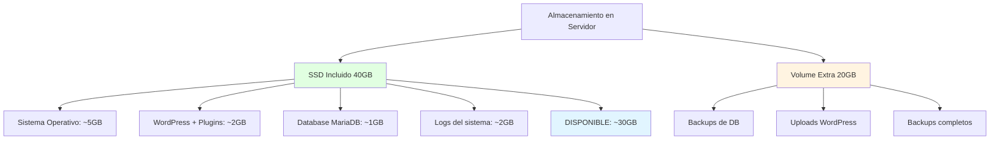

**¿Necesitas el Volume extra de 20GB (+€2.40/mes)?**

**NO necesitas Volume extra SI:**

- Sitio pequeño/mediano (<1000 usuarios)
- Pocos cursos (<50 cursos con videos)
- Uploads pequeños (documentos PDF, imágenes)
- **Los 40GB incluidos son suficientes**

**SÍ necesitas Volume extra SI:**

- Muchos videos (cada curso con 2+ horas de video)
- Miles de usuarios con contenido
- Quieres backups completos diarios en el servidor
- Prevés >10GB de uploads

**Recomendación:** Empieza SIN el volume. Puedes añadirlo después si lo necesitas.

**Para desactivarlo en la configuración:**

```hcl
# terraform/environments/production/terraform.tfvars
volume_size = 0  # Cambiar de 20 a 0 = sin volume extra
```

### Costos Mensuales de Infraestructura

```mermaid
pie title Distribución de Costos Mensuales (Configuración MÍNIMA)
    "Hetzner Server CX22" : 5.39
    "Cloudflare CDN" : 0
    "Total" : 5.39
```

**Configuración MÍNIMA (Recomendada para empezar):**

| Componente | Especificaciones | Costo Mensual | Costo Anual |
|-----------|------------------|---------------|-------------|
| **Hetzner CX22** | 2 vCPU, 4GB RAM, 40GB SSD | €5.39 | €64.68 |
| **Cloudflare** | CDN, DNS, SSL, DDoS protection | €0.00 | €0.00 |
| **SUBTOTAL MENSUAL** | | **€5.39** | **€64.68** |

**Configuración COMPLETA (Con todas las opciones):**

| Componente | Especificaciones | Costo Mensual | Costo Anual |
|-----------|------------------|---------------|-------------|
| **Hetzner CX22** | 2 vCPU, 4GB RAM, 40GB SSD | €5.39 | €64.68 |
| **Hetzner Volume** | 20 GB almacenamiento adicional | €2.40 | €28.80 |
| **Hetzner Backup** | Backups automáticos (20% del servidor) | €1.08 | €12.96 |
| **Floating IP** | IP estática (opcional) | €1.19 | €14.28 |
| **Cloudflare** | CDN, DNS, SSL, DDoS protection | €0.00 | €0.00 |
| **SUBTOTAL MENSUAL** | | **€10.06** | **€120.72** |

### Costos Anuales Recurrentes

| Componente | Descripción | Costo | Notas |
|-----------|-------------|-------|-------|
| **Dominio** | Renovación anual (.com) | €9-12/año | €9 si transfieres a Cloudflare, €12 en GoDaddy |
| **LearnDash License** | Plugin LMS - RENOVACIÓN | $199/año (~€186) | OBLIGATORIO |
| **SSL Certificate** | Gratis con Cloudflare | €0 | Incluido |
| **SUBTOTAL ANUAL** | | **~€195-198** | |

### 💵 Resumen de Costos Total

#### Opción 1: CONFIGURACIÓN MÍNIMA (Recomendada)

```
GASTOS INICIALES:
LearnDash:              $199 USD (~€186)
Hetzner primer mes:     €5.39
─────────────────────────────────
TOTAL INICIAL:          ~€191 / $210 USD

GASTOS MENSUALES:
Hetzner CX22:           €5.39/mes

GASTOS ANUALES:
Infraestructura:        €64.68
Dominio:                €12
LearnDash renovación:   €186
─────────────────────────────────
TOTAL PRIMER AÑO:       €262.68 (~$287 USD)
AÑOS SIGUIENTES:        €262.68/año
```

#### Opción 2: CONFIGURACIÓN COMPLETA (Con backups y volume)

```
GASTOS INICIALES:
LearnDash:              $199 USD (~€186)
Hetzner primer mes:     €10.06
─────────────────────────────────
TOTAL INICIAL:          ~€196 / $215 USD

GASTOS MENSUALES:
Hetzner completo:       €10.06/mes

GASTOS ANUALES:
Infraestructura:        €120.72
Dominio:                €12
LearnDash renovación:   €186
─────────────────────────────────
TOTAL PRIMER AÑO:       €318.72 (~$349 USD)
AÑOS SIGUIENTES:        €318.72/año
```

### Costos Opcionales

| Componente | Costo | Cuándo Necesario |
|-----------|-------|------------------|
| **SendGrid/Mailgun SMTP** | €0-10/mes | Envío masivo de emails (>100/día) |
| **Servidor más potente (CPX31)** | €14.28/mes | >10,000 usuarios activos/mes |
| **Firewall adicional** | €5.39/mes | Múltiples servidores |
| **Load Balancer** | €5.39/mes | Alta disponibilidad / redundancia |
| **Cloudflare Pro** | $20/mes | WAF avanzado, Image optimization |

---

## Configuración Inicial

### Paso 1: Obtener API Token de Hetzner Cloud

```mermaid
sequenceDiagram
    actor User
    participant HC as Hetzner Console
    participant Proj as Proyecto
    participant API as API Tokens

    User->>HC: Iniciar sesión
    HC->>User: Dashboard
    User->>Proj: Crear/Seleccionar Proyecto
    Proj->>API: Security → API Tokens
    User->>API: Generate API Token
    API->>User: Token (solo se muestra una vez)
    User->>User: Guardar en .env
```

**Instrucciones detalladas:**

1. Acceder a <https://console.hetzner.cloud>
2. Crear cuenta nueva o iniciar sesión
3. Verificar cuenta (puede requerir documento de identidad)
4. Crear nuevo proyecto o seleccionar existente:
   - Click en "New Project"
   - Nombre: "wordpress-production"
5. Navegar a: **Security → API Tokens**
6. Click en "Generate API Token"
   - Nombre: "terraform-automation"
   - Permisos: **Read & Write**
7. **IMPORTANTE:** Copiar token inmediatamente (solo se muestra una vez)
8. Guardar token de forma segura

### Paso 2: Configurar SSH Keys en Hetzner

```bash
# Subir clave pública a Hetzner Cloud Console
# Security → SSH Keys → Add SSH Key

# Copiar contenido de la clave pública
cat ~/.ssh/hetzner_ed25519.pub
```

En Hetzner Console:

1. Security → SSH Keys
2. Add SSH Key
3. Pegar contenido de `hetzner_ed25519.pub`
4. Nombre: "hetzner-production-key"

### Paso 3: Clonar Repositorio y Configurar

```bash
# Clonar repositorio
git clone <tu-repositorio>
cd hetzner-secure-infrastructure

# Crear archivo de variables de entorno
cp .env.example .env

# Editar .env con tu información
nano .env
```

**Contenido de `.env`:**

```bash
# Hetzner Cloud API Token
export HCLOUD_TOKEN="tu-token-aqui"
export TF_VAR_hcloud_token="${HCLOUD_TOKEN}"

# SSH Configuration
export TF_VAR_ssh_public_key="$(cat ~/.ssh/hetzner_ed25519.pub)"
export TF_VAR_admin_username="malpanez"

# Tu IP pública para SSH (CRÍTICO PARA SEGURIDAD)
export TF_VAR_ssh_allowed_ips='["TU.IP.PUBLICA.AQUI/32"]'

# Obtener tu IP actual:
# curl -4 ifconfig.me
```

**IMPORTANTE:** Para obtener tu IP pública:

```bash
# Linux/Mac
curl -4 ifconfig.me

# Resultado ejemplo: 203.0.113.42
# Usar en .env como: ["203.0.113.42/32"]
```

### Paso 4: Configurar Secrets de Ansible

```bash
# Crear archivo de secrets
cp ansible/inventory/group_vars/all/secrets.yml.example \
   ansible/inventory/group_vars/all/secrets.yml

# Editar secrets (SIN CIFRAR AÚN)
nano ansible/inventory/group_vars/all/secrets.yml
```

**Generar contraseñas seguras:**

```bash
# Generar contraseña de 32 caracteres
openssl rand -base64 32

# Generar 3 contraseñas diferentes para:
# - Grafana admin
# - MariaDB root
# - WordPress database
```

**Contenido de `secrets.yml`:**

```yaml
---
# ESTAS CONTRASEÑAS SON EJEMPLOS - GENERA LAS TUYAS
vault_grafana_admin_password: "8kN2mP9xQ5rT7vW1zA3bC6dE0fG4hJ8k"
vault_mariadb_root_password: "L9nM2oP5qR8sT1uV4wX7yZ0aB3cD6eF9"
vault_wordpress_db_password: "G2hJ5kL8mN1oP4qR7sT0uV3wX6yZ9aB"
vault_wordpress_admin_password: "C5dE8fG1hJ4kL7mN0oP3qR6sT9uV2wX"
vault_smtp_password: "tu-smtp-password-si-usas"
```

**Cifrar el archivo:**

```bash
# Cifrar secrets con ansible-vault
ansible-vault encrypt ansible/inventory/group_vars/all/secrets.yml

# Te pedirá una contraseña para el vault
# GUARDA ESTA CONTRASEÑA EN LUGAR SEGURO (ej: 1Password, Bitwarden)

# Verificar cifrado
cat ansible/inventory/group_vars/all/secrets.yml
# Debe mostrar: $ANSIBLE_VAULT;1.1;AES256...
```

### Paso 5: Configurar Variables de Producción

```bash
# Editar variables de producción
nano terraform/environments/production/terraform.tfvars
```

**Contenido mínimo de `terraform.tfvars`:**

```hcl
# Información básica
server_name  = "wordpress-prod"
environment  = "production"
server_type  = "cx22"  # 2 vCPU, 4GB RAM
location     = "nbg1"  # Nuremberg (o "fsn1", "hel1")

# Usuario admin (mismo que en .env)
admin_username = "malpanez"

# SSH Configuration
ssh_port = 22  # Cambiar a puerto no estándar si deseas (ej: 2222)

# IPs permitidas para SSH (TU IP PÚBLICA)
ssh_allowed_ips = ["TU.IP.PUBLICA.AQUI/32"]

# Firewall - Permitir tráfico web
allow_http  = true
allow_https = true

# Almacenamiento adicional
volume_size      = 20  # GB
volume_automount = true

# Floating IP (IP estática)
enable_floating_ip = false  # true si necesitas IP fija (+€1.19/mes)

# Protección contra borrado accidental
prevent_destroy = false  # Cambiar a true después del primer deploy
```

---

## Proceso de Deployment

### Diagrama de Flujo Completo

```mermaid
flowchart TD
    Start([Inicio]) --> A[Validar Configuración]
    A --> B{¿Validación OK?}
    B -->|No| A
    B -->|Sí| C[Terraform Init]
    C --> D[Terraform Plan]
    D --> E{¿Plan correcto?}
    E -->|No| Fix[Corregir configuración]
    Fix --> A
    E -->|Sí| F[Terraform Apply]
    F --> G[Servidor Creado]
    G --> H[Esperar Cloud-Init]
    H --> I[Ansible: Hardening]
    I --> J[Ansible: Firewall]
    J --> K[Ansible: SSH 2FA]
    K --> L[Ansible: Monitoring]
    L --> M[Ansible: WordPress]
    M --> N{¿Todo OK?}
    N -->|No| Debug[Revisar logs]
    Debug --> I
    N -->|Sí| O[Configuración Manual]
    O --> P[Verificación Final]
    P --> End([Deployment Completo])

    style Start fill:#e1f5ff
    style End fill:#e1ffe1
    style G fill:#fff4e1
    style N fill:#ffe1e1
```

### Paso 1: Validación Pre-Deployment

```bash
# Cargar variables de entorno
source .env

# Validar Terraform
cd terraform/environments/production
terraform fmt -check
terraform validate

# Validar Ansible
cd ../../..
make validate

# Resultado esperado:
# ✅ Terraform Format: PASS
# ✅ Terraform Validate: PASS
# ✅ Ansible Syntax: PASS
# ✅ Ansible Lint: 0 errors, 0 warnings
```

### Paso 2: Deployment de Infraestructura (Terraform)

```bash
cd terraform/environments/production

# Inicializar Terraform
terraform init

# Ver plan de ejecución (¡REVISAR CUIDADOSAMENTE!)
terraform plan -out=tfplan

# Revisar recursos a crear:
# - hcloud_server.main
# - hcloud_firewall.main (si create_firewall=true)
# - hcloud_volume.main (si volume_size>0)
# - hcloud_floating_ip.main (si enable_floating_ip=true)
```

**Ejemplo de output esperado:**

```
Plan: 4 to add, 0 to change, 0 to destroy.

Changes to Outputs:
  + server_ip      = (known after apply)
  + server_name    = "wordpress-prod"
  + firewall_id    = (known after apply)
```

```bash
# Si el plan es correcto, aplicar
terraform apply tfplan

# Tiempo estimado: 1-2 minutos
```

**Guardar información importante:**

```bash
# IP del servidor
terraform output server_ip

# Ejemplo: 203.0.113.42
# Guardar esta IP
```

### Paso 3: Esperar Cloud-Init

Cloud-init configura el servidor inicial. Verificar progreso:

```bash
# Obtener IP del servidor
SERVER_IP=$(terraform output -raw server_ip)

# Esperar ~3-5 minutos y luego verificar
ssh -i ~/.ssh/hetzner_ed25519 malpanez@${SERVER_IP} \
  'cat /var/log/cloud-init-status.log'

# Debe mostrar: "Cloud-init completed"

# Ver log completo si hay problemas
ssh -i ~/.ssh/hetzner_ed25519 malpanez@${SERVER_IP} \
  'tail -100 /var/log/cloud-init-output.log'
```

### Paso 3.1: Configurar DNS en Cloudflare (OBLIGATORIO)

**Tienes 2 opciones:**

#### OPCIÓN A: DNS Automático con Terraform (RECOMENDADO ✅)

Terraform gestiona DNS automáticamente usando el módulo Cloudflare integrado.

**Ventajas:**

- ✅ DNS records creados automáticamente
- ✅ Reglas WAF para WordPress (bloqueo xmlrpc.php, wp-config.php)
- ✅ Configuración SSL/TLS automática (Full strict, TLS 1.2+)
- ✅ Rate limiting en wp-login.php (5 intentos/min)
- ✅ Caching optimizado para WordPress
- ✅ Protección contra ataques comunes (XSS, path traversal)
- ✅ Infrastructure as Code (versionado en Git)

**Paso 1: Migrar dominio a Cloudflare**

1. Ir a <https://dash.cloudflare.com>
2. Click "Add a Site"
3. Introducir tu dominio: `tudominio.com`
4. Seleccionar plan **Free** (suficiente para todo)
5. Cloudflare te dará 2 nameservers:

   ```
   Ejemplo:
   alex.ns.cloudflare.com
   june.ns.cloudflare.com
   ```

**En GoDaddy:**

1. Ir a <https://account.godaddy.com>
2. My Products → Domains → tudominio.com
3. Settings → Manage DNS → Nameservers
4. Cambiar a "Custom"
5. Introducir los 2 nameservers de Cloudflare
6. Guardar
7. **Esperar 2-48 horas** (normalmente 2-6 horas para propagación)

**Paso 2: Obtener API Token de Cloudflare (CRÍTICO)**

⚠️ **IMPORTANTE:** NO uses la "Global API Key" (antigua). Necesitas crear un "API Token" específico con permisos limitados.

**Pasos EXACTOS (seguir al pie de la letra):**

1. **Ir directamente a:** <https://dash.cloudflare.com/profile/api-tokens>
   - O en el dashboard: Click tu email (arriba derecha) → My Profile → API Tokens

2. Click botón azul **"Create Token"** (NO "View Global API Key")

3. Buscar el template **"Edit zone DNS"** en la lista
   - Descripción: "Edit DNS records for a specific zone"
   - Click **"Use template"**

4. **Configurar permisos:**

   **Permissions:** (ya vienen configuradas correctamente)
   - Zone → DNS → Edit
   - Zone → Zone → Read
   - Zone → Zone Settings → Read

   **Zone Resources:** (IMPORTANTE - cambiar esto)
   - Cambiar de "All zones" a:
   - **Include** → **Specific zone** → Seleccionar **tu dominio exacto** del dropdown
   - Ejemplo: `tudominio.com`

   **Account Resources:** (opcional, dejar como está)
   - Include → All accounts (está bien así)

   **Client IP Address Filtering:** (opcional, dejar vacío)
   - O añade tu IP si quieres más seguridad

   **TTL:** (tiempo de vida del token)
   - Dejar en "Forever" (recomendado para producción)
   - O poner fecha futura si quieres rotación

5. Click **"Continue to summary"**

6. Revisar resumen:
   - Permissions: Zone.DNS Edit, Zone.Zone Read
   - Zone Resources: Includes tudominio.com
   - ✅ Si todo correcto, click **"Create Token"**

7. **PANTALLA CRÍTICA:**
   - Se muestra el token UNA SOLA VEZ
   - Empieza con: `cloudflare_token_XXXXXXXXXXXXXXXXXXXXXXXX`
   - **COPIAR AHORA** y guardar en gestor de contraseñas
   - NO cierres esta ventana hasta haber guardado el token

8. **Verificar que funciona:**

   ```bash
   # Test del token (RECOMENDADO)
   curl -X GET "https://api.cloudflare.com/client/v4/user/tokens/verify" \
     -H "Authorization: Bearer TU_TOKEN_AQUI" \
     -H "Content-Type:application/json"

   # Debe retornar:
   # {"result":{"id":"...","status":"active"},"success":true}
   ```

9. Click **"View"** si necesitas ver qué permisos tiene (pero NO puedes ver el token de nuevo)

**Errores comunes:**

- ❌ Usar "Global API Key" en lugar de "API Token" → Terraform fallará
- ❌ No especificar "Specific zone" → Terraform puede afectar otros dominios
- ❌ Copiar mal el token (espacios, saltos de línea) → Authentication failed

**Paso 3: Configurar Terraform**

```bash
# Añadir Cloudflare token a .env
nano .env

# Añadir estas líneas:
export CLOUDFLARE_API_TOKEN="tu-token-cloudflare-aqui"
export TF_VAR_cloudflare_api_token="${CLOUDFLARE_API_TOKEN}"

# Cargar variables
source .env

# Editar terraform.tfvars
nano terraform/environments/production/terraform.tfvars
```

**Añadir a terraform.tfvars:**

```hcl
# DNS Configuration
domain              = "tudominio.com"
enable_cloudflare   = true  # Habilita gestión automática de DNS
```

**Paso 4: Terraform crea DNS automáticamente**

```bash
cd terraform/environments/production

# Ver qué se va a crear
terraform plan

# Aplicar configuración
terraform apply
```

Terraform creará automáticamente:

- ✅ Registro A: `@` (root) → IP del servidor (proxied)
- ✅ Registro A: `www` → CNAME al root (proxied)
- ✅ Registro AAAA: IPv6 si disponible (proxied)
- ✅ Firewall Rules: Block XML-RPC, wp-config.php, ataques comunes
- ✅ Rate Limiting: 5 intentos/min en wp-login.php
- ✅ SSL/TLS: Full (strict), TLS 1.2+, Always HTTPS
- ✅ Page Rules: Cache static assets, bypass admin
- ✅ Security Settings: Bot management, HSTS, email obfuscation

**Paso 5: Verificar DNS**

```bash
# Verificar que DNS resuelve
dig tudominio.com +short
# Debe mostrar IP de Cloudflare (si proxy on) o IP del servidor

dig www.tudominio.com +short
# Debe mostrar la misma IP

# Ver outputs de Terraform
terraform output
```

**✅ DNS configurado! Continuar con Ansible.**

---

#### OPCIÓN B: DNS Manual en Cloudflare (Si no usas Terraform automation)

Si prefieres configurar DNS manualmente o no quieres usar el módulo Cloudflare:

```mermaid
flowchart TD
    A[Obtener IP del Servidor] --> B[terraform output server_ip]
    B --> C[IP: 203.0.113.42]
    C --> D[Ir a Cloudflare Dashboard]
    D --> E[DNS Settings]
    E --> F[Crear Registros A]
    F --> G[@/www → IP del servidor]
    F --> H[monitoring → IP del servidor]
    G --> I[Esperar propagación 5-30 min]
    H --> I
    I --> J[Verificar: dig tudominio.com]
    J --> K{¿IP correcta?}
    K -->|Sí| L[✓ Continuar con Ansible]
    K -->|No| I

    style A fill:#fff4e1
    style D fill:#ffe1e1
    style L fill:#e1ffe1
```

**Paso 1: Migrar dominio a Cloudflare**

(Mismo proceso que Opción A - Pasos 1 del anterior)

**Paso 2: Obtener IP del servidor**

```bash
cd terraform/environments/production
SERVER_IP=$(terraform output -raw server_ip)
echo "IP del servidor: ${SERVER_IP}"
# Anota esta IP
```

**Paso 3: Crear registros DNS manualmente**

En Cloudflare Dashboard → DNS → Records:

| Tipo | Nombre | Contenido | Proxy | TTL | Notas |
|------|--------|-----------|-------|-----|-------|
| A | @ | `TU.IP.SERVIDOR` | ✅ Proxied | Auto | WordPress root |
| A | www | `TU.IP.SERVIDOR` | ✅ Proxied | Auto | WordPress www |
| A | monitoring | `TU.IP.SERVIDOR` | ❌ DNS only | Auto | Grafana (sin proxy) |

**IMPORTANTE sobre Proxy:**

- ✅ **WordPress (@, www): PROXIED** - Cloudflare cachea y protege con CDN
- ❌ **Grafana (monitoring): DNS ONLY** - Acceso directo sin proxy

**Paso 4: Configurar SSL/TLS manualmente**

Cloudflare Dashboard → SSL/TLS:

1. **Overview:**
   - Encryption mode: **Full (strict)**

2. **Edge Certificates:**
   - Always Use HTTPS: **On**
   - Automatic HTTPS Rewrites: **On**
   - Minimum TLS Version: **TLS 1.2**
   - TLS 1.3: **On**

3. **Origin Server:**
   - (Opcional - Nginx usará Let's Encrypt)

**Paso 5: Configurar seguridad básica (MANUAL)**

Cloudflare Dashboard → Security → WAF:

1. **Crear regla para bloquear XML-RPC:**
   - Expression: `(http.request.uri.path eq "/xmlrpc.php")`
   - Action: Block

2. **Crear regla para rate limit wp-login:**
   - Expression: `(http.request.uri.path contains "/wp-login.php")`
   - Action: Challenge (CAPTCHA)

**Paso 6: Verificar DNS**

```bash
# Verificar resolución DNS
dig tudominio.com +short
# Debe mostrar IP de Cloudflare (si proxy on)

dig monitoring.tudominio.com +short
# Debe mostrar tu SERVER_IP directamente

# Verificar propagación global
# Ir a: https://www.whatsmydns.net/#A/tudominio.com
```

**NO CONTINUAR hasta que DNS esté propagado y verificado.**

### Paso 4: Configurar Inventario de Ansible

**¡Tienes razón!** Ansible puede usar inventario dinámico con el plugin de Hetzner Cloud que descubre servidores automáticamente.

```mermaid
flowchart LR
    A[Opciones de Inventario] --> B[Inventario Estático]
    A --> C[Inventario Dinámico]

    B --> B1[Editar hosts.yml manualmente]
    B --> B2[✓ Simple y directo]
    B --> B3[✗ Hay que actualizar IPs]

    C --> C1[Plugin Hetzner Cloud]
    C --> C2[✓ Descubre servidores automáticamente]
    C --> C3[✓ Usa labels de Terraform]
    C --> C4[✗ Requiere HCLOUD_TOKEN]

    style C fill:#e1ffe1
    style C2 fill:#e1ffe1
```

#### Opción 1: Inventario Dinámico (RECOMENDADO)

El plugin de Hetzner Cloud ya está configurado en [`ansible/inventory/hetzner.yml`](ansible/inventory/hetzner.yml)

**Ventajas:**

- ✅ Descubre servidores automáticamente desde Hetzner API
- ✅ Lee labels de Terraform (environment, project, etc.)
- ✅ No necesitas copiar/pegar IPs manualmente
- ✅ Se actualiza automáticamente cuando añades servidores

**Usar inventario dinámico:**

```bash
cd ansible

# Verificar que el plugin funciona
ansible-inventory -i inventory/hetzner.yml --graph

# Debe mostrar:
# @all:
#   |--@hetzner:
#   |  |--@env_production:
#   |  |  |--wordpress-prod
#   |--@ungrouped:

# Ver todas las variables descubiertas
ansible-inventory -i inventory/hetzner.yml --host wordpress-prod

# Test de conectividad
ansible -i inventory/hetzner.yml hetzner -m ping
```

**Configurar variables de grupo:**

```bash
# Editar variables de producción
nano ansible/inventory/group_vars/env_production/wordpress.yml
```

**Contenido de `wordpress.yml`:**

```yaml
---
# WordPress configuration
wordpress_domain: "tudominio.com"
wordpress_title: "Mi Plataforma LMS"
wordpress_admin_email: "admin@tudominio.com"

# Database
wordpress_db_name: "wordpress_prod"
wordpress_db_user: "wordpress"

# Monitoring
grafana_domain: "monitoring.tudominio.com"
prometheus_retention: "30d"

# SSH config
ansible_user: malpanez
ansible_ssh_private_key_file: ~/.ssh/id_ed25519
ansible_python_interpreter: /usr/bin/python3
```

**Ejecutar playbook con inventario dinámico:**

```bash
ansible-playbook -i inventory/hetzner.yml \
  playbooks/site.yml \
  --ask-vault-pass
```

**OpenBao bootstrap (si aplica):**

```bash
ansible-playbook -i inventory/hetzner.yml \
  playbooks/openbao-bootstrap.yml \
  -e openbao_bootstrap_ack=true \
  --ask-vault-pass
```

#### Opción 2: Inventario Estático (Alternativa Simple)

Si prefieres control manual o no quieres usar el plugin dinámico:

```bash
# Editar inventario de producción
nano ansible/inventory/production/hosts.yml
```

**Contenido de `hosts.yml`:**

```yaml
---
all:
  children:
    wordpress_servers:
      hosts:
        wordpress-prod:
          ansible_host: TU.IP.DEL.SERVIDOR  # De terraform output
          ansible_user: malpanez
          ansible_ssh_private_key_file: ~/.ssh/id_ed25519
          ansible_python_interpreter: /usr/bin/python3

      vars:
        # WordPress configuration
        wordpress_domain: "tudominio.com"
        wordpress_title: "Mi Plataforma LMS"
        wordpress_admin_email: "admin@tudominio.com"

        # Database
        wordpress_db_name: "wordpress_prod"
        wordpress_db_user: "wordpress"

        # Monitoring
        grafana_domain: "monitoring.tudominio.com"
        prometheus_retention: "30d"
```

**Ejecutar playbook con inventario estático:**

```bash
ansible-playbook -i inventory/production/hosts.yml \
  playbooks/site.yml \
  --ask-vault-pass
```

#### ¿Cuál usar?

| Criterio | Inventario Dinámico | Inventario Estático |
|----------|-------------------|-------------------|
| **Complejidad** | Media | Baja |
| **Mantenimiento** | Automático | Manual |
| **Múltiples servidores** | ✅ Excelente | ⚠️ Tedioso |
| **Control preciso** | ⚠️ Basado en labels | ✅ Total |
| **Requerimientos** | HCLOUD_TOKEN en env | Solo IP del servidor |
| **Recomendado para** | Producción, múltiples servers | Testing, servidor único |

**Recomendación:** Usa **inventario dinámico** si tienes `HCLOUD_TOKEN` configurado (que ya lo tienes en `.env`)

### Paso 5: Deployment con Ansible

```mermaid
sequenceDiagram
    actor Admin
    participant Ansible
    participant Server
    participant Services

    Admin->>Ansible: ansible-playbook site.yml
    Ansible->>Server: Security Hardening
    Server-->>Ansible: ✓ Sysctl, AIDE, Auditd
    Ansible->>Server: Firewall (UFW)
    Server-->>Ansible: ✓ UFW configurado
    Ansible->>Server: SSH 2FA
    Server-->>Ansible: ✓ TOTP + FIDO2
    Ansible->>Server: Fail2ban
    Server-->>Ansible: ✓ IDS activo
    Ansible->>Server: MariaDB
    Server-->>Ansible: ✓ Database lista
    Ansible->>Server: Nginx + PHP
    Server-->>Ansible: ✓ Web server listo
    Ansible->>Server: WordPress
    Server-->>Ansible: ✓ WordPress instalado
    Ansible->>Server: Monitoring
    Server-->>Ansible: ✓ Prometheus + Grafana
    Ansible->>Services: Verificar servicios
    Services-->>Admin: ✓ Deployment completo
```

**Ejecutar playbook completo:**

```bash
cd ansible

# Test de conectividad
ansible -i inventory/production/hosts.yml wordpress_servers -m ping

# Ejecutar deployment completo
ansible-playbook -i inventory/production/hosts.yml \
  playbooks/site.yml \
  --ask-vault-pass

# Se te pedirá la contraseña del vault
# Tiempo estimado: 15-25 minutos (primera ejecución)
```

**Deployment por fases (recomendado para primera vez):**

```bash
# Fase 1: Hardening de seguridad
ansible-playbook -i inventory/production/hosts.yml \
  playbooks/site.yml \
  --tags security,hardening \
  --ask-vault-pass

# Verificar y continuar si OK

# Fase 2: Base de datos
ansible-playbook -i inventory/production/hosts.yml \
  playbooks/site.yml \
  --tags mariadb \
  --ask-vault-pass

# Fase 3: Web server
ansible-playbook -i inventory/production/hosts.yml \
  playbooks/site.yml \
  --tags nginx,wordpress \
  --ask-vault-pass

# Fase 4: Monitoring
ansible-playbook -i inventory/production/hosts.yml \
  playbooks/site.yml \
  --tags monitoring \
  --ask-vault-pass
```

---

## Arquitectura de Nginx como Reverse Proxy

### ¿Cómo funciona el enrutamiento de servicios?

**Nginx actúa como reverse proxy único para todos los servicios.** Esto significa que TODO el tráfico HTTPS (puerto 443) pasa por Nginx, que luego decide a qué servicio backend enviar la petición según el dominio.

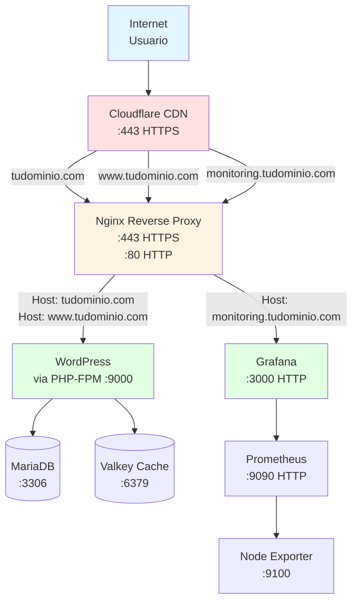

### Configuración de Virtual Hosts en Nginx

Ansible configura automáticamente 2 virtual hosts (server blocks):

#### 1. WordPress Virtual Host

**Archivo:** `/etc/nginx/sites-available/wordpress`

```nginx
server {
    listen 443 ssl http2;
    server_name tudominio.com www.tudominio.com;

    # SSL configurado por Ansible
    ssl_certificate /etc/letsencrypt/live/tudominio.com/fullchain.pem;
    ssl_certificate_key /etc/letsencrypt/live/tudominio.com/privkey.pem;

    root /var/www/html;
    index index.php;

    # Proxy a PHP-FPM para WordPress
    location ~ \.php$ {
        fastcgi_pass unix:/run/php/php8.2-fpm.sock;
        fastcgi_index index.php;
        include fastcgi_params;
    }

    # Caché estático (CSS, JS, imágenes)
    location ~* \.(jpg|jpeg|png|gif|ico|css|js|svg|woff|woff2)$ {
        expires 7d;
        add_header Cache-Control "public, immutable";
    }
}
```

**¿Qué hace?**

- Escucha en puerto 443 (HTTPS)
- Responde SOLO si el dominio es `tudominio.com` o `www.tudominio.com`
- Pasa peticiones PHP a PHP-FPM (puerto 9000)
- Sirve archivos estáticos directamente desde `/var/www/html`
- Cachea imágenes/CSS/JS por 7 días

#### 2. Grafana Virtual Host

**Archivo:** `/etc/nginx/sites-available/grafana`

```nginx
server {
    listen 443 ssl http2;
    server_name monitoring.tudominio.com;

    # SSL configurado por Ansible
    ssl_certificate /etc/letsencrypt/live/tudominio.com/fullchain.pem;
    ssl_certificate_key /etc/letsencrypt/live/tudominio.com/privkey.pem;

    # Reverse proxy a Grafana
    location / {
        proxy_pass http://127.0.0.1:3000;
        proxy_set_header Host $host;
        proxy_set_header X-Real-IP $remote_addr;
        proxy_set_header X-Forwarded-For $proxy_add_x_forwarded_for;
        proxy_set_header X-Forwarded-Proto $scheme;
    }
}
```

**¿Qué hace?**

- Escucha en puerto 443 (HTTPS)
- Responde SOLO si el dominio es `monitoring.tudominio.com`
- Reenvía TODO el tráfico a Grafana (localhost:3000)
- Preserva headers originales (IP del cliente, etc.)

### Flujo de una Petición

```mermaid
sequenceDiagram
    actor User as Usuario
    participant CF as Cloudflare
    participant Nginx as Nginx :443
    participant WP as WordPress/PHP
    participant Graf as Grafana :3000
    participant DB as MariaDB

    Note over User,DB: Petición a WordPress
    User->>CF: GET https://tudominio.com/
    CF->>Nginx: GET / (Host: tudominio.com)
    Nginx->>Nginx: Coincide virtual host WordPress
    Nginx->>WP: FastCGI a PHP-FPM
    WP->>DB: Query SQL
    DB-->>WP: Datos
    WP-->>Nginx: HTML generado
    Nginx-->>CF: HTML + Cache headers
    CF-->>User: Página cached

    Note over User,DB: Petición a Grafana
    User->>CF: GET https://monitoring.tudominio.com/
    CF->>Nginx: GET / (Host: monitoring.tudominio.com)
    Nginx->>Nginx: Coincide virtual host Grafana
    Nginx->>Graf: Proxy a :3000
    Graf-->>Nginx: Dashboard HTML
    Nginx-->>CF: HTML
    CF-->>User: Dashboard
```

### Puertos Internos vs Externos

**Puertos EXTERNOS (accesibles desde internet):**

```
443/TCP → Nginx HTTPS (todos los servicios)
 80/TCP → Nginx HTTP (redirect a HTTPS)
 22/TCP → SSH (SOLO desde tu IP)
```

**Puertos INTERNOS (solo localhost, NO accesibles):**

```
3000/TCP → Grafana (solo via Nginx proxy)
3306/TCP → MariaDB (solo desde localhost)
6379/TCP → Valkey/Redis (solo desde localhost)
9000/TCP → PHP-FPM (solo desde Nginx)
9090/TCP → Prometheus (solo desde Grafana/localhost)
9100/TCP → Node Exporter (solo desde Prometheus)
```

### Verificación de Configuración

Después del deployment, verificar Nginx:

```bash
# Conectar al servidor
ssh malpanez@tudominio.com

# Ver virtual hosts activos
sudo nginx -T | grep server_name
# Debe mostrar:
# server_name tudominio.com www.tudominio.com;
# server_name monitoring.tudominio.com;

# Ver puertos en escucha
sudo netstat -tlnp | grep nginx
# Debe mostrar:
# tcp  0.0.0.0:80   LISTEN  nginx
# tcp  0.0.0.0:443  LISTEN  nginx

# Ver backends escuchando
sudo netstat -tlnp | grep -E '(3000|3306|6379|9000|9090|9100)'
# Debe mostrar todos los servicios en 127.0.0.1

# Test de configuración Nginx
sudo nginx -t
# Debe retornar: syntax is ok, test is successful
```

### Resumen de Enrutamiento

| URL | DNS Apunta a | Nginx Server Block | Backend | Puerto Final |
|-----|--------------|-------------------|---------|--------------|
| `https://tudominio.com` | Server IP | wordpress | PHP-FPM | 9000 |
| `https://www.tudominio.com` | Server IP | wordpress | PHP-FPM | 9000 |
| `https://monitoring.tudominio.com` | Server IP | grafana | Grafana | 3000 |
| `http://tudominio.com` | Server IP | redirect | → HTTPS | 443 |

**TODO pasa por Nginx primero. Nginx es el único proceso escuchando en puertos 80/443.**

---

## Configuración Manual Requerida

### Servicios que se Instalan Automáticamente

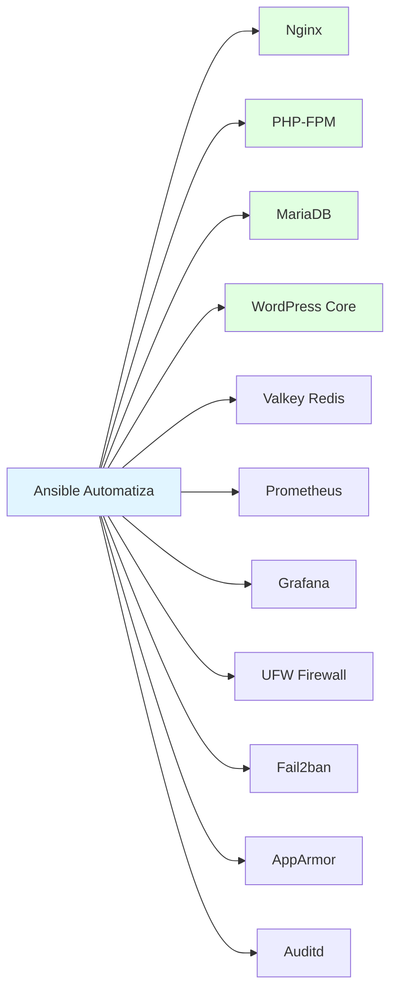

### Configuración Manual Necesaria

#### 1. DNS (Configurar ANTES del deployment)

```mermaid
flowchart TD
    A[Configurar DNS] --> B[Obtener Server IP]
    B --> C[Cloudflare Dashboard]
    C --> D[Añadir Registro A]
    D --> E[@/www → Server_IP]
    D --> F[monitoring → Server_IP]
    E --> G[Esperar propagación<br/>5-30 minutos]
    F --> G
    G --> H[Verificar: dig tudominio.com]

    style A fill:#fff4e1
    style H fill:#e1ffe1
```

**Registros DNS a crear:**

| Tipo | Nombre | Valor | Proxy | TTL |
|------|--------|-------|-------|-----|
| A | @ | IP_DEL_SERVIDOR | ✓ Proxied | Auto |
| A | www | IP_DEL_SERVIDOR | ✓ Proxied | Auto |
| A | monitoring | IP_DEL_SERVIDOR | ✗ DNS Only | Auto |
| CNAME | * | tudominio.com | ✗ DNS Only | Auto |

**Cloudflare: Configuración SSL/TLS:**

- SSL/TLS → Overview → **Full (strict)**
- SSL/TLS → Edge Certificates → Always Use HTTPS: **On**
- SSL/TLS → Edge Certificates → Automatic HTTPS Rewrites: **On**

#### 2. WordPress - Instalación y Configuración Inicial

```bash
# Acceder a WordPress
https://tudominio.com/wp-admin/install.php
```

**Wizard de instalación automático:**

1. Seleccionar idioma
2. Crear usuario administrador:
   - Usuario: admin (o tu preferencia)
   - Contraseña: (usa la de vault_wordpress_admin_password)
   - Email: <admin@tudominio.com>
3. Click "Install WordPress"

#### 3. LearnDash - Instalación Manual (OBLIGATORIA)

```mermaid
sequenceDiagram
    actor Admin
    participant WP as WordPress
    participant LD as LearnDash.com
    participant Server

    Admin->>LD: Comprar licencia ($199)
    LD-->>Admin: License key + download
    Admin->>WP: Plugins → Add New → Upload
    Admin->>WP: Subir learndash-xxx.zip
    WP->>Server: Instalar plugin
    Admin->>WP: Activate
    WP->>Admin: Pedir license key
    Admin->>WP: Introducir key
    WP->>LD: Validar licencia
    LD-->>WP: ✓ Activada
```

**Pasos detallados:**

1. **Comprar LearnDash:**
   - Ir a <https://www.learndash.com/pricing/>
   - Seleccionar plan (Basic $199/año)
   - Completar compra

2. **Descargar plugin:**
   - Login en learndash.com
   - My Account → Downloads
   - Descargar `learndash-xxx.zip`

3. **Instalar en WordPress:**

   ```
   WordPress Admin → Plugins → Add New → Upload Plugin
   ```

   - Seleccionar archivo .zip
   - Click "Install Now"
   - Click "Activate"

4. **Activar licencia:**

   ```
   LearnDash LMS → Settings → LMS License
   ```

   - Introducir License Email
   - Introducir License Key
   - Click "Update License"

#### 4. Plugins WordPress Recomendados (Instalación Manual)

**Seguridad:**

- **Wordfence Security** (Gratis) - WAF + Malware scanner
- **UpdraftPlus** (Gratis) - Backups a Cloudflare R2/S3

**Performance:**

- **WP Rocket** ($59/año) - Caché avanzado (opcional, Nginx ya cachea)
- **Imagify** (Gratis hasta 20MB/mes) - Optimización de imágenes

**LearnDash Extras:**

- **Uncanny Toolkit** (Gratis) - Mejoras UI para LearnDash
- **GamiPress** (Gratis) - Gamificación

**Email:**

- **WP Mail SMTP** (Gratis) - Configurar SendGrid/Mailgun

#### 5. Configuración SMTP (Para Emails)

```mermaid
graph TD
    A[Elegir Proveedor] --> B[SendGrid]
    A --> C[Mailgun]
    A --> D[Amazon SES]

    B --> E[Crear cuenta gratuita]
    C --> E
    D --> E

    E --> F[Generar API Key]
    F --> G[Instalar WP Mail SMTP]
    G --> H[Configurar credenciales]
    H --> I[Test email]

    style B fill:#e1ffe1
    style C fill:#e1ffe1
    style I fill:#fff4e1
```

**SendGrid (Recomendado - 100 emails/día gratis):**

1. Crear cuenta en <https://sendgrid.com>
2. Verificar dominio:
   - Settings → Sender Authentication → Authenticate Your Domain
   - Añadir registros DNS en Cloudflare
3. Crear API Key:
   - Settings → API Keys → Create API Key
   - Permisos: Mail Send → Full Access
4. Configurar WP Mail SMTP:

   ```
   WordPress → Settings → Email
   From Email: noreply@tudominio.com
   Mailer: SendGrid
   API Key: [tu-api-key]
   ```

#### 6. SSH 2FA - Configuración Personal

**TOTP (Google Authenticator):**

```bash
# Conectar al servidor
ssh malpanez@tudominio.com

# Generar código QR TOTP
google-authenticator

# Responder:
# - Time-based tokens: Yes
# - Update .google_authenticator: Yes
# - Disallow multiple uses: Yes
# - Rate limiting: Yes
# - Time skew: Yes

# Escanear QR con app:
# - Google Authenticator (iOS/Android)
# - Authy (iOS/Android/Desktop)
# - 1Password (con soporte TOTP)
```

**YubiKey (FIDO2) - Opcional:**

```bash
# Si tienes YubiKey, registrarla
ssh malpanez@tudominio.com

# Crear directorio si no existe
mkdir -p ~/.ssh

# Añadir tu clave pública YubiKey
nano ~/.ssh/authorized_keys
# Pegar contenido de yubikey_ed25519.pub

# Probar acceso con YubiKey
# (requerirá tocar YubiKey física)
```

### Puertos de Servicios

```mermaid
graph TB
    Internet[Internet] --> CF[Cloudflare]

    CF --> |443/HTTPS| Nginx
    CF --> |80/HTTP| Nginx

    Nginx --> WP[WordPress :9000]
    Nginx --> |Proxy| Graf[Grafana :3000]

    WP --> DB[MariaDB :3306]
    WP --> Cache[Valkey :6379]

    SSH[SSH :22] --> Server
    Prom[Prometheus :9090] --> Server
    Node[Node Exporter :9100] --> Server

    style Internet fill:#e1f5ff
    style CF fill:#ffe1e1
    style Nginx fill:#e1ffe1
    style Server fill:#fff4e1
```

**Puertos accesibles externamente:**

- `80/TCP` - HTTP (redirect a HTTPS)
- `443/TCP` - HTTPS (WordPress + Grafana)
- `22/TCP` - SSH (solo desde tu IP)

**Puertos internos (localhost only):**

- `3000/TCP` - Grafana (proxy via Nginx)
- `3306/TCP` - MariaDB
- `6379/TCP` - Valkey (Redis)
- `9000/TCP` - PHP-FPM
- `9090/TCP` - Prometheus
- `9100/TCP` - Node Exporter

---

## Verificación y Testing

### Checklist Post-Deployment

```mermaid
flowchart TD
    A[Inicio Verificación] --> B{Servidor pingable?}
    B -->|No| B1[Verificar Firewall/IP]
    B -->|Sí| C{SSH funciona?}
    C -->|No| C1[Verificar SSH keys]
    C -->|Sí| D{Nginx responde?}
    D -->|No| D1[systemctl status nginx]
    D -->|Sí| E{WordPress carga?}
    E -->|No| E1[Verificar PHP-FPM]
    E -->|Sí| F{DB conecta?}
    F -->|No| F1[Verificar MariaDB]
    F -->|Sí| G{Grafana accesible?}
    G -->|No| G1[Verificar Prometheus]
    G -->|Sí| H{SSL válido?}
    H -->|No| H1[Verificar Cloudflare]
    H -->|Sí| I[✓ Deployment OK]

    style I fill:#e1ffe1
```

**Script de verificación automática:**

```bash
#!/bin/bash
SERVER_IP="TU.IP.AQUI"
DOMAIN="tudominio.com"

echo "=== Verificación de Deployment ==="

# 1. Conectividad básica
echo "[1/8] Verificando conectividad..."
ping -c 2 ${SERVER_IP} &>/dev/null && echo "✓ Ping OK" || echo "✗ Ping FAIL"

# 2. SSH
echo "[2/8] Verificando SSH..."
ssh -o ConnectTimeout=5 malpanez@${SERVER_IP} 'echo "✓ SSH OK"' || echo "✗ SSH FAIL"

# 3. HTTP/HTTPS
echo "[3/8] Verificando Web..."
curl -sSf https://${DOMAIN} >/dev/null && echo "✓ HTTPS OK" || echo "✗ HTTPS FAIL"

# 4. WordPress admin
echo "[4/8] Verificando WordPress..."
curl -sSf https://${DOMAIN}/wp-admin/ >/dev/null && echo "✓ WP Admin OK" || echo "✗ WP Admin FAIL"

# 5. SSL Certificate
echo "[5/8] Verificando SSL..."
echo | openssl s_client -connect ${DOMAIN}:443 -servername ${DOMAIN} 2>/dev/null | \
  grep -q "Verify return code: 0" && echo "✓ SSL válido" || echo "✗ SSL inválido"

# 6. Servicios en el servidor
echo "[6/8] Verificando servicios..."
ssh malpanez@${SERVER_IP} '
  systemctl is-active --quiet nginx && echo "✓ Nginx activo" || echo "✗ Nginx inactivo"
  systemctl is-active --quiet mariadb && echo "✓ MariaDB activo" || echo "✗ MariaDB inactivo"
  systemctl is-active --quiet php8.2-fpm && echo "✓ PHP-FPM activo" || echo "✗ PHP-FPM inactivo"
  systemctl is-active --quiet prometheus && echo "✓ Prometheus activo" || echo "✗ Prometheus inactivo"
  systemctl is-active --quiet grafana-server && echo "✓ Grafana activo" || echo "✗ Grafana inactivo"
'

# 7. Firewall
echo "[7/8] Verificando firewall..."
ssh malpanez@${SERVER_IP} 'sudo ufw status | grep -q "Status: active"' && \
  echo "✓ UFW activo" || echo "✗ UFW inactivo"

# 8. Fail2ban
echo "[8/8] Verificando Fail2ban..."
ssh malpanez@${SERVER_IP} 'sudo fail2ban-client status | grep -q "Number of jail"' && \
  echo "✓ Fail2ban activo" || echo "✗ Fail2ban inactivo"

echo "=== Verificación completa ==="
```

### URLs de Acceso

| Servicio | URL | Credenciales |
|----------|-----|--------------|
| **WordPress Admin** | <https://tudominio.com/wp-admin> | Usuario: admin<br/>Pass: (vault) |
| **WordPress Site** | <https://tudominio.com> | Público |
| **Grafana** | <https://monitoring.tudominio.com> | Usuario: admin<br/>Pass: (vault) |
| **Prometheus** | <http://IP:9090> | Sin auth (local only) |

### Tests de Seguridad

**Verificar hardening:**

```bash
# Conectar al servidor
ssh malpanez@tudominio.com

# 1. Verificar auditd
sudo auditctl -l | wc -l
# Debe mostrar ~100+ reglas

# 2. Verificar AppArmor
sudo aa-status
# Debe mostrar profiles en enforce mode

# 3. Verificar Fail2ban
sudo fail2ban-client status sshd
# Debe mostrar jail activo

# 4. Verificar firewall
sudo ufw status verbose
# Debe mostrar reglas restrictivas

# 5. Test de permisos
ls -la /etc/ssh/sshd_config
# Debe ser: -rw------- root root

# 6. Verificar sysctl hardening
sudo sysctl net.ipv4.tcp_syncookies
# Debe retornar: net.ipv4.tcp_syncookies = 1
```

**Scan externo (desde tu máquina local):**

```bash
# Nmap scan
nmap -sV -p 22,80,443 tudominio.com

# Resultado esperado:
# 22/tcp   open  ssh
# 80/tcp   open  http
# 443/tcp  open  https
# Todos los demás puertos: filtered/closed
```

---

## Mantenimiento

### Backups

```mermaid
flowchart LR
    A[Datos a Respaldar] --> B[Database MySQL]
    A --> C[WordPress Files]
    A --> D[Nginx Config]
    A --> E[SSL Certificates]

    B --> F[mysqldump diario]
    C --> G[rsync/UpdraftPlus]
    D --> H[Ansible repo]
    E --> I[Auto-renovación]

    F --> J[Hetzner Volume]
    G --> J
    F --> K[Cloudflare R2]
    G --> K

    style J fill:#fff4e1
    style K fill:#e1ffe1
```

**Script de backup automático:**

```bash
# En el servidor: /usr/local/bin/backup.sh
#!/bin/bash
BACKUP_DIR="/mnt/backup"
DATE=$(date +%Y%m%d_%H%M%S)

# Database backup
mysqldump -u root wordpress_prod | gzip > \
  ${BACKUP_DIR}/db_${DATE}.sql.gz

# WordPress files
tar -czf ${BACKUP_DIR}/wp_${DATE}.tar.gz \
  /var/www/html

# Retener solo últimos 7 días
find ${BACKUP_DIR} -name "*.gz" -mtime +7 -delete

echo "Backup completado: ${DATE}"
```

**Cron para backups:**

```bash
# Crontab: backup diario a las 3 AM
0 3 * * * /usr/local/bin/backup.sh >> /var/log/backup.log 2>&1
```

### Actualizaciones

**WordPress (interfaz web):**

- Dashboard → Updates
- Actualizar automático para security patches
- Probar en staging antes de major updates

**Sistema operativo:**

```bash
# Actualizaciones automáticas configuradas por Ansible
# Ver: /etc/apt/apt.conf.d/50unattended-upgrades

# Manual updates:
sudo apt update
sudo apt upgrade -y
sudo apt autoremove -y
```

**Ansible roles:**

```bash
# Desde tu máquina local
cd hetzner-secure-infrastructure

# Actualizar roles
ansible-galaxy install -r ansible/requirements.yml --force

# Re-aplicar configuración
ansible-playbook -i ansible/inventory/production/hosts.yml \
  ansible/playbooks/site.yml \
  --ask-vault-pass
```

### Monitoreo

**Grafana Dashboards:**

1. **WordPress Performance:**
   - Acceder: <https://monitoring.tudominio.com>
   - Dashboard: "Node Exporter Full"
   - Métricas clave:
     - CPU usage < 70%
     - RAM usage < 80%
     - Disk I/O
     - Network traffic

2. **Alertas recomendadas:**
   - CPU > 80% por 5 minutos
   - RAM > 90% por 3 minutos
   - Disk > 85% full
   - Server down (ping fail)

**Logs a revisar:**

```bash
# WordPress
tail -f /var/log/nginx/access.log
tail -f /var/log/nginx/error.log
tail -f /var/www/html/wp-content/debug.log

# Seguridad
sudo tail -f /var/log/audit/audit.log
sudo tail -f /var/log/fail2ban.log
sudo journalctl -u sshd -f

# Sistema
sudo journalctl -xe
dmesg -T
```

### Troubleshooting Común

| Problema | Diagnóstico | Solución |
|----------|-------------|----------|
| **WordPress lento** | `top`, `htop` | Aumentar cache, optimizar DB |
| **502 Bad Gateway** | `systemctl status php8.2-fpm` | Reiniciar PHP-FPM |
| **SSH bloqueado** | Acceder via Hetzner Console | `sudo fail2ban-client unban TU_IP` |
| **Disco lleno** | `df -h`, `du -sh /*` | Limpiar backups antiguos |
| **SSL error** | Verificar Cloudflare SSL mode | Cambiar a "Full (strict)" |

---

## Soporte y Recursos

### Documentación

- **Este proyecto:** [TESTING.md](TESTING.md), [ARCHITECTURE.md](ARCHITECTURE.md)
- **Hetzner Cloud:** <https://docs.hetzner.com/cloud/>
- **Terraform:** <https://www.terraform.io/docs>
- **Ansible:** <https://docs.ansible.com>
- **WordPress:** <https://wordpress.org/support/>
- **LearnDash:** <https://www.learndash.com/support/>

### Comunidad

- **Hetzner Community:** <https://community.hetzner.com>
- **WordPress Forums:** <https://wordpress.org/support/forums/>
- **LearnDash Facebook Group:** <https://www.facebook.com/groups/learndash/>

---

## Resumen de Comandos Rápidos

```bash
# Deploy inicial
source .env
cd terraform/environments/production
terraform init && terraform apply
cd ../../..
ansible-playbook -i ansible/inventory/production/hosts.yml \
  ansible/playbooks/site.yml --ask-vault-pass

# Verificar servicios
ssh malpanez@tudominio.com 'systemctl status nginx mariadb php8.2-fpm'

# Ver logs
ssh malpanez@tudominio.com 'sudo tail -f /var/log/nginx/error.log'

# Backup manual
ssh malpanez@tudominio.com 'sudo /usr/local/bin/backup.sh'

# Actualizar configuración
ansible-playbook -i ansible/inventory/production/hosts.yml \
  ansible/playbooks/site.yml --ask-vault-pass --diff

# Destruir infraestructura (¡PELIGRO!)
cd terraform/environments/production
terraform destroy
```

---

**Última actualización:** 2025-12-27
**Versión:** 1.0.0
