# Mermaid Diagrams - Best Practices Guide

**Version:** 1.0.0
**Last Updated:** 2026-01-10
**Status:** Official Standard

---

## 🎯 Purpose

This guide ensures all Mermaid diagrams in this project are:

- **Neurodivergent-friendly** - Easy to understand for all cognitive styles
- **WCAG AAA compliant** - Accessible for color-blind and low-vision users
- **Professional quality** - Suitable for client presentations and documentation
- **Maintainable** - Consistent style across the entire codebase

---

## ✅ Golden Rules (MANDATORY)

### Rule #1: Keep It Simple

```
❌ BAD: Complex diagram with 25+ nodes
✅ GOOD: Multiple simple diagrams with 4-5 nodes each
```

**Maximum limits:**

- **Nodes per diagram:** 10-12 (ideal: 4-5)
- **Words per node:** 4-6 (ideal: 2-3)
- **Decisions per diagram:** 2-3 (ideal: 0-1)
- **Nesting levels:** 2 (ideal: 1)

**If you exceed these limits:** Divide into multiple diagrams.

### Rule #2: Use WCAG AAA Colors ONLY


**Approved palette:**

| Color Name | Fill | Stroke | Use Case |
|------------|------|--------|----------|
| Light Blue | `#E8F4FD` | `#1565C0` | Primary components, Internet |
| Light Green | `#E8F5E9` | `#2E7D32` | Success states, servers |
| Light Orange | `#FFF3E0` | `#E65100` | External services, CDN |
| Light Purple | `#F3E5F5` | `#6A1B9A` | Data layer, databases |
| Light Pink | `#FCE4EC` | `#C2185B` | Security, critical |

**Never use:**

- ❌ Bright saturated colors (`#FF0000`, `#00FF00`)
- ❌ Dark fills that reduce contrast
- ❌ Colors not in the approved palette

### Rule #3: Move Details to Tables

```
❌ BAD: Put technical specs in diagram nodes
✅ GOOD: Simple nodes + detailed table below
```

**Example - BAD:**

```mermaid
graph TD
    A[Nginx<br/>• FastCGI Cache<br/>• Gzip/Brotli<br/>• Security Headers<br/>• Rate Limiting]
```



**Example - GOOD:**


**Nginx Configuration:**

| Feature | Description |
|---------|-------------|
| FastCGI Cache | Page caching for WordPress |
| Gzip/Brotli | Compression for faster delivery |
| Security Headers | HSTS, CSP, X-Frame-Options |
| Rate Limiting | 10 req/s per IP |

---

## 📐 Diagram Types Guide

### When to Use Each Type

| Type | Best For | Max Nodes | Example Use Case |
|------|----------|-----------|------------------|
| `graph TB` | Hierarchies, architecture | 8-10 | System components |
| `graph LR` | Sequential flows | 6-8 | Data pipelines |
| `flowchart TD` | Decision trees | 10-12 | Deployment process |
| `sequenceDiagram` | Interactions over time | 8-10 steps | API request flow |
| `stateDiagram-v2` | State machines | 6-8 states | Deployment states |
| `erDiagram` | Database schemas | 8-10 entities | Data models |
| `gantt` | Timelines | 6-8 tasks | Project schedule |
| `pie` | Proportions | 4-6 slices | Cost breakdown |

### Type Selection Flowchart


---

## 🧠 Neurodivergent-Friendly Patterns

### Pattern 1: Divide Complex Diagrams

**BEFORE (❌ Overwhelming):**

- 1 diagram with 20 components
- Nested subgraphs 4 levels deep
- Impossible to understand quickly

**AFTER (✅ Clear):**

- Diagram 1: High-level overview (5 nodes)
- Diagram 2: Detail layer 1 (5 nodes)
- Diagram 3: Detail layer 2 (5 nodes)
- Tables: Technical specifications

### Pattern 2: Linear Flows

**BEFORE (❌ Confusing):**


Too many paths, hard to follow.

**AFTER (✅ Clear):**


Linear, easy to follow.

### Pattern 3: Consistent Node Shapes

**Use consistent shapes for consistent meanings:**

```mermaid
graph TB
    User[👥 User]
    Server[🖥️ Server]
    DB[(💾 Database)]
    Cache[(⚡ Cache)]
    External{{☁️ External}}

    User --> Server
    Server --> DB
    Server --> Cache
    Server -.-> External

    style User fill:#E8F4FD,stroke:#1565C0
    style Server fill:#E8F5E9,stroke:#2E7D32
    style DB fill:#F3E5F5,stroke:#6A1B9A
    style Cache fill:#F3E5F5,stroke:#6A1B9A
    style External fill:#FFF3E0,stroke:#E65100
```



**Shape legend:**

- `[Square]` - Standard component
- `[(Cylinder)]` - Database/storage
- `{{Diamond}}` - External service
- `((Circle))` - Start/end point
- `>Flag]` - Important milestone

### Pattern 4: Use Icons Sparingly

**Good icon use:**

```
✅ [👥 Users]       - Adds context without clutter
✅ [🖥️ Server]      - Universal symbols
✅ [💾 Database]    - Familiar metaphors
```

**Bad icon use:**

```
❌ [👥🔐🌐💻 Complex Node]  - Too many icons
❌ [Node ✨🚀⭐]           - Decorative only
```

**Rule:** Maximum 1 icon per node, only if it adds clarity.

---

## 🎨 Styling Guide

### Standard Styling Template


### Line Styles

| Style | Syntax | Meaning |
|-------|--------|---------|
| Solid arrow | `-->` | Primary flow |
| Dashed arrow | `-.->` | Secondary/optional |
| Thick arrow | `==>` | Critical path |
| Bidirectional | `<-->` | Two-way communication |
| No arrow | `---` | Association only |

### Font and Text

**DO:**

- Use sentence case: "User authentication"
- Keep labels short: "DB" not "Database Server Instance"
- Use line breaks sparingly: `<br/>` only if needed

**DON'T:**

- Use ALL CAPS (except acronyms)
- Use colors in text (use node fill instead)
- Use special characters unnecessarily

---

## 📝 Documentation Requirements

### Every Diagram Must Have

1. **Title/Heading** above diagram
2. **Context** - Brief explanation of what it shows
3. **Legend** (if using special symbols/colors)
4. **Supporting table** (for technical details)
5. **Rendering test** - View in GitHub to confirm it displays

### Example Structure

```markdown
## User Request Flow

This diagram shows how a user request travels through the system.

```mermaid
[... diagram here ...]
```

**Flow explanation:**

1. User sends HTTPS request to Cloudflare
2. Cloudflare filters and proxies to server
3. Server processes request and returns response

**Component details:**

| Component | Technology | Purpose |
|-----------|-----------|---------|
| Cloudflare | CDN | Edge caching, WAF |
| Server | Nginx | Web server |
```

---

## 🚫 Common Anti-Patterns to Avoid

### Anti-Pattern 1: The Information Dump

```mermaid
graph TD
    A[Component A<br/>• Feature 1<br/>• Feature 2<br/>• Feature 3<br/>• Feature 4<br/>• Feature 5<br/>• Configuration X<br/>• Configuration Y]
```



**Problem:** Too much text, unreadable.

**Solution:** Simple node + table.

### Anti-Pattern 2: The Spaghetti


**Problem:** Too many connections, hard to follow.

**Solution:** Break into linear steps or separate diagrams.

### Anti-Pattern 3: The Rainbow


**Problem:** Bright colors, not accessible.

**Solution:** Use WCAG AAA palette.

### Anti-Pattern 4: The Comparison Diagram


**Problem:** Comparisons work better as tables.

**Solution:** Use comparison table.

---

## ✅ Checklist Before Committing

Before adding or modifying a diagram, verify:

- [ ] Diagram has ≤10 nodes (ideal: 4-5)
- [ ] Each node has ≤4 words (ideal: 2-3)
- [ ] Uses WCAG AAA colors ONLY
- [ ] Has clear title and context
- [ ] Technical details moved to table
- [ ] Renders correctly on GitHub
- [ ] Follows linear flow (minimal branching)
- [ ] Icons used sparingly (max 1 per node)
- [ ] Consistent with other project diagrams
- [ ] No bright/saturated colors
- [ ] Includes legend if needed

---

## 📚 Additional Resources

- [Mermaid Official Docs](https://mermaid.js.org/)
- [WCAG 2.1 Color Contrast](https://www.w3.org/WAI/WCAG21/Understanding/contrast-minimum)
- [Neurodivergent Design Patterns](https://neurodiversity.design/)
- [Project Diagram Examples](../infrastructure/SYSTEM_OVERVIEW.md)

---

## 🔄 Version History

| Version | Date | Changes |
|---------|------|---------|
| 1.0.0 | 2026-01-10 | Initial guide based on major refactoring |

---

**This is a living document. Update as patterns evolve.**
