# Architecture Documentation

> **Detailed architecture diagrams and design decisions**

## Table of Contents

- [System Overview](#system-overview)
- [Infrastructure Layer](#infrastructure-layer)
- [Security Layer](#security-layer)
- [Monitoring Layer](#monitoring-layer)
- [Data Flow](#data-flow)
- [Network Architecture](#network-architecture)
- [Deployment Pipeline](#deployment-pipeline)

---

## System Overview

### High-Level Architecture

```mermaid
graph TB
    subgraph dev["👨‍💻 Development"]
        code["📝 Code<br/>(Terraform + Ansible)"]
        git["🔀 Git Repository<br/>(GitHub)"]
    end

    subgraph cicd["🔄 CI/CD Pipeline"]
        validate["✅ Validation<br/>(Format, Lint)"]
        security["🔒 Security Scan<br/>(TFSec, Checkov)"]
        test["🧪 Tests<br/>(Molecule)"]
    end

    subgraph provision["☁️ Infrastructure Provisioning"]
        tofu["💻 OpenTofu<br/>(Apply)"]
        vault["🔐 OpenBao<br/>(Secrets)"]
        hetzner["🖥️ Hetzner Cloud<br/>(Servers)"]
    end

    subgraph config["⚙️ Configuration Management"]
        ansible["🔧 Ansible<br/>(Hardening)"]
        roles["📦 Roles<br/>(Security, Monitoring)"]
    end

    subgraph runtime["🏃 Runtime"]
        servers["🖥️ Production Servers"]
        monitoring["📊 Monitoring<br/>(Prometheus)"]
        logs["📝 Logging<br/>(Rsyslog)"]
    end

    code --> git
    git --> validate
    validate --> security
    security --> test
    test --> tofu
    tofu --> vault
    vault --> hetzner
    hetzner --> ansible
    ansible --> roles
    roles --> servers
    servers --> monitoring
    servers --> logs

    style dev fill:#e3f2fd
    style cicd fill:#fff3e0
    style provision fill:#f3e5f5
    style config fill:#e8f5e9
    style runtime fill:#fce4ec
```

---

## Infrastructure Layer

### Terraform/OpenTofu Architecture

```mermaid
graph LR
    subgraph modules["📦 Terraform Modules"]
        server_mod["🖥️ hetzner-server<br/>• Server creation<br/>• Firewall rules<br/>• Volumes<br/>• Floating IPs"]
        network_mod["🌐 networking<br/>• VPC setup<br/>• Subnets<br/>• Routes"]
    end

    subgraph environments["🌍 Environments"]
        prod["🏭 Production<br/>• HA setup<br/>• Backups enabled<br/>• Monitoring"]
        staging["🧪 Staging<br/>• Testing<br/>• Pre-production"]
        dev["💻 Development<br/>• Experimental<br/>• Cost-optimized"]
    end

    subgraph backend["💾 State Backend"]
        openbao["🔐 OpenBao<br/>• Encrypted state<br/>• State locking<br/>• Version control"]
        local["💿 Local<br/>• Dev/testing<br/>• Fast iteration"]
    end

    server_mod --> prod
    server_mod --> staging
    server_mod --> dev
    network_mod --> prod

    prod --> openbao
    staging --> openbao
    dev --> local

    style modules fill:#e8f5e9
    style environments fill:#e3f2fd
    style backend fill:#fff3e0
```

### Ansible Role Architecture

```mermaid
graph TB
    subgraph playbooks["📖 Playbooks"]
        site["🎯 site.yml<br/>(Main playbook)"]
        monitoring_pb["📊 monitoring.yml"]
        security_pb["🔒 security.yml"]
    end

    subgraph roles["📦 Ansible Roles"]
        common["🔧 common<br/>• Base packages<br/>• Users<br/>• Timezone"]
        security["🔒 security-hardening<br/>• Kernel params<br/>• AIDE<br/>• Updates"]
        apparmor["🛡️ apparmor<br/>• SSH profile<br/>• Fail2ban profile"]
        ssh2fa["🔐 ssh-2fa<br/>• FIDO2<br/>• TOTP"]
        firewall["🔥 firewall<br/>• UFW rules<br/>• Rate limiting"]
        fail2ban["🚨 fail2ban<br/>• Auto-ban<br/>• Jails"]
        monitoring["📊 monitoring<br/>• Node Exporter<br/>• Prometheus"]
    end

    site --> common
    site --> security
    site --> apparmor
    site --> ssh2fa
    site --> firewall
    site --> fail2ban
    site --> monitoring

    security_pb --> security
    security_pb --> apparmor
    security_pb --> ssh2fa

    monitoring_pb --> monitoring

    style playbooks fill:#e8f5e9
    style roles fill:#e3f2fd
```

---

## Security Layer

### Authentication Flow

```mermaid
sequenceDiagram
    actor User as 👤 User
    participant SSH as 🔐 SSH Client
    participant Firewall as 🔥 Firewall
    participant Fail2ban as 🚨 Fail2ban
    participant SSHD as 🖥️ SSH Daemon
    participant AppArmor as 🛡️ AppArmor
    participant PAM as 🔑 PAM
    participant System as ⚙️ System

    User->>SSH: ssh user@server
    SSH->>Firewall: Connection attempt

    alt Rate limit exceeded
        Firewall-->>SSH: ❌ Connection refused
    else Allowed
        Firewall->>Fail2ban: Check IP reputation

        alt IP banned
            Fail2ban-->>SSH: ❌ Connection refused
        else IP clean
            Fail2ban->>SSHD: Forward connection
            SSHD->>AppArmor: Check permissions
            AppArmor->>SSHD: ✅ Allowed

            SSHD->>User: Request SSH key
            User->>SSH: Touch Yubikey (FIDO2)
            SSH->>SSHD: Signed challenge
            SSHD->>SSHD: Verify signature

            SSHD->>PAM: Request TOTP
            PAM->>User: "Verification code:"
            User->>PAM: 123456 (TOTP)
            PAM->>PAM: Verify TOTP

            alt Invalid TOTP
                PAM->>Fail2ban: Log failed attempt
                Fail2ban->>Fail2ban: Increment counter
                PAM-->>User: ❌ Access denied
            else Valid TOTP
                PAM->>System: Grant access
                System-->>User: ✅ Login successful
            end
        end
    end
```

### Security Controls Matrix

```mermaid
graph LR
    subgraph controls["🔒 Security Controls"]
        subgraph preventive["🛡️ Preventive"]
            firewall_ctrl["🔥 Firewall"]
            auth_ctrl["🔐 Strong Auth"]
            mac_ctrl["🔒 AppArmor"]
        end

        subgraph detective["🔍 Detective"]
            ids_ctrl["🚨 Fail2ban"]
            fim_ctrl["📁 AIDE"]
            logs_ctrl["📝 Audit Logs"]
        end

        subgraph responsive["⚡ Responsive"]
            autoban_ctrl["🚫 Auto-ban"]
            alerts_ctrl["🔔 Alerts"]
            backup_ctrl["💾 Backups"]
        end
    end

    subgraph threats["⚠️ Threats"]
        brute["🔨 Brute Force"]
        exploit["💣 Exploits"]
        privesc["⬆️ Privilege Escalation"]
        data_loss["💔 Data Loss"]
    end

    firewall_ctrl -.->|blocks| brute
    auth_ctrl -.->|prevents| brute
    ids_ctrl -.->|detects| brute
    autoban_ctrl -.->|responds| brute

    mac_ctrl -.->|prevents| exploit
    mac_ctrl -.->|prevents| privesc
    fim_ctrl -.->|detects| exploit

    backup_ctrl -.->|recovers| data_loss
    logs_ctrl -.->|audits| privesc
    alerts_ctrl -.->|notifies| exploit

    style controls fill:#e8f5e9
    style threats fill:#ffebee
```

---

## Monitoring Layer

### Monitoring Architecture (Option 1: Dedicated Server)

```mermaid
graph TB
    subgraph app_servers["🖥️ Application Servers"]
        app1["App Server 1<br/>📡 Node Exporter :9100"]
        app2["App Server 2<br/>📡 Node Exporter :9100"]
        app3["App Server N<br/>📡 Node Exporter :9100"]
    end

    subgraph monitoring["📊 Monitoring Server"]
        prometheus["📈 Prometheus :9090<br/>• Scrape metrics (15s)<br/>• 15 days retention<br/>• Alert rules"]
        grafana["📊 Grafana :3000<br/>• Dashboards<br/>• Visualization<br/>• User access"]
        alertmanager["🔔 Alertmanager :9093<br/>• Email alerts<br/>• Slack/Discord<br/>• PagerDuty"]
        loki["📝 Loki :3100<br/>• Log aggregation<br/>• Log queries"]
    end

    subgraph alerts["🔔 Alert Channels"]
        email["📧 Email"]
        slack["💬 Slack"]
        pagerduty["📟 PagerDuty"]
    end

    app1 -->|metrics| prometheus
    app2 -->|metrics| prometheus
    app3 -->|metrics| prometheus

    app1 -.->|logs| loki
    app2 -.->|logs| loki
    app3 -.->|logs| loki

    prometheus --> grafana
    prometheus --> alertmanager
    loki --> grafana

    alertmanager --> email
    alertmanager --> slack
    alertmanager --> pagerduty

    style app_servers fill:#e3f2fd
    style monitoring fill:#e8f5e9
    style alerts fill:#fff3e0
```

---

## Data Flow

### Deployment Flow

---

## Network Architecture

### Network Topology

```mermaid
graph TB
    subgraph internet["🌐 Internet"]
        users["👥 Users"]
        admin["👤 Admin"]
    end

    subgraph hetzner["☁️ Hetzner Cloud"]
        subgraph firewall["🛡️ Cloud Firewall"]
            fw_rules["📋 Firewall Rules<br/>• SSH: 22 (limited)<br/>• HTTP: 80<br/>• HTTPS: 443"]
        end

        subgraph servers["🖥️ Servers"]
            subgraph prod_net["🏭 Production Network"]
                prod1["🖥️ App Server 1<br/>10.0.1.10"]
                prod2["🖥️ App Server 2<br/>10.0.1.11"]
                lb["⚖️ Load Balancer<br/>10.0.1.5"]
            end

            subgraph mon_net["📊 Monitoring Network"]
                mon["📊 Monitoring Server<br/>10.0.2.10"]
            end
        end

        subgraph storage["💾 Storage"]
            volumes["📦 Volumes<br/>• Persistent data<br/>• Backups"]
            snapshots["📸 Snapshots<br/>• Weekly backups"]
        end
    end

    subgraph external["🌍 External Services"]
        backup_s3["☁️ S3 Backup<br/>(Restic)"]
        grafana_cloud["☁️ Grafana Cloud<br/>(Optional)"]
    end

    users -->|HTTPS| firewall
    admin -->|SSH + 2FA| firewall

    firewall --> lb
    lb --> prod1
    lb --> prod2

    firewall -.->|monitoring| mon
    prod1 -->|metrics| mon
    prod2 -->|metrics| mon

    prod1 --> volumes
    prod2 --> volumes
    volumes --> snapshots

    servers -.->|encrypted| backup_s3
    mon -.->|metrics| grafana_cloud

    style internet fill:#e3f2fd
    style hetzner fill:#e8f5e9
    style external fill:#fff3e0
    style firewall fill:#ffebee
```

---

## Deployment Pipeline

### Infrastructure Lifecycle

```mermaid
stateDiagram-v2
    [*] --> Planning: New Infrastructure

    Planning --> Development: Design Complete
    Development --> Validation: Code Ready

    Validation --> SecurityScan: Format OK
    SecurityScan --> Testing: No Vulnerabilities
    Testing --> Review: Tests Pass

    Review --> Approved: PR Approved
    Review --> Development: Changes Requested

    Approved --> Staging: Deploy to Staging
    Staging --> StagingTest: Staging Running

    StagingTest --> Production: Tests Pass
    StagingTest --> Development: Tests Fail

    Production --> Monitoring: Deployed
    Monitoring --> Healthy: All Checks Pass
    Monitoring --> Incident: Issues Detected

    Incident --> Investigation: Alert Triggered
    Investigation --> Hotfix: Root Cause Found
    Hotfix --> Production: Fix Applied

    Healthy --> [*]: Stable

    note right of Planning
        • Requirements gathering
        • Architecture design
        • Cost estimation
    end note

    note right of Validation
        • terraform validate
        • terraform fmt
        • tflint
    end note

    note right of SecurityScan
        • TFSec
        • Checkov
        • Trivy
        • GitLeaks
    end note
```

---

## Component Interaction

### Service Dependencies

```mermaid
graph TB
    subgraph core["🎯 Core Services"]
        ssh["🔐 SSH Daemon<br/>(Port 22)"]
        app["⚙️ Application<br/>(Port 80/443)"]
    end

    subgraph security["🔒 Security Services"]
        ufw["🔥 UFW Firewall"]
        fail2ban["🚨 Fail2ban"]
        apparmor["🛡️ AppArmor"]
    end

    subgraph monitoring["📊 Monitoring Services"]
        node_exp["📡 Node Exporter<br/>(Port 9100)"]
        rsyslog["📝 Rsyslog"]
    end

    subgraph system["⚙️ System Services"]
        systemd["🔧 Systemd"]
        pam["🔑 PAM"]
        auditd["📋 Auditd"]
    end

    ufw -->|protects| ssh
    ufw -->|protects| app
    fail2ban -->|monitors| ssh
    fail2ban -->|updates| ufw
    apparmor -->|confines| ssh
    apparmor -->|confines| fail2ban

    ssh --> pam
    pam -->|logs| rsyslog
    pam -->|logs| auditd

    node_exp -->|collects| systemd
    node_exp -->|exposes| monitoring
    rsyslog -->|aggregates| monitoring
    auditd -->|sends| rsyslog

    systemd -->|manages| ssh
    systemd -->|manages| app
    systemd -->|manages| fail2ban
    systemd -->|manages| node_exp

    style core fill:#e8f5e9
    style security fill:#ffebee
    style monitoring fill:#e3f2fd
    style system fill:#fff3e0
```

---

## Design Decisions

### Architecture Decision Records (ADRs)

#### ADR-001: Use OpenTofu instead of Terraform

**Status:** Accepted

**Context:** Need open-source infrastructure provisioning tool

**Decision:** Use OpenTofu (Terraform fork) for full open-source stack

**Consequences:**
- ✅ No vendor lock-in
- ✅ Community-driven development
- ✅ Compatible with Terraform modules
- ⚠️ Smaller ecosystem than Terraform

#### ADR-002: Defense in Depth Security Model

**Status:** Accepted

**Context:** Need enterprise-grade security

**Decision:** Implement 6-layer defense in depth

**Consequences:**
- ✅ Multiple failure points required for breach
- ✅ Compliant with CIS benchmarks
- ⚠️ More complex to manage

#### ADR-003: Ansible for Configuration Management

**Status:** Accepted

**Context:** Need to harden servers after provisioning

**Decision:** Use Ansible with custom roles

**Consequences:**
- ✅ Idempotent operations
- ✅ Easy to audit and version control
- ✅ Large community and module ecosystem
- ⚠️ Requires Python on targets

---

**Document Version:** 1.0.0
**Last Updated:** 2025-12-25
**Maintained by:** DevOps Team
