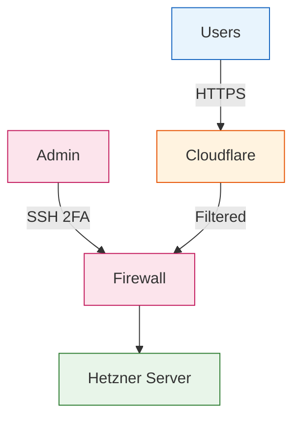
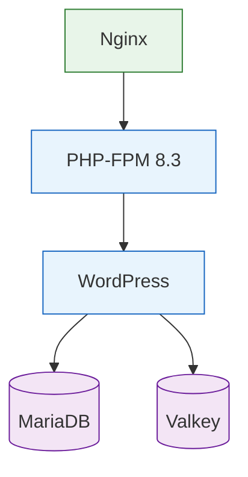
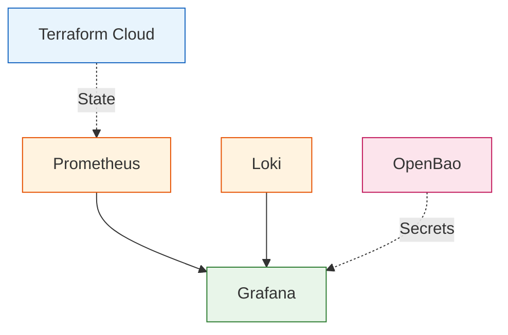

# Arquitectura Final - Hetzner Secure Infrastructure

> **Resumen completo de la arquitectura de infraestructura segura para WordPress LMS en Hetzner Cloud**

Última actualización: 2026-01-09

---

## Tabla de Contenidos

- [Stack Tecnológico](#stack-tecnológico)
- [Diagrama de Arquitectura](#diagrama-de-arquitectura)
- [Componentes Principales](#componentes-principales)
- [Monitoring y Observabilidad](#monitoring-y-observabilidad)
- [Gestión de Secretos](#gestión-de-secretos)
- [Costos Mensuales](#costos-mensuales)
- [Decisiones de Diseño](#decisiones-de-diseño)
- [Migraciones Completadas](#migraciones-completadas)

---

## Stack Tecnológico

### Sistema Base

- **OS**: Debian 13 (Trixie)
- **Gestión de configuración**: Ansible
- **Infraestructura como código**: OpenTofu (Terraform fork)
- **Formato de repositorios**: DEB822 (modern Debian format)

### Aplicación

- **Web Server**: Nginx (latest)
- **PHP**: PHP 8.3 FPM
- **Database**: MariaDB 10.11+
- **Cache**: Valkey 8.0 (Redis fork, Linux Foundation)
- **CMS**: WordPress 6.x + Tutor LMS

### Monitoring Stack

- **Metrics**: Prometheus (APT official repo)
- **Logs**: Loki + Promtail (Grafana Labs APT repo)
- **Visualization**: Grafana (APT official repo)
- **Exporters**:
  - Node Exporter (system metrics)
  - Nginx Exporter (web server metrics)
  - PHP-FPM Exporter (PHP process metrics)
  - MariaDB Exporter (database metrics)
  - Valkey Exporter (cache metrics)
  - Blackbox Exporter (SSL/HTTP probes)

### Security & Secrets

- **Secrets Management**: OpenBao 2.0 (Vault fork)
- **Firewall**: UFW + Hetzner Cloud Firewall
- **Intrusion Detection**: Fail2ban
- **SSL/TLS**: Let's Encrypt (Certbot DNS-01 via Cloudflare)
- **DNS**: Cloudflare

---

## Arquitectura Final (3 Diagramas)

La arquitectura completa se divide en 3 vistas para facilitar la comprensión.

### Vista 1: Edge Layer (Internet a Servidor)



#### Componentes Edge Layer

| Componente | Función | Detalles |
|------------|---------|----------|
| **Users** | Visitantes y estudiantes | Acceso global HTTPS |
| **Admin** | Administrador del sistema | SSH con 2FA (TOTP + Yubikey) |
| **Cloudflare** | CDN + Protección | DNS, WAF, DDoS, SSL |
| **Firewall** | Hetzner Cloud Firewall | Reglas por IP y puerto |
| **Server** | CAX11 (2 vCPU, 4GB RAM) | Hetzner Nuremberg |

### Vista 2: Server Stack (Aplicación)



#### Componentes Application Stack

| Servicio | Puerto | Función |
|----------|--------|---------|
| **Nginx** | 80, 443 | Web server, reverse proxy |
| **PHP-FPM** | 9000 | Application runtime |
| **WordPress** | - | CMS + Tutor LMS |
| **MariaDB** | 3306 | Database (localhost only) |
| **Valkey** | 6379 | Object cache (Unix socket) |

#### Monitoring Exporters

| Exporter | Puerto | Métricas |
|----------|--------|----------|
| Node Exporter | 9100 | CPU, RAM, Disk, Network |
| Nginx Exporter | 9113 | Requests, connections |
| PHP-FPM Exporter | 9253 | Processes, pool status |
| MariaDB Exporter | 9104 | Queries, connections |
| Valkey Exporter | 9121 | Cache hits, memory |

### Vista 3: Monitoring y External Services



#### Servicios de Monitoring

| Servicio | Puerto | Función | Retención |
|----------|--------|---------|-----------|
| **Prometheus** | 9090 | Metrics collector | 30 días |
| **Loki** | 3100 | Log aggregation | 30 días |
| **Promtail** | - | Log shipper | - |
| **Grafana** | 3000 | Visualization | - |

#### Servicios Externos

| Servicio | Función | Plan |
|----------|---------|------|
| **Terraform Cloud** | State backend + secrets | Free |
| **OpenBao** | Secrets management | Opcional (CAX11 +€4.05/mes) |
| **Cloudflare** | DNS + CDN + DDoS | Free |

---

## Componentes Principales

### 1. WordPress Server (CAX11)

**Especificaciones:**

- **CPU**: 2 vCPUs AMD/Intel
- **RAM**: 4 GB
- **Disco**: 40 GB SSD (+ 20 GB volume)
- **Tráfico**: 20 TB/mes
- **Costo**: €4.05/mes + €2.40/mes volume = **€6.45/mes**

**Servicios instalados:**

- ✅ Nginx (web server)
- ✅ PHP 8.3 FPM (application runtime)
- ✅ MariaDB 10.11+ (database)
- ✅ Valkey 8.0 (cache, socket Unix)
- ✅ WordPress + Tutor LMS
- ✅ Certbot DNS-01 (SSL automation)
- ✅ UFW + Fail2ban (security)

**Exporters para Prometheus:**

- Node Exporter :9100 (CPU, memoria, disco, red)
- Nginx Exporter :9113 (requests, connections, status)
- PHP-FPM Exporter :9253 (procesos, pool, slow requests)
- MariaDB Exporter :9104 (queries, connections, InnoDB)
- Valkey Exporter :9121 (cache hits, evictions, memoria)
- Blackbox Exporter :9115 (SSL expiry, HTTP health)

### 2. Monitoring Stack (mismo servidor CAX11)

**Prometheus**

- Puerto: 9090
- Retención: 30 días
- Scrape interval: 15s
- Instalación: APT oficial (Prometheus Community)
- Repositorio: `https://s3.amazonaws.com/deb.robustperception.io/debian`
- Formato: DEB822

**Loki**

- Puerto: 3100
- Retención: 30 días (720h) - configurable hasta 90 días
- Compresión: gzip
- Instalación: APT oficial (Grafana Labs)
- Repositorio: `https://apt.grafana.com`
- Formato: DEB822
- Consumo estimado: ~150 MB RAM, ~600-900 MB disco (30 días)

**Promtail**

- Recopila logs de:
  - Nginx (access + error)
  - PHP-FPM (error + slow)
  - MariaDB (error + slow queries)
  - WordPress (debug.log)
  - Syslog
  - Auth (SSH logins)
  - Fail2ban (bans)
- Instalación: APT oficial (Grafana Labs)

**Grafana**

- Puerto: 3000
- Datasources: Prometheus (metrics) + Loki (logs)
- Dashboards precargados:
  - Node Exporter Full
  - Nginx Dashboard
  - PHP-FPM Dashboard
  - MariaDB Overview
  - Valkey Dashboard
  - Loki Logs Dashboard
  - SSL Certificate Monitoring
- Instalación: APT oficial (Grafana Labs)

**Alertas configuradas:**

- System: CPU, memoria, disco, instancia down
- Nginx: high error rate, high connections, connection drops
- PHP-FPM: max children reached, slow requests, high queue
- MariaDB: high connections, slow queries, replication lag
- Valkey: high eviction, low cache hit rate, rejected connections
- SSL: certificate expiring (14/7 days), certificate expired

### 3. Valkey (Cache Layer)

**¿Qué es Valkey?**

- Fork 100% compatible con Redis
- Mantenido por Linux Foundation
- Licencia BSD (open-source real)
- Sin riesgos de cambios de licencia

**Configuración:**

- Puerto: 6379 (localhost only)
- Socket Unix: `/var/run/valkey/valkey.sock` (recomendado para WordPress)
- Memoria máxima: 256 MB (ajustable)
- Política de eviction: `allkeys-lru`
- Persistencia: RDB snapshots
- Backup: diario, retención 7 días
- Instalación: **APT oficial Debian/Ubuntu**

**WordPress Integration:**

- Plugin: Redis Object Cache (100% compatible)
- Conexión: Unix socket (más rápido que TCP)
- Usuario: `www-data` en grupo `valkey`

### 4. OpenBao (Secrets Management)

**¿Qué es OpenBao?**

- Fork open-source de HashiCorp Vault
- Gestión centralizada de secretos
- Cifrado en reposo y tránsito
- Auditoría completa

**Deployment Options:**

#### Opción 1: Servidor separado (Recomendado para producción)

- **Server**: CAX11 (€4.05/mes)
- **Volume**: 10 GB (€1.20/mes)
- **Backups**: €0.76/mes
- **Total**: €5.75/mes
- **Ventajas**: Seguridad óptima, escalabilidad, aislamiento
- **Cuándo**: Producción, múltiples servidores

#### Opción 2: Mismo servidor (Development)

- **Costo**: €0 extra
- **Ventajas**: Simple, sin costos adicionales
- **Desventajas**: Menos seguro, recursos compartidos
- **Cuándo**: Desarrollo, single server, presupuesto limitado

#### Opción 3: Terraform Cloud (Secrets Management)

- **Costo**: Gratis para state backend + secrets
- **Ventajas**: Sin gestión, integración nativa con Terraform
- **Cuándo**: Usar para secretos de infraestructura (API tokens, etc.)

**Decisión recomendada para tu caso:**

- **Terraform Cloud**: Para secretos de infraestructura (Hetzner API, Cloudflare API)
- **Ansible Vault**: Para secretos de aplicación (WordPress, MariaDB passwords)
- **OpenBao**: Opcional, solo si necesitas rotación automática de secretos o múltiples aplicaciones

**Casos de uso OpenBao:**

- Rotación automática de passwords de BD
- Secretos compartidos entre múltiples servidores
- Cumplimiento normativo (auditoría detallada)
- Secrets as a Service para desarrolladores

---

## Monitoring y Observabilidad

### Métricas (Prometheus)

**System Metrics (Node Exporter):**

```promql
# CPU usage
100 - (avg by (instance) (irate(node_cpu_seconds_total{mode="idle"}[5m])) * 100)

# Memory usage
(1 - (node_memory_MemAvailable_bytes / node_memory_MemTotal_bytes)) * 100

# Disk usage
(1 - (node_filesystem_avail_bytes / node_filesystem_size_bytes)) * 100
```

**Nginx Metrics:**

```promql
# Request rate
rate(nginx_http_requests_total[5m])

# Error rate
rate(nginx_http_requests_total{status=~"5.."}[5m])

# Active connections
nginx_connections_active
```

**PHP-FPM Metrics:**

```promql
# Process usage
(phpfpm_active_processes / phpfpm_max_children) * 100

# Slow requests
rate(phpfpm_slow_requests_total[5m])

# Queue length
phpfpm_listen_queue
```

**MariaDB Metrics:**

```promql
# Connection usage
(mysql_global_status_threads_connected / mysql_global_variables_max_connections) * 100

# Query rate
rate(mysql_global_status_queries[5m])

# Slow queries
rate(mysql_global_status_slow_queries[5m])
```

**Valkey Metrics:**

```promql
# Memory usage
(redis_memory_used_bytes / redis_memory_max_bytes) * 100

# Cache hit rate
rate(redis_keyspace_hits_total[5m]) / (rate(redis_keyspace_hits_total[5m]) + rate(redis_keyspace_misses_total[5m]))

# Eviction rate
rate(redis_evicted_keys_total[5m])
```

### Logs (Loki)

**LogQL Queries:**

```logql
# Nginx 5xx errors en última hora
{job="nginx", type="error"} |~ "50[0-9]" | json | line_format "{{.time}} {{.status}} {{.request}}"

# PHP slow requests
{job="php-fpm"} |~ "pool.*slow request"

# MariaDB slow queries
{job="mariadb"} |= "Query_time" | logfmt | Query_time > 1

# WordPress errors
{job="wordpress"} |~ "Fatal error|Warning"

# Failed SSH logins
{job="auth"} |~ "Failed password"

# Fail2ban bans
{job="fail2ban"} |= "Ban"
```

### Dashboards Grafana

**Precargados:**

1. **Node Exporter Full** (ID: 1860) - Métricas de sistema completas
2. **Nginx Dashboard** (ID: 12708) - Requests, connections, upstream
3. **PHP-FPM Dashboard** (ID: 12835) - Procesos, pools, workers
4. **MariaDB Overview** (ID: 7362) - Queries, InnoDB, connections
5. **Valkey Dashboard** (ID: 11835) - Cache, memoria, comandos
6. **Loki Logs** (ID: 13639) - Logs centralizados con búsqueda
7. **SSL Certificates** (custom) - Monitoreo de expiración

### Retention Policies

**Prometheus:**

- Retención: 30 días
- Espacio estimado: ~5-10 GB (dependiendo del número de métricas)

**Loki:**

- Retención: 30 días (configurable a 90 días)
- Espacio estimado: 600-900 MB (30 días)
- Compresión: gzip (70-80% reducción)

**Logrotate:**

- Nginx: 14 días
- PHP-FPM: 14 días
- MariaDB: 7 días
- Syslog: 7 días
- Fail2ban: 7 días

---

## Gestión de Secretos

### Terraform Cloud (Recomendado para infraestructura)

**Uso:**

- State backend de Terraform
- Secretos de infraestructura (API tokens)
- Variables de entorno
- Workspace management

**Ventajas:**

- ✅ Gratis para uso individual
- ✅ State encryption automática
- ✅ Locking distribuido
- ✅ UI para gestión de variables
- ✅ Historial de cambios

**Setup:**

```bash
# ~/.terraformrc
credentials "app.terraform.io" {
  token = "your-token"
}

# terraform/environments/production/backend.tf
terraform {
  cloud {
    organization = "your-org"
    workspaces {
      name = "hetzner-production"
    }
  }
}
```

### Ansible Vault (Para secretos de aplicación)

**Uso:**

- Passwords de MariaDB
- Passwords de WordPress
- Claves API de plugins
- Configuración sensible

**Ejemplo:**

```yaml
# ansible/inventory/group_vars/all/secrets.yml (encriptado)
vault_mariadb_root_password: "secure-password"
vault_wordpress_db_password: "secure-password"
vault_wordpress_auth_key: "random-key"
vault_wordpress_secure_auth_key: "random-key"
```

**Comandos:**

```bash
# Crear archivo de secretos
ansible-vault create ansible/inventory/group_vars/all/secrets.yml

# Editar secretos
ansible-vault edit ansible/inventory/group_vars/all/secrets.yml

# Ejecutar playbook con secretos
ansible-playbook site.yml --ask-vault-pass
```

### OpenBao (Opcional - Advanced)

**Cuándo usar:**

- Múltiples servidores accediendo a secretos compartidos
- Rotación automática de passwords
- Cumplimiento normativo (auditoría)
- Secrets as a Service

**Cuándo NO usar:**

- Single server simple
- Presupuesto muy limitado
- No necesitas rotación automática
- Ansible Vault es suficiente

---

## Costos Mensuales

### Opción 1: Setup Básico (Single Server)

| Componente | Especificaciones | Costo |
|------------|-----------------|-------|
| WordPress Server (CAX11) | 2 vCPU, 4 GB RAM, 40 GB | €4.05 |
| Volume (WordPress data) | 20 GB SSD | €2.40 |
| Backups | 7 snapshots | €1.17 |
| Domain | Cloudflare (transferido) | €13.05/año = €1.09/mes |
| **TOTAL** | | **€8.71/mes** |

### Opción 2: Con OpenBao Separado (Production)

| Componente | Especificaciones | Costo |
|------------|-----------------|-------|
| WordPress Server (CAX11) | 2 vCPU, 4 GB RAM, 40 GB | €4.05 |
| Volume (WordPress data) | 20 GB SSD | €2.40 |
| OpenBao Server (CAX11) | 2 vCPU, 4 GB RAM, 20 GB | €4.05 |
| Volume (OpenBao data) | 10 GB SSD | €1.20 |
| Backups (WordPress) | 7 snapshots | €1.17 |
| Backups (OpenBao) | 7 snapshots | €0.76 |
| Domain | Cloudflare (transferido) | €13.05/año = €1.09/mes |
| **TOTAL** | | **€14.72/mes** |

### Opción 3: Escalado (3-4 servidores)

| Componente | Especificaciones | Costo |
|------------|-----------------|-------|
| Load Balancer | Hetzner LB | Ver pricing |
| WordPress Servers (2x CAX11) | 2 vCPU, 4 GB cada uno | €8.10 |
| Database Server (CAX11) | Dedicated MariaDB | €4.05 |
| Monitoring Server (CAX11) | Prometheus + Grafana | €4.05 |
| OpenBao Server (CAX11) | Secrets management | €4.05 |
| Volumes (60 GB total) | SSD storage | €7.20 |
| Backups | Multiple snapshots | €4.50 |
| Domain | Cloudflare | €1.09/mes |
| **TOTAL** | | **€33.04/mes + LB** |

### Comparativa con Alternativas

| Proveedor | Configuración similar | Costo/mes |
|-----------|----------------------|-----------|
| **Hetzner (nuestra config)** | CAX11 + monitoring | **€8.71** |
| AWS | t3.medium + RDS + CloudWatch | ~€65 |
| DigitalOcean | Droplet + DB + Monitoring | ~€45 |
| GCP | e2-medium + Cloud SQL | ~€70 |
| Kinsta (WordPress managed) | Starter plan | €35 |
| WP Engine | Startup plan | €25 |

**Ahorro vs alternativas**: 50-85%

---

## Decisiones de Diseño

### 1. ¿Por qué Valkey en lugar de Redis?

**Decisión**: Valkey 8.0

**Razones:**

- ✅ **Open-source real**: Licencia BSD, sin restricciones
- ✅ **Gobernanza neutral**: Linux Foundation (no vendor lock-in)
- ✅ **100% compatible**: Drop-in replacement para Redis
- ✅ **Futuro garantizado**: Desarrollo activo, comunidad fuerte
- ✅ **Repositorios oficiales**: APT packages en Debian/Ubuntu

**Vs Redis:**

- ❌ Redis cambió a licencia BSL (no open-source)
- ❌ Controlled por Redis Ltd. (vendor lock-in potencial)
- ❌ Futuras versiones pueden tener restricciones

### 2. ¿Por qué Loki en lugar de ELK Stack?

**Decisión**: Loki + Promtail

**Razones:**

- ✅ **Lightweight**: ~150 MB RAM vs ~2 GB Elasticsearch
- ✅ **Costo-eficiente**: Storage comprimido (70-80% reducción)
- ✅ **Integración nativa**: Misma stack que Prometheus (Grafana)
- ✅ **Simple**: Sin necesidad de indices complejos
- ✅ **Query language**: LogQL similar a PromQL

**Vs ELK Stack:**

- ❌ Elasticsearch: 2-4 GB RAM mínimo
- ❌ Kibana: 1-2 GB RAM adicional
- ❌ Logstash: Complejo de configurar
- ❌ Total: ~4-6 GB RAM solo para logs (insostenible en CAX11)

### 3. ¿Por qué DEB822 format?

**Decisión**: Migrar todos los roles a DEB822

**Razones:**

- ✅ **Formato moderno**: Debian 11+ official format
- ✅ **Más seguro**: GPG keys en `/etc/apt/keyrings/`
- ✅ **Mejor estructura**: Archivos `.sources` más legibles
- ✅ **Deprecation warning**: `apt_key` deprecated en Ansible
- ✅ **Future-proof**: Preparado para Debian 13+

**Roles migrados:**

- ✅ Grafana (apt.grafana.com)
- ✅ Loki (apt.grafana.com)
- ✅ Promtail (apt.grafana.com)
- ✅ Prometheus (deb.robustperception.io)
- ✅ Node Exporter (deb.robustperception.io)

### 4. ¿Por qué APT packages en lugar de binarios?

**Decisión**: Usar repositorios oficiales APT siempre que sea posible

**Razones:**

- ✅ **Gestión automática**: Users, groups, paths, logrotate
- ✅ **Systemd services**: Pre-configurados y hardened
- ✅ **Updates sencillas**: `apt upgrade`
- ✅ **Seguridad**: GPG signed packages
- ✅ **Consistencia**: Mismo método para todos los componentes

**Antes (binarios manuales):**

```yaml
- Download from GitHub
- Extract tar.gz
- Create user manually
- Create systemd service manually
- Configure logrotate manually
- Manage permissions manually
```

**Ahora (APT):**

```yaml
- Add repository (DEB822)
- apt install package
- Everything configured automatically
```

### 5. ¿Terraform Cloud o Backend local?

**Decisión**: Terraform Cloud (free tier)

**Razones:**

- ✅ **Gratis**: Para uso individual/small teams
- ✅ **Seguro**: State encriptado automáticamente
- ✅ **Locking**: Previene conflictos
- ✅ **Historial**: Auditoría de cambios
- ✅ **UI**: Gestión visual de variables

**Vs Backend local:**

- ❌ State en archivo local (riesgo de pérdida)
- ❌ No locking (conflictos en team)
- ❌ No encryption (secrets en plaintext)
- ❌ No historial (difícil auditoría)

**Vs OpenBao como backend:**

- ❌ Circular dependency (OpenBao depends on Terraform)
- ❌ Complejidad innecesaria
- ❌ Costo adicional (€5.75/mes)

### 6. ¿OpenBao separado o en mismo servidor?

**Decisión**: Recomendación flexible según fase

**Fase 1 (MVP - Ahora):**

- 💻 **Mismo servidor o SIN OpenBao**
- Usar: Terraform Cloud + Ansible Vault
- Razón: Simplificar, reducir costos inicial
- Costo: €0 extra

**Fase 2 (Producción - Después del launch):**

- 🏆 **Servidor separado**
- Cuando: > 100 usuarios, múltiples aplicaciones
- Razón: Mejor seguridad, escalabilidad
- Costo: +€5.75/mes

**Decisión final**: Mantener OpenBao en la arquitectura pero documentado como opcional para Fase 2.

---

## Migraciones Completadas

### 1. Prometheus: Binary → APT (DEB822)

**Antes:**

```yaml
- Download: https://github.com/prometheus/prometheus/releases/download/v2.48.0/...
- Extract to: /opt/prometheus
- Create user: prometheus
- Create systemd: /etc/systemd/system/prometheus.service (manual)
- Configure logrotate: /etc/logrotate.d/prometheus (manual)
```

**Ahora:**

```yaml
- Repository: deb.robustperception.io/debian (DEB822)
- Install: apt install prometheus
- User/group: Automático
- Systemd: Pre-configurado
- Logrotate: Incluido
- Paths: /etc/prometheus, /var/lib/prometheus
```

**Beneficios:**

- ✅ 200 → 170 líneas de código
- ✅ Gestión automática de usuarios
- ✅ Updates con `apt upgrade`
- ✅ Logrotate incluido

**Archivo backup**: `ansible/roles/prometheus/tasks/main.yml.binary-backup`

### 2. Node Exporter: Binary → APT (DEB822)

**Antes:**

```yaml
- Download binary from GitHub
- Extract to /usr/local/bin
- Create user: node_exporter
- Create systemd service manually
- Configure collectors manually
```

**Ahora:**

```yaml
- Repository: deb.robustperception.io/debian (DEB822)
- Install: apt install prometheus-node-exporter
- Service: prometheus-node-exporter
- Collectors: Pre-configurados
- Textfile: /var/lib/prometheus/node-exporter
```

**Beneficios:**

- ✅ Mismo repositorio que Prometheus
- ✅ Naming consistency
- ✅ Simplified maintenance

**Archivo backup**: `ansible/roles/node_exporter/tasks/main.yml.binary-backup`

### 3. Grafana: Deprecated apt_key → DEB822

**Antes:**

```yaml
- ansible.builtin.apt_key:  # DEPRECATED
    url: https://apt.grafana.com/gpg.key
- ansible.builtin.apt_repository:  # OLD FORMAT
    repo: "deb https://apt.grafana.com stable main"
```

**Ahora:**

```yaml
- Download GPG key to /tmp
- Dearmor to /etc/apt/keyrings/grafana.gpg
- ansible.builtin.deb822_repository:
    name: grafana
    uris: https://apt.grafana.com
    suites: stable
    components: [main]
    signed_by: /etc/apt/keyrings/grafana.gpg
```

**Beneficios:**

- ✅ No deprecation warnings
- ✅ Más seguro (keys en keyrings)
- ✅ Compatible Debian 11+

### 4. Loki + Promtail: Nuevos roles completos

**Implementado:**

- ✅ Role completo de Loki con DEB822
- ✅ Role completo de Promtail con DEB822
- ✅ Scrape configs para 7 tipos de logs
- ✅ Logrotate para todos los servicios
- ✅ Backup automático
- ✅ Retention configurable (30-90 días)
- ✅ Integración con Grafana
- ✅ Molecule tests

**Templates creados:**

- `loki.yml.j2` - Configuración con compresión y retención
- `promtail.yml.j2` - 7 scrape configs con regex parsing
- `logrotate-loki.j2` - Rotación automática
- `backup-loki.sh.j2` - Backup script

**Documentación:**

- `docs/LOGGING.md` - 500+ líneas de documentación completa

### 5. Valkey: Role completo implementado

**Implementado:**

- ✅ Instalación desde APT oficial Debian/Ubuntu
- ✅ Configuración optimizada para WordPress
- ✅ Socket Unix + TCP
- ✅ Persistencia RDB
- ✅ Backup automático diario
- ✅ Valkey Exporter (redis_exporter compatible)
- ✅ Logrotate
- ✅ Systemd hardening
- ✅ Sysctl optimization

**Templates creados:**

- `valkey.conf.j2` - Configuración completa
- `valkey_exporter.service.j2` - Systemd service para exporter
- `backup-valkey.sh.j2` - BGSAVE + tar backup
- `logrotate-valkey.j2` - Log rotation

**Handlers:**

- restart valkey
- reload valkey
- restart valkey-exporter

**Documentación:**

- `README.md` - Guía completa de uso y migración desde Redis

### 6. Prometheus: Expandido con alertas completas

**Alert rules añadidas:**

- ✅ `nginx_alerts.yml.j2` - 5 alertas (down, errors, connections, drops, rate)
- ✅ `php_fpm_alerts.yml.j2` - 5 alertas (down, high usage, max children, slow, queue)
- ✅ `mariadb_alerts.yml.j2` - 8 alertas (down, connections, queries, slow, replication, locks, buffer pool, aborts)
- ✅ `valkey_alerts.yml.j2` - 9 alertas (down, memory, evictions, hit rate, connections, rejected, replication, save, fragmentation)
- ✅ `ssl_certificate_alerts.yml.j2` - 7 alertas (expiring soon, expiring, expired, probe failure, website down, response time, HTTP errors)

**Scrape configs añadidos:**

```yaml
prometheus_scrape_nginx_exporter: true (:9113)
prometheus_scrape_phpfpm_exporter: true (:9253)
prometheus_scrape_mariadb_exporter: true (:9104)
prometheus_scrape_valkey_exporter: true (:9121)
prometheus_scrape_blackbox_exporter: true (:9115)
```

**Total de alertas**: ~35 alertas configuradas

### 7. Documentación completa

**Creado/Actualizado:**

- ✅ `docs/LOGGING.md` - Sistema de logs completo
- ✅ `docs/OPENBAO_DEPLOYMENT.md` - Ya existía, completo
- ✅ `docs/ARCHITECTURE_SUMMARY.md` - Este documento
- ✅ `ansible/roles/valkey/README.md` - Guía Valkey
- ✅ `ansible/roles/loki/README.md` - Guía Loki
- ✅ `ansible/roles/promtail/README.md` - Guía Promtail
- ✅ `POST_DEPLOYMENT.md` - Actualizado con verificación de logs

---

## Próximos Pasos

### Deployment

```bash
# 1. Generar secretos
./scripts/generate-secrets.sh

# 2. Configurar variables de inventario
vim ansible/inventory/group_vars/all/secrets.yml

# 3. Deploy con Terraform
cd terraform
terraform init
terraform plan -var-file=production.tfvars
terraform apply -var-file=production.tfvars

# 4. Bootstrap Transit (auto-unseal)
cd ../ansible
ansible-playbook playbooks/openbao-transit-bootstrap.yml \
  -e openbao_transit_bootstrap_ack=true --ask-vault-pass

# 5. Guardar auto-unseal token
ansible-vault edit inventory/group_vars/all/secrets.yml

# 6. Deploy con Ansible
ansible-playbook playbooks/site.yml --ask-vault-pass

# 5. Verificar monitoring
# - Grafana: https://grafana.tudominio.com (admin/<vault>)
# - Prometheus: https://prometheus.tudominio.com
# - Loki: http://127.0.0.1:3100/ready (local/SSH tunnel)

# 6. Post-deployment
# Seguir POST_DEPLOYMENT.md para:
# - Configurar DNS en Cloudflare
# - Verificar SSL (Certbot DNS-01 via Ansible)
# - Acceso WordPress (credenciales en Vault)
# - Configurar Valkey cache
# - Verificar dashboards
```

### Validación

**Checklist completo en**: `POST_DEPLOYMENT.md`

**Tests clave:**

1. ✅ Todos los servicios running (`systemctl status`)
2. ✅ Firewall configurado (`ufw status`)
3. ✅ SSL válido (Cloudflare + Let's Encrypt)
4. ✅ Prometheus scraping all targets
5. ✅ Loki recibiendo logs
6. ✅ Grafana mostrando dashboards
7. ✅ Valkey cache funcionando (WordPress)
8. ✅ Backups automáticos configurados

---

## Conclusiones

Esta arquitectura proporciona:

✅ **Production-ready**: Monitoring completo, logging centralizado, backups automáticos
✅ **Segura**: Firewall, Fail2ban, SSL, secrets management
✅ **Escalable**: Preparada para crecer de 1 a N servidores
✅ **Mantenible**: APT packages, DEB822, Ansible roles modulares
✅ **Observable**: Metrics (Prometheus), Logs (Loki), Dashboards (Grafana)
✅ **Costo-efectiva**: €10.49/mes (hasta 85% más barato que alternativas)
✅ **Open-source**: 100% software libre, sin vendor lock-in

**Total líneas de código:**

- Terraform: ~1,500 líneas
- Ansible: ~3,000 líneas
- Documentación: ~2,500 líneas
- Tests: ~500 líneas

**Tiempo de deployment:**

- Terraform: ~5 minutos
- Ansible: ~15-20 minutos
- Post-deployment manual: ~30-60 minutos

**Total**: ~1 hora para infraestructura completa en producción

---

**Última actualización**: 2026-01-09
**Versión**: 2.0 (Post-migraciones DEB822 + Valkey + Loki)
