# Cloudflare Setup Guide

> **Migración de dominio de GoDaddy a Cloudflare + Protección DDoS gratuita**

## Table of Contents

- [¿Por qué Cloudflare?](#por-qué-cloudflare)
- [Arquitectura con Cloudflare](#arquitectura-con-cloudflare)
- [Migración de GoDaddy a Cloudflare](#migración-de-godaddy-a-cloudflare)
- [Terraform Integration](#terraform-integration)
- [Configuración de Seguridad](#configuración-de-seguridad)
- [WordPress Optimization](#wordpress-optimization)

---

## ¿Por qué Cloudflare?

### Beneficios para WordPress + Tutor LMS

| Feature | Sin Cloudflare | Con Cloudflare Free |
|---------|---------------|---------------------|
| **DDoS Protection** | ❌ Vulnerable | ✅ Hasta 1 Tbps |
| **CDN Global** | ❌ No | ✅ 300+ POPs |
| **SSL/TLS** | ⚠️ Let's Encrypt manual | ✅ Universal SSL |
| **WAF** | ❌ No | ✅ Reglas básicas |
| **Caching** | ⚠️ Server-side solo | ✅ Edge caching |
| **Rate Limiting** | ⚠️ Fail2ban solo | ✅ Cloudflare + Fail2ban |
| **Bot Protection** | ❌ No | ✅ Bot Fight Mode |
| **Analytics** | ⚠️ Básicas | ✅ Detalladas |
| **Costo mensual** | €0 | **€0 (Free)** |

### Ideal para Trading Course

- ✅ **Protege contra competidores** - DDoS y scraping
- ✅ **Velocidad global** - Estudiantes de todo el mundo
- ✅ **Protege contenido premium** - WAF rules
- ✅ **Uptime crítico** - Siempre online
- ✅ **SSL automático** - Confianza de estudiantes

---

## Arquitectura con Cloudflare

### Flujo de Tráfico

```mermaid
graph LR
    subgraph users["🌍 Estudiantes Globales"]
        user1["👤 España"]
        user2["👤 México"]
        user3["👤 Argentina"]
    end

    subgraph cloudflare["☁️ Cloudflare Network"]
        edge["🌐 Edge Server<br/>(Más cercano)"]
        waf["🛡️ WAF<br/>(Firewall)"]
        cache["💾 CDN Cache<br/>(Contenido)"]
        ddos["🚫 DDoS Protection"]
    end

    subgraph hetzner["🖥️ Hetzner Server"]
        nginx["⚡ Nginx"]
        wordpress["📝 WordPress"]
        tutor["🎓 Tutor LMS"]
        mysql["🗄️ MySQL"]
    end

    user1 --> edge
    user2 --> edge
    user3 --> edge

    edge --> ddos
    ddos --> waf
    waf --> cache

    cache -->|Cache MISS| nginx
    cache -.->|Cache HIT<br/>Respuesta inmediata| edge

    nginx --> wordpress
    wordpress --> tutor
    wordpress --> mysql

    style cloudflare fill:#ff9800,color:#fff
    style hetzner fill:#e8f5e9
    style cache fill:#4caf50,color:#fff
    style waf fill:#f44336,color:#fff
    style ddos fill:#9c27b0,color:#fff
```



### Capas de Protección

```mermaid
graph TB
    internet["🌐 Internet<br/>(Atacantes + Usuarios)"]

    subgraph cloudflare_protection["☁️ Cloudflare Protection (Free Tier)"]
        layer_ddos["🚫 Layer 1: DDoS Mitigation<br/>• Hasta 1 Tbps<br/>• Siempre activo"]
        layer_bot["🤖 Layer 2: Bot Fight Mode<br/>• Challenge pages<br/>• JS/Captcha"]
        layer_waf["🛡️ Layer 3: WAF Rules<br/>• OWASP Top 10<br/>• SQL Injection<br/>• XSS Protection"]
        layer_rate["⏱️ Layer 4: Rate Limiting<br/>• 10 req/10s por IP<br/>• Login protection"]
        layer_ssl["🔐 Layer 5: SSL/TLS<br/>• Full (strict)<br/>• Always HTTPS"]
    end

    subgraph server_protection["🖥️ Server Protection"]
        layer_cf_tunnel["🔒 Layer 6: Cloudflare IPs Only<br/>• UFW whitelist<br/>• Fail2ban"]
        layer_nginx["⚡ Layer 7: Nginx<br/>• Rate limiting<br/>• Security headers"]
        layer_wp["📝 Layer 8: WordPress<br/>• 2FA Admin (plugin)<br/>• Login rate limiting"]
    end

    internet --> layer_ddos
    layer_ddos --> layer_bot
    layer_bot --> layer_waf
    layer_waf --> layer_rate
    layer_rate --> layer_ssl
    layer_ssl --> layer_cf_tunnel
    layer_cf_tunnel --> layer_nginx
    layer_nginx --> layer_wp

    style cloudflare_protection fill:#ff9800,color:#fff
    style server_protection fill:#e8f5e9
    style layer_ddos fill:#9c27b0,color:#fff
    style layer_waf fill:#f44336,color:#fff
    style layer_ssl fill:#4caf50,color:#fff
```



---

## Migración de GoDaddy a Cloudflare

### Paso 1: Preparar Migración

**Antes de empezar:**

```bash
# 1. Verificar registros DNS actuales en GoDaddy
# Ir a: GoDaddy → Mi cuenta → Dominios → [tu-dominio] → DNS

# 2. Documentar todos los registros:
# - A records (IP del servidor)
# - CNAME records
# - MX records (email)
# - TXT records (SPF, DKIM, etc.)

# 3. Captura de pantalla o exportar
```

### Paso 2: Crear Cuenta Cloudflare

```bash
# 1. Ir a: https://dash.cloudflare.com/sign-up
# 2. Crear cuenta gratuita
# 3. Agregar sitio: [tu-dominio.com]
# 4. Seleccionar plan: Free ($0)
```

### Paso 3: Configurar DNS en Cloudflare

**Cloudflare importará automáticamente tus registros existentes:**

```bash
# Cloudflare escaneará GoDaddy y mostrará registros encontrados
# Revisar y confirmar:

# Ejemplo de registros típicos para WordPress:
# A     @           IP_SERVIDOR     (Proxied ☁️)
# A     www         IP_SERVIDOR     (Proxied ☁️)
# CNAME mail        @               (DNS only)
# MX    @           mail.tu-dominio.com

# ⚠️ IMPORTANTE:
# - WordPress: Proxy ON (☁️ naranja)
# - Email (MX): Proxy OFF (☁️ gris)
```

### Paso 4: Cambiar Nameservers en GoDaddy

**Cloudflare te dará 2 nameservers:**

```
Ejemplo:
alice.ns.cloudflare.com
bob.ns.cloudflare.com
```

**En GoDaddy:**

```bash
# 1. Ir a: GoDaddy → Dominios → [tu-dominio] → Configuración
# 2. Buscar "Nameservers"
# 3. Cambiar de "Default" a "Custom"
# 4. Ingresar los 2 nameservers de Cloudflare
# 5. Guardar

# ⚠️ Puede tardar 24-48 horas en propagarse
```

### Paso 5: Verificar Migración

```bash
# Comprobar nameservers actuales
dig NS tu-dominio.com +short

# Debería mostrar:
# alice.ns.cloudflare.com
# bob.ns.cloudflare.com

# Comprobar resolución DNS
dig A tu-dominio.com +short
# Debería mostrar: IP de tu servidor Hetzner

# Test desde diferentes ubicaciones
# https://www.whatsmydns.net/
```

---

## Terraform Integration

### Configuración del Provider Cloudflare

**terraform/providers.tf:**

```hcl
terraform {
  required_version = ">= 1.6.0"

  required_providers {
    hcloud = {
      source  = "hetznercloud/hcloud"
      version = "~> 1.45, < 2.0"
    }

    cloudflare = {
      source  = "cloudflare/cloudflare"
      version = "~> 4.0"
    }
  }
}

provider "hcloud" {
  token = var.hcloud_token
}

provider "cloudflare" {
  api_token = var.cloudflare_api_token
}
```

### Variables para Cloudflare

**terraform/environments/production/variables.tf:**

```hcl
variable "cloudflare_api_token" {
  description = "Cloudflare API Token"
  type        = string
  sensitive   = true

  validation {
    condition     = length(var.cloudflare_api_token) > 0
    error_message = "Cloudflare API token must not be empty."
  }
}

variable "domain_name" {
  description = "Domain name (e.g., tu-trading-academy.com)"
  type        = string

  validation {
    condition     = can(regex("^[a-z0-9][a-z0-9-]{1,61}[a-z0-9]\\.[a-z]{2,}$", var.domain_name))
    error_message = "Must be a valid domain name."
  }
}

variable "cloudflare_zone_id" {
  description = "Cloudflare Zone ID (from dashboard)"
  type        = string
}
```

### Módulo Cloudflare

**terraform/modules/cloudflare-config/main.tf:**

```hcl
# Data source: Get zone info
data "cloudflare_zone" "main" {
  zone_id = var.zone_id
}

# DNS A Record - Root domain (Proxied)
resource "cloudflare_record" "root" {
  zone_id = var.zone_id
  name    = "@"
  value   = var.server_ipv4
  type    = "A"
  ttl     = 1  # Auto
  proxied = true  # ☁️ IMPORTANTE: Activa CDN + DDoS protection

  comment = "Main server - WordPress + Tutor LMS"
}

# DNS A Record - www subdomain (Proxied)
resource "cloudflare_record" "www" {
  zone_id = var.zone_id
  name    = "www"
  value   = var.server_ipv4
  type    = "A"
  ttl     = 1
  proxied = true

  comment = "WWW subdomain"
}

# SSL/TLS Configuration
resource "cloudflare_zone_settings_override" "main" {
  zone_id = var.zone_id

  settings {
    # SSL/TLS - Full (strict) mode
    ssl = "full"

    # Always use HTTPS
    always_use_https = "on"

    # Automatic HTTPS Rewrites
    automatic_https_rewrites = "on"

    # Minimum TLS version
    min_tls_version = "1.2"

    # TLS 1.3
    tls_1_3 = "on"

    # HTTP/2
    http2 = "on"

    # HTTP/3 (QUIC)
    http3 = "on"

    # Security level
    security_level = "high"

    # Browser cache TTL
    browser_cache_ttl = 14400  # 4 hours

    # Challenge TTL
    challenge_ttl = 1800  # 30 minutes

    # Bot Fight Mode (Free)
    bot_fight_mode = "on"

    # Browser Integrity Check
    browser_check = "on"

    # Email Obfuscation
    email_obfuscation = "on"

    # Hotlink Protection
    hotlink_protection = "on"

    # IP Geolocation
    ip_geolocation = "on"

    # Rocket Loader (Performance)
    rocket_loader = "off"  # Puede interferir con WordPress

    # Mirage (Image optimization)
    mirage = "off"  # No disponible en Free

    # Polish (Image compression)
    polish = "off"  # No disponible en Free

    # WebP
    webp = "off"  # No disponible en Free

    # Development mode (disable temporalmente)
    development_mode = "off"
  }
}

# Page Rules para WordPress
resource "cloudflare_page_rule" "wordpress_admin" {
  zone_id = var.zone_id
  target  = "${var.domain_name}/wp-admin/*"
  priority = 1

  actions {
    cache_level         = "bypass"  # No cachear admin
    security_level      = "high"
    disable_performance = true
  }
}

resource "cloudflare_page_rule" "wordpress_login" {
  zone_id  = var.zone_id
  target   = "${var.domain_name}/wp-login.php"
  priority = 2

  actions {
    cache_level    = "bypass"
    security_level = "high"
  }
}

resource "cloudflare_page_rule" "cache_everything" {
  zone_id  = var.zone_id
  target   = "${var.domain_name}/*"
  priority = 3

  actions {
    cache_level = "cache_everything"
    edge_cache_ttl = 7200  # 2 hours
  }
}

# WAF Rules - WordPress específico
resource "cloudflare_firewall_rule" "block_xmlrpc" {
  zone_id     = var.zone_id
  description = "Block XML-RPC attacks"
  filter_id   = cloudflare_filter.xmlrpc.id
  action      = "block"
}

resource "cloudflare_filter" "xmlrpc" {
  zone_id     = var.zone_id
  description = "WordPress XML-RPC"
  expression  = "(http.request.uri.path eq \"/xmlrpc.php\")"
}

resource "cloudflare_firewall_rule" "rate_limit_login" {
  zone_id     = var.zone_id
  description = "Rate limit wp-login"
  filter_id   = cloudflare_filter.wp_login.id
  action      = "challenge"  # CAPTCHA después de muchos intentos
}

resource "cloudflare_filter" "wp_login" {
  zone_id     = var.zone_id
  description = "WordPress Login"
  expression  = "(http.request.uri.path eq \"/wp-login.php\" and rate_limit(10s, 5))"
}

# Rate Limiting Rule (Free tier: 1 rule)
resource "cloudflare_rate_limit" "login_protection" {
  zone_id   = var.zone_id
  threshold = 5
  period    = 10
  action {
    mode    = "challenge"  # CAPTCHA
    timeout = 3600         # 1 hora
  }

  match {
    request {
      url_pattern = "*/wp-login.php"
    }
  }

  description = "Protect WordPress login from brute force"
}

# Security Headers
resource "cloudflare_transform_rule" "security_headers" {
  zone_id     = var.zone_id
  description = "Add security headers"

  rules {
    action = "rewrite"
    action_parameters {
      headers {
        name      = "X-Frame-Options"
        operation = "set"
        value     = "SAMEORIGIN"
      }
      headers {
        name      = "X-Content-Type-Options"
        operation = "set"
        value     = "nosniff"
      }
      headers {
        name      = "X-XSS-Protection"
        operation = "set"
        value     = "1; mode=block"
      }
      headers {
        name      = "Referrer-Policy"
        operation = "set"
        value     = "strict-origin-when-cross-origin"
      }
    }
    expression = "(http.request.uri.path contains \"/\")"
  }
}

# Output Cloudflare Proxy IPs
output "cloudflare_ipv4_cidrs" {
  description = "Cloudflare IPv4 CIDR ranges for UFW whitelist"
  value = [
    "173.245.48.0/20",
    "103.21.244.0/22",
    "103.22.200.0/22",
    "103.31.4.0/22",
    "141.101.64.0/18",
    "108.162.192.0/18",
    "190.93.240.0/20",
    "188.114.96.0/20",
    "197.234.240.0/22",
    "198.41.128.0/17",
    "162.158.0.0/15",
    "104.16.0.0/13",
    "104.24.0.0/14",
    "172.64.0.0/13",
    "131.0.72.0/22"
  ]
}
```

### Uso en Production

**terraform/environments/production/main.tf:**

```hcl
module "hetzner_server" {
  source = "../../modules/hetzner-server"

  server_name    = "trading-academy-prod"
  server_type    = "cax11"  # 2 vCPU, 4GB RAM (ARM64 baseline)
  # ... resto de configuración
}

module "cloudflare" {
  source = "../../modules/cloudflare-config"

  zone_id      = var.cloudflare_zone_id
  domain_name  = var.domain_name
  server_ipv4  = module.hetzner_server.ipv4_address

  depends_on = [module.hetzner_server]
}

# Configurar UFW para solo aceptar tráfico de Cloudflare
resource "null_resource" "configure_cloudflare_ips" {
  provisioner "local-exec" {
    command = <<-EOT
      ANSIBLE_CONFIG=ansible/ansible.cfg ansible-playbook \
        ansible/playbooks/cloudflare-firewall.yml \
        --limit wordpress_servers \
        -e "cloudflare_ips='${jsonencode(module.cloudflare.cloudflare_ipv4_cidrs)}'"
    EOT
  }

  depends_on = [module.cloudflare]
}
```

---

## Configuración de Seguridad

### Obtener Cloudflare API Token

```bash
# 1. Ir a: https://dash.cloudflare.com/profile/api-tokens
# 2. Click "Create Token"
# 3. Usar template: "Edit zone DNS"
# 4. Permisos:
#    - Zone - DNS - Edit
#    - Zone - Zone Settings - Edit
#    - Zone - Zone - Read
# 5. Zone Resources:
#    - Include - Specific zone - [tu-dominio.com]
# 6. Create Token
# 7. Copiar token (se muestra solo una vez)

# Guardar en variables de entorno
export TF_VAR_cloudflare_api_token="tu-token-aqui"
```

### Desplegar con Terraform

```bash
cd terraform/environments/production

# Configurar variables
cat > terraform.tfvars <<EOF
domain_name            = "tu-trading-academy.com"
cloudflare_zone_id     = "tu-zone-id-de-cloudflare"
cloudflare_api_token   = "tu-api-token"
hcloud_token           = "tu-hetzner-token"
ssh_public_key         = "tu-ssh-key"
EOF

# Planificar
tofu plan

# Aplicar
tofu apply
```

---

## WordPress Optimization

### Firewall Rules para WordPress

**Ansible playbook:** `ansible/playbooks/cloudflare-firewall.yml`

```yaml
---
- name: Configure UFW to only allow Cloudflare IPs
  hosts: all
  become: yes

  vars:
    cloudflare_ipv4:
      - "173.245.48.0/20"
      - "103.21.244.0/22"
      - "103.22.200.0/22"
      - "103.31.4.0/22"
      - "141.101.64.0/18"
      - "108.162.192.0/18"
      - "190.93.240.0/20"
      - "188.114.96.0/20"
      - "197.234.240.0/22"
      - "198.41.128.0/17"
      - "162.158.0.0/15"
      - "104.16.0.0/13"
      - "104.24.0.0/14"
      - "172.64.0.0/13"
      - "131.0.72.0/22"

  tasks:
    - name: Reset UFW to deny all
      community.general.ufw:
        state: reset

    - name: Set default policies
      community.general.ufw:
        direction: "{{ item.direction }}"
        policy: "{{ item.policy }}"
      loop:
        - { direction: 'incoming', policy: 'deny' }
        - { direction: 'outgoing', policy: 'allow' }

    - name: Allow SSH (antes de habilitar UFW!)
      community.general.ufw:
        rule: limit
        port: '22'
        proto: tcp
        comment: 'SSH rate limited'

    - name: Allow HTTP/HTTPS only from Cloudflare
      community.general.ufw:
        rule: allow
        port: "{{ item.port }}"
        proto: tcp
        from_ip: "{{ item.ip }}"
        comment: "Cloudflare {{ item.port }}"
      loop: "{{ cloudflare_ipv4 | product(['80', '443']) | map('combine') | list }}"
      vars:
        combine: "{{ {'ip': item.0, 'port': item.1} }}"

    - name: Enable UFW
      community.general.ufw:
        state: enabled

    - name: Show UFW status
      ansible.builtin.command: ufw status verbose
      register: ufw_status
      changed_when: false

    - name: Display UFW status
      ansible.builtin.debug:
        var: ufw_status.stdout_lines
```

### Plugins WordPress Recomendados

```yaml
# ansible/roles/nginx_wordpress/defaults/main.yml (extracto)
wordpress_plugins:
  - redis-cache                      # Valkey object cache
  - nginx-helper                     # FastCGI cache purging
  - wordfence-login-security         # Admin 2FA/MFA
  - limit-login-attempts-reloaded    # Login rate limiting
```

**Nota:** No usamos el plugin de Cloudflare; la integración es DNS/API y reglas en el edge.

---

## Verificación Final

### Checklist de Seguridad

```bash
# 1. Verificar SSL
curl -I https://tu-dominio.com | grep -i "cf-"
# Debe mostrar headers de Cloudflare

# 2. Test DDoS protection
# https://www.cloudflare.com/ssl/encrypted-sni/

# 3. Test WAF
curl -X POST https://tu-dominio.com/xmlrpc.php
# Debe ser bloqueado (403)

# 4. Test rate limiting
for i in {1..10}; do
  curl https://tu-dominio.com/wp-login.php
done
# Después de 5 intentos debe mostrar CAPTCHA

# 5. Verificar headers
curl -I https://tu-dominio.com
# Debe incluir:
# X-Frame-Options: SAMEORIGIN
# X-Content-Type-Options: nosniff
```

### Monitoreo

**Cloudflare Analytics:**

- Dashboard → Analytics → Traffic
- Ver requests, bandwidth, threats blocked

**Alertas recomendadas:**

- DDoS attacks detected
- High error rate (5xx)

**Última actualización:** 2026-01-09
- SSL certificate expiring

---

## Costos

| Componente | Costo Mensual |
|------------|---------------|
| **Cloudflare Free** | €0 |
| **Dominio (Cloudflare)** | ~€10/año |
| **Hetzner CAX11** | ~€4.05/mes |
| **Total** | **~€4.05/mes** |

**vs. Sin Cloudflare + GoDaddy:**

- GoDaddy dominio: ~€15/año
- Sin DDoS protection: Riesgo alto
- Sin CDN: Lento para usuarios internacionales
- **Ahorro + Mejora:** Incalculable

---

**Tu stack final:**

- ✅ Cloudflare Free (DDoS + CDN + WAF)
- ✅ Hetzner Cloud (Server)
- ✅ WordPress + Tutor LMS
- ✅ Nginx + PHP-FPM
- ✅ MySQL
- ✅ Automated backups (Restic)
- ✅ Monitoring (Prometheus + Grafana)
- ✅ Security hardening (AppArmor + Fail2ban + Yubikey)

**= Infraestructura de €100k/mes por €13/mes** 🚀
