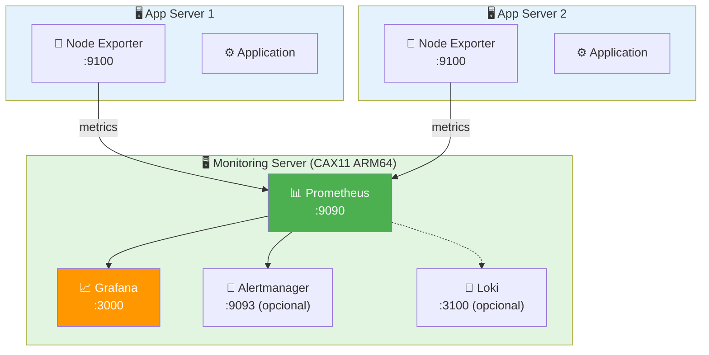
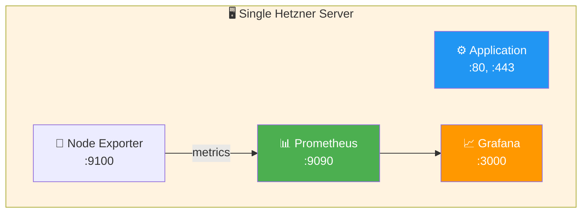
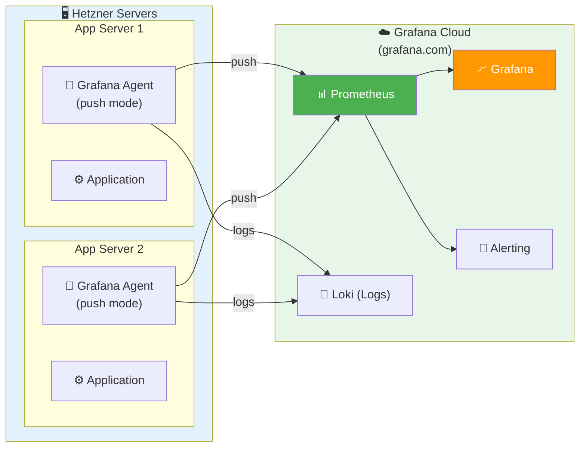
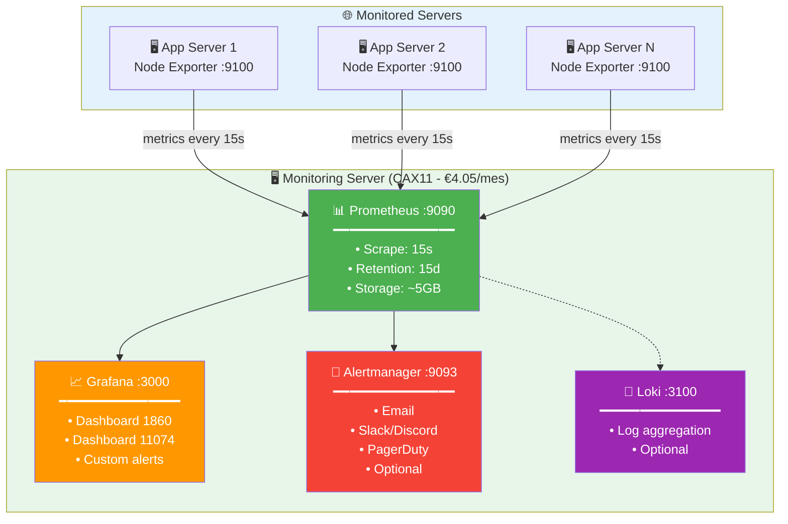

# Monitoring Architecture

> **Arquitectura completa de monitorización con Prometheus, Grafana y Loki (opcional)**

## Table of Contents

- [Arquitectura General](#arquitectura-general)
- [Opciones de Despliegue](#opciones-de-despliegue)
- [Opción 1: Servidor Dedicado (Recomendado)](#opción-1-servidor-dedicado-recomendado)
- [Opción 2: Mismo Servidor (Dev/Testing)](#opción-2-mismo-servidor-devtesting)
- [Opción 3: Servicios Externos (Cloud)](#opción-3-servicios-externos-cloud)
- [Configuración Paso a Paso](#configuración-paso-a-paso)

---

## Arquitectura General

### ¿Dónde va Prometheus y Grafana?

**Tienes 3 opciones principales:**

#### Opción 1: Servidor Dedicado (Recomendado para Producción)



#### Opción 2: Mismo Servidor (Dev/Testing)



#### Opción 3: Grafana Cloud (Startups/MVP)



---

## Opciones de Despliegue

### Comparación

| Aspecto | Opción 1: Dedicado | Opción 2: Mismo Server | Opción 3: Cloud |
|---------|-------------------|----------------------|----------------|
| **Costo** | ~€4.05/mes extra | €0 | €0 (free tier) |
| **Complejidad** | Media | Baja | Baja |
| **Escalabilidad** | Excelente | Limitada | Excelente |
| **Rendimiento** | Excelente | Puede afectar app | Excelente |
| **Seguridad** | Aislado | Compartido | Depende del proveedor |
| **Mantenimiento** | Manual | Manual | Gestionado |
| **Recomendado para** | Producción | Dev/Testing | Startups, MVP |

---

## Opción 1: Servidor Dedicado (Recomendado)

### Ventajas

- ✅ Aislamiento completo (monitoreo no afecta aplicaciones)
- ✅ Puede monitorear múltiples servidores
- ✅ Escalable (agrega más servidores monitoreados)
- ✅ Mejor seguridad (firewall dedicado)

### Desventajas

- ❌ Costo adicional (~€4.05/mes para CAX11)
- ❌ Más infraestructura que gestionar

### Cuándo usar

- Producción con múltiples servidores
- Cuando el monitoreo es crítico
- Equipos profesionales

### Arquitectura Detallada



**Componentes del Monitoring Server:**

| Componente | Puerto | Descripción | Configuración |
|------------|--------|-------------|---------------|
| **Prometheus** | 9090 | Time-series database | Scrape: 15s, Retention: 15d |
| **Grafana** | 3000 | Visualization & dashboards | Dashboards: 1860, 11074 |
| **Alertmanager** | 9093 | Alert routing & notification (opcional) | Email, Slack, PagerDuty |
| **Loki** | 3100 | Log aggregation (opcional) | Centralized logging |
| **Node Exporter** | 9100 | Self-monitoring | Monitors the monitoring server |

---

## Opción 2: Mismo Servidor (Dev/Testing)

### Ventajas

- ✅ Sin costo adicional
- ✅ Configuración simple
- ✅ Ideal para desarrollo y pruebas

### Desventajas

- ❌ Recursos compartidos con la aplicación
- ❌ Si el servidor cae, pierdes el monitoreo
- ❌ No escala para múltiples servidores

### Cuándo usar

- Entorno de desarrollo
- Proyectos pequeños (1 servidor)
- Aprendizaje y experimentación
- Presupuesto limitado

### Configuración

```yaml
# ansible/playbooks/site.yml (extracto)
---
- name: Deploy monitoring stack
  hosts: monitoring_servers
  become: true

  roles:
    - prometheus.prometheus.prometheus
    - grafana.grafana.grafana
    - grafana.grafana.loki        # opcional (deploy_loki=true)
    - grafana.grafana.promtail    # opcional (deploy_promtail=true)
    - prometheus.prometheus.node_exporter
```

---

## Opción 3: Servicios Externos (Cloud)

### Grafana Cloud (Recomendado para cloud)

**Nota**: Esta opción no está automatizada por Ansible en este repositorio.

**Free Tier incluye:**

- ✅ 10,000 series de métricas
- ✅ 50 GB de logs
- ✅ 50 GB de traces
- ✅ 14 días de retención
- ✅ Grafana alojado
- ✅ Prometheus alojado
- ✅ Loki (logs) alojado

**Ventajas:**

- ✅ Gratis hasta cierto límite
- ✅ Sin mantenimiento de infraestructura
- ✅ Escalado automático
- ✅ Backups incluidos
- ✅ Alerting avanzado

**Desventajas:**

- ❌ Dependencia de terceros
- ❌ Datos fuera de tu infraestructura
- ❌ Costo si superas free tier

### Alternativas Cloud

1. **Datadog** - Muy completo, caro ($15+/host/mes)
2. **New Relic** - Free tier generoso
3. **Netdata Cloud** - Free hasta 5 nodos
4. **Elastic Cloud** - Elastic Stack hosted

---

## Configuración Paso a Paso

### OPCIÓN 1: Servidor Dedicado de Monitoring

#### Paso 1: Crear servidor de monitoreo con Terraform

```hcl
# terraform/environments/production/monitoring-server.tf

module "monitoring_server" {
  source = "../../modules/hetzner-server"

  server_name    = "monitoring-01"
  server_type    = "cax11"  # Suficiente para ~10 servidores
  image          = "debian-13"
  location       = "nbg1"
  environment    = "production"
  admin_username = "malpanez"

  ssh_public_key = var.ssh_public_key

  # Firewall para monitoreo
  create_firewall = true
  ssh_allowed_ips = var.ssh_allowed_ips

  additional_ports = [
    {
      protocol   = "tcp"
      port       = "9090"  # Prometheus
      source_ips = var.monitoring_allowed_ips
    },
    {
      protocol   = "tcp"
      port       = "3000"  # Grafana
      source_ips = ["0.0.0.0/0", "::/0"]  # Acceso público a Grafana
    },
    {
      protocol   = "tcp"
      port       = "9093"  # Alertmanager
      source_ips = var.monitoring_allowed_ips
    }
  ]

  labels = {
    role    = "monitoring"
    project = "infrastructure"
  }

  prevent_destroy = true
}
```

#### Paso 2: Desplegar con Terraform

```bash
cd terraform/environments/production
tofu apply
```

#### Paso 3: Desplegar con Ansible (colecciones oficiales)

```bash
cd ansible
ansible-playbook playbooks/site.yml --tags monitoring
```

#### Paso 4: Playbook de monitoring

**ansible/playbooks/setup-monitoring-server.yml:**

```yaml
---
- name: Setup dedicated monitoring server
  hosts: monitoring
  become: yes

  roles:
    - common
    - security-hardening
    - firewall
    - ssh-2fa
    - monitoring         # Node Exporter para self-monitoring
    - prometheus         # Prometheus server
    - grafana            # Grafana
    # - alertmanager     # Opcional
    # - loki             # Opcional
```

#### Paso 5: Inventario

**ansible/inventory/group_vars/monitoring.yml:**

```yaml
---
# Monitoring server configuration

prometheus_allowed_ips:
  - "10.0.0.0/8"      # Internal network
  - "YOUR_OFFICE_IP"  # Your office

grafana_admin_password: "{{ vault_grafana_password }}"  # Use ansible-vault

# Servidores a monitorear
monitored_servers:
  - name: app-server-1
    ip: 10.0.1.10
    port: 9100
  - name: app-server-2
    ip: 10.0.1.11
    port: 9100
```

#### Paso 6: Desplegar monitoring

```bash
cd ansible

# Configurar servidor de monitoreo (inventario en ansible.cfg)
ansible-playbook playbooks/setup-monitoring-server.yml

# Configurar Node Exporter en servidores de aplicación
ansible-playbook playbooks/site.yml --tags monitoring
```

#### Paso 7: Acceder a Grafana

```bash
# Obtener IP del servidor de monitoreo
cd terraform/environments/production
tofu output monitoring_server_ip

# Acceder a Grafana (opción 1: subdominio)
open https://grafana.tudominio.com

# Acceder a Grafana (opción 2: IP directa)
# open http://MONITORING_IP:3000

# Login inicial:
# User: admin
# Password: admin (cambiar en primer login)
```

**Subdominios opcionales (recomendado con auth):**

- Grafana: `https://grafana.tudominio.com`
- Prometheus: `https://prometheus.tudominio.com` (solo si lo expones vía Nginx + auth)
- Loki: `https://loki.tudominio.com` (solo si lo expones vía Nginx + auth)

#### Paso 8: Configurar Grafana

1. **Add Data Source**
   - Go to Configuration → Data Sources
   - Click "Add data source"
   - Select "Prometheus"
   - URL: `http://localhost:9090`
   - Click "Save & Test"

2. **Import Dashboards**
   - Go to Dashboards → Import
   - Enter dashboard ID: `1860` (Node Exporter Full)
   - Select Prometheus data source
   - Click "Import"

3. **Create Alerts**
   - Go to Alerting → Alert rules
   - Create rules for:
     - High CPU usage
     - High memory usage
     - Disk space low
     - Server down

---

### OPCIÓN 2: Mismo Servidor (Simplificado)

```bash
cd ansible

# Instalar todo en el mismo servidor
ansible-playbook playbooks/site.yml --tags monitoring,prometheus,grafana

# Acceder
open http://YOUR_SERVER_IP:3000
```

---

### OPCIÓN 3: Grafana Cloud

#### Paso 1: Crear cuenta en Grafana Cloud

1. Ir a <https://grafana.com/auth/sign-up/create-user>
2. Crear cuenta gratuita
3. Obtener API key y endpoint

#### Paso 2: Configurar Grafana Agent en servidores

**ansible/roles/grafana-agent/tasks/main.yml:**

```yaml
---
- name: Download Grafana Agent
  ansible.builtin.get_url:
    url: https://github.com/grafana/agent/releases/latest/download/grafana-agent-linux-amd64.zip
    dest: /tmp/grafana-agent.zip

- name: Install Grafana Agent
  ansible.builtin.unarchive:
    src: /tmp/grafana-agent.zip
    dest: /usr/local/bin
    remote_src: yes

- name: Configure Grafana Agent
  ansible.builtin.template:
    src: agent-config.yaml.j2
    dest: /etc/grafana-agent.yaml
    mode: '0644'

- name: Create systemd service
  ansible.builtin.copy:
    src: grafana-agent.service
    dest: /etc/systemd/system/grafana-agent.service
    mode: '0644'

- name: Start Grafana Agent
  ansible.builtin.systemd:
    name: grafana-agent
    state: started
    enabled: yes
```

**ansible/roles/grafana-agent/templates/agent-config.yaml.j2:**

```yaml
server:
  log_level: info

metrics:
  global:
    scrape_interval: 60s
    remote_write:
      - url: {{ grafana_cloud_prometheus_url }}
        basic_auth:
          username: {{ grafana_cloud_prometheus_username }}
          password: {{ grafana_cloud_api_key }}

  configs:
    - name: hosted-prometheus
      scrape_configs:
        - job_name: 'node'
          static_configs:
            - targets: ['localhost:9100']
              labels:
                instance: '{{ inventory_hostname }}'
                environment: '{{ environment }}'

integrations:
  node_exporter:
    enabled: true
```

---

## Costos Estimados

### Opción 1: Servidor Dedicado

```
Servidor monitoring (CAX11):    €4.05/mes
Servidores aplicación (CAX11):  €4.05/mes × N servers
─────────────────────────────────────────
Total (1 app + 1 monitoring):  €8.10/mes
Total (3 app + 1 monitoring):  €16.20/mes
```

### Opción 2: Mismo Servidor

```
Servidor único (CAX11):        €4.05/mes
─────────────────────────────────────────
Total:                         €4.05/mes
```

### Opción 3: Grafana Cloud

```
Free tier:                     €0/mes (hasta 10k series)
Servidores aplicación (CAX11): €4.05/mes × N servers
─────────────────────────────────────────
Total (3 app servers):         €12.15/mes
```

---

## Recomendaciones

### Para Producción

✅ **Opción 1: Servidor Dedicado**

- Separa monitoreo de aplicaciones
- Escalable y confiable
- ~€4/mes extra bien invertidos

### Para Desarrollo/Testing

✅ **Opción 2: Mismo Servidor**

- Sin costo adicional
- Suficiente para pruebas

### Para Startups/MVP

✅ **Opción 3: Grafana Cloud**

- Sin infraestructura adicional
- Free tier generoso
- Upgradable cuando crezcas

---

## Próximos Pasos

1. **Decidir arquitectura** según tu caso de uso
2. **Desplegar infraestructura** con Terraform
3. **Configurar Ansible roles** para Prometheus/Grafana
4. **Importar dashboards** en Grafana
5. **Configurar alertas** para métricas críticas
6. **Documentar runbooks** de respuesta a alertas

---

**Recomendación Personal:** Empieza con **Opción 2** para desarrollo, y cuando tengas múltiples servidores en producción, migra a **Opción 1** (servidor dedicado).

**Última actualización:** 2026-01-09
