# OpenBao Deployment Architecture

> **Complete guide for deploying OpenBao for secrets management and Terraform state backend**

## Table of Contents

- [What is OpenBao?](#what-is-openbao)
- [Deployment Options](#deployment-options)
- [Architecture Decision](#architecture-decision)
- [Option 1: Separate Server (Recommended)](#option-1-separate-server-recommended)
- [Option 2: Same Server (Development)](#option-2-same-server-development)
- [Option 3: HashiCorp Cloud (Managed)](#option-3-hashicorp-cloud-managed)
- [Use Cases](#use-cases)
- [Installation Guide](#installation-guide)
- [Terraform State Management](#terraform-state-management)
- [Secrets Management](#secrets-management)
- [Security Best Practices](#security-best-practices)
- [Backup and Recovery](#backup-and-recovery)

---

## What is OpenBao?

**OpenBao** is a fork of HashiCorp Vault, providing:

- 🔐 **Secrets Management** - Store API keys, database passwords, certificates
- 🗄️ **Terraform State Backend** - Encrypted, versioned state storage
- 🔑 **Dynamic Secrets** - Generate database credentials on-demand
- 🔒 **Encryption as a Service** - Encrypt data without managing keys
- 📝 **Audit Logging** - Complete access logs

### Why OpenBao Instead of Vault?

- ✅ **Open Source** - Fully open-source (no enterprise restrictions)
- ✅ **Community-driven** - Not controlled by single vendor
- ✅ **Compatible** - Drop-in replacement for Vault
- ✅ **No License Issues** - BSL license concerns avoided

---

## Deployment Options

```mermaid
graph TB
    subgraph option1["🏆 Option 1: Separate Server (Production)"]
        openbao1["OpenBao Server<br/>cx11 (€3.79/mo)<br/>Dedicated, Highly Available"]
        app1["Application Servers<br/>Access OpenBao via API"]

        openbao1 -.->|Secrets API| app1
    end

    subgraph option2["💻 Option 2: Same Server (Dev/Small)"]
        combined["Single Server<br/>cx21 (€5.83/mo)<br/>OpenBao + WordPress"]
    end

    subgraph option3["☁️ Option 3: HCP Vault (Managed)"]
        hcp["HashiCorp Cloud<br/>$0.03/hour (~€22/mo)<br/>Fully Managed"]
    end

    style option1 fill:#c8e6c9
    style option2 fill:#fff9c4
    style option3 fill:#e3f2fd
```



---

## Architecture Decision

### Decision Matrix

| Factor | Separate Server | Same Server | HCP Vault |
|--------|----------------|-------------|-----------|
| **Cost** | €3.79/mo | €0 extra | ~€22/mo |
| **Security** | ⭐⭐⭐⭐⭐ Excellent | ⭐⭐⭐ Good | ⭐⭐⭐⭐⭐ Excellent |
| **Availability** | ⭐⭐⭐⭐ High | ⭐⭐⭐ Medium | ⭐⭐⭐⭐⭐ Very High |
| **Management** | ⭐⭐⭐ Manual | ⭐⭐⭐ Manual | ⭐⭐⭐⭐⭐ Fully Managed |
| **Complexity** | ⭐⭐⭐⭐ High | ⭐⭐ Low | ⭐ Very Low |
| **Scalability** | ⭐⭐⭐⭐ Scales well | ⭐⭐ Limited | ⭐⭐⭐⭐⭐ Auto-scales |

### Recommendation by Use Case

**Production Trading Course (Your Case):**
- 🏆 **Option 1: Separate Server** (RECOMMENDED)
- Why: Better security isolation, can manage multiple servers
- Cost: Only €3.79/mo extra (worth it for security)

**Development/Testing:**
- 💻 **Option 2: Same Server**
- Why: Cost-effective, simpler setup
- Cost: €0 extra

**Enterprise/Multiple Projects:**
- ☁️ **Option 3: HCP Vault**
- Why: No management overhead, SLA guarantees
- Cost: ~€22/mo (expensive for single project)

---

## Option 1: Separate Server (Recommended)

### Architecture



```mermaid
graph TB
    subgraph internet["🌐 Internet"]
        admin["👤 Admin"]
        terraform["💻 Terraform"]
    end

    subgraph hetzner["☁️ Hetzner Cloud"]
        subgraph openbao_server["🔐 OpenBao Server (cx11)"]
            openbao["OpenBao<br/>:8200"]
            consul["Consul<br/>:8500<br/>(HA Backend)"]
        end

        subgraph app_servers["🖥️ Application Servers"]
            wordpress1["WordPress Server 1"]
            wordpress2["WordPress Server 2"]
        end

        subgraph firewall["🛡️ Cloud Firewall"]
            fw_rules["OpenBao: 8200 (from admin IP only)<br/>Consul: 8500 (internal only)"]
        end
    end

    admin -->|SSH + 2FA| fw_rules
    terraform -->|State API :8200| fw_rules
    fw_rules --> openbao
    openbao --> consul

    wordpress1 -.->|Get Secrets :8200| openbao
    wordpress2 -.->|Get Secrets :8200| openbao

    style openbao_server fill:#ffebee
    style app_servers fill:#e3f2fd
```

### Terraform Configuration

Create: `terraform/environments/production/openbao-server.tf`

```hcl
# OpenBao Server for Secrets Management

module "openbao_server" {
  source = "../../modules/hetzner-server"

  # Server configuration
  server_name = "openbao-prod"
  server_type = "cx11"  # 1 vCPU, 2 GB RAM - Sufficient for OpenBao
  location    = "nbg1"
  image       = "debian-13"

  # SSH access (VERY RESTRICTIVE!)
  ssh_public_key  = var.ssh_public_key
  ssh_user        = "admin"
  ssh_allowed_ips = var.admin_ips  # Only your IP!

  # Firewall rules
  firewall_rules = [
    {
      description = "OpenBao API (admin access only)"
      protocol    = "tcp"
      port        = "8200"
      source_ips  = var.admin_ips
    },
    {
      description = "OpenBao API from application servers"
      protocol    = "tcp"
      port        = "8200"
      source_ips  = [
        module.wordpress_server.ipv4_address,
        # Add other servers here
      ]
    },
  ]

  # Volume for encrypted storage
  volume_size      = 10  # 10 GB for secrets and audit logs
  volume_automount = true
  volume_format    = "ext4"

  # Backups (CRITICAL for secrets!)
  enable_backups = true

  # Labels
  labels = {
    environment = "production"
    application = "openbao"
    role        = "secrets-management"
    managed_by  = "terraform"
  }

  # Lifecycle
  prevent_destroy = true  # NEVER accidentally delete!
}

output "openbao_server_ip" {
  description = "OpenBao server IP address"
  value       = module.openbao_server.ipv4_address
}

output "openbao_url" {
  description = "OpenBao API URL"
  value       = "https://${module.openbao_server.ipv4_address}:8200"
}
```

### Ansible Playbook

Create: `ansible/playbooks/openbao.yml`

```yaml
---
- name: Deploy OpenBao Server
  hosts: openbao_servers
  become: yes

  vars:
    openbao_version: "2.0.0"  # Latest version
    openbao_user: "openbao"
    openbao_group: "openbao"
    openbao_config_dir: "/etc/openbao.d"
    openbao_data_dir: "/mnt/openbao-data"  # On volume
    openbao_tls_dir: "/etc/openbao.d/tls"

  tasks:
    - name: Create OpenBao user
      user:
        name: "{{ openbao_user }}"
        system: yes
        shell: /bin/false
        home: "{{ openbao_data_dir }}"

    - name: Create OpenBao directories
      file:
        path: "{{ item }}"
        state: directory
        owner: "{{ openbao_user }}"
        group: "{{ openbao_group }}"
        mode: '0750'
      loop:
        - "{{ openbao_config_dir }}"
        - "{{ openbao_data_dir }}"
        - "{{ openbao_tls_dir }}"

    - name: Download OpenBao binary
      get_url:
        url: "https://github.com/openbao/openbao/releases/download/v{{ openbao_version }}/bao_{{ openbao_version }}_linux_amd64.zip"
        dest: "/tmp/openbao.zip"
        checksum: "sha256:..."  # Get from releases page

    - name: Extract OpenBao binary
      unarchive:
        src: "/tmp/openbao.zip"
        dest: "/usr/local/bin"
        remote_src: yes
        creates: "/usr/local/bin/bao"

    - name: Set OpenBao binary permissions
      file:
        path: /usr/local/bin/bao
        owner: root
        group: root
        mode: '0755'

    - name: Generate self-signed certificate (for now)
      command: >
        openssl req -x509 -newkey rsa:4096
        -keyout {{ openbao_tls_dir }}/tls.key
        -out {{ openbao_tls_dir }}/tls.crt
        -days 365 -nodes
        -subj "/CN={{ ansible_default_ipv4.address }}"
      args:
        creates: "{{ openbao_tls_dir }}/tls.crt"

    - name: Set TLS certificate permissions
      file:
        path: "{{ item }}"
        owner: "{{ openbao_user }}"
        group: "{{ openbao_group }}"
        mode: '0600'
      loop:
        - "{{ openbao_tls_dir }}/tls.key"
        - "{{ openbao_tls_dir }}/tls.crt"

    - name: Deploy OpenBao configuration
      copy:
        dest: "{{ openbao_config_dir }}/config.hcl"
        owner: "{{ openbao_user }}"
        group: "{{ openbao_group }}"
        mode: '0640'
        content: |
          storage "file" {
            path = "{{ openbao_data_dir }}"
          }

          listener "tcp" {
            address       = "0.0.0.0:8200"
            tls_cert_file = "{{ openbao_tls_dir }}/tls.crt"
            tls_key_file  = "{{ openbao_tls_dir }}/tls.key"
          }

          api_addr = "https://{{ ansible_default_ipv4.address }}:8200"
          cluster_addr = "https://{{ ansible_default_ipv4.address }}:8201"

          ui = true

          # Disable mlock (not needed with encrypted volume)
          disable_mlock = true

          # Audit logging
          log_level = "info"

    - name: Create OpenBao systemd service
      copy:
        dest: /etc/systemd/system/openbao.service
        content: |
          [Unit]
          Description=OpenBao
          Documentation=https://openbao.org/docs/
          Requires=network-online.target
          After=network-online.target
          ConditionFileNotEmpty={{ openbao_config_dir }}/config.hcl

          [Service]
          User={{ openbao_user }}
          Group={{ openbao_group }}
          ProtectSystem=full
          ProtectHome=read-only
          PrivateTmp=yes
          PrivateDevices=yes
          SecureBits=keep-caps
          AmbientCapabilities=CAP_IPC_LOCK
          CapabilityBoundingSet=CAP_SYSLOG CAP_IPC_LOCK
          NoNewPrivileges=yes
          ExecStart=/usr/local/bin/bao server -config={{ openbao_config_dir }}/config.hcl
          ExecReload=/bin/kill --signal HUP $MAINPID
          KillMode=process
          KillSignal=SIGINT
          Restart=on-failure
          RestartSec=5
          TimeoutStopSec=30
          LimitNOFILE=65536
          LimitMEMLOCK=infinity

          [Install]
          WantedBy=multi-user.target
        mode: '0644'

    - name: Enable and start OpenBao service
      systemd:
        name: openbao
        enabled: yes
        state: started
        daemon_reload: yes

    - name: Wait for OpenBao to start
      wait_for:
        port: 8200
        delay: 5
        timeout: 60

    - name: Display initialization instructions
      debug:
        msg: |
          ========================================
          OpenBao Initialization Required
          ========================================

          1. Set environment variable:
             export VAULT_ADDR='https://{{ ansible_default_ipv4.address }}:8200'
             export VAULT_SKIP_VERIFY=1  # Only until you get proper cert

          2. Initialize OpenBao:
             bao operator init

          3. SAVE THE UNSEAL KEYS AND ROOT TOKEN!
             Store them securely (password manager, offline backup)

          4. Unseal OpenBao (requires 3 of 5 keys by default):
             bao operator unseal <key1>
             bao operator unseal <key2>
             bao operator unseal <key3>

          5. Login with root token:
             bao login <root-token>

          6. Enable secrets engines:
             bao secrets enable -path=secret kv-v2

          7. Enable audit logging:
             bao audit enable file file_path={{ openbao_data_dir }}/audit.log

          ========================================
```

### Bootstrap Automation (Post-Unseal)

Once OpenBao is installed and reachable, you can run the dedicated bootstrap playbook to:
- Initialize and unseal (first run only)
- Enable secrets engines
- Seed WordPress/MariaDB secrets
- Create the rotation policy/token

Run:

```bash
ansible-playbook -i inventory/production/hosts.yml \
  playbooks/openbao-bootstrap.yml \
  -e openbao_bootstrap_ack=true \
  --ask-vault-pass
```

**Important**: This will output unseal keys and the root token once. Store them securely.

### Source of Truth for Initial Secrets

Before OpenBao takes over, the initial secrets live in:
- `ansible/inventory/group_vars/all/secrets.yml` (Ansible Vault)

After bootstrap:
- Store `openbao_wordpress_rotation_token` in the same vault file.
- Re-run the WordPress deployment so the rotation timer can use it.

### Cost

- **Server**: cx11 = €3.79/month
- **Volume**: 10 GB = €1.20/month
- **Backups**: €0.76/month
- **Total**: €5.75/month

---

## Option 2: Same Server (Development)

### Architecture



```mermaid
graph TB
    subgraph server["🖥️ Single Server (cx21)"]
        wordpress["WordPress<br/>:80, :443"]
        openbao["OpenBao<br/>:8200"]
        mysql["MySQL<br/>:3306"]
    end

    users["👥 Users"] -->|HTTPS| wordpress
    admin["👤 Admin"] -->|Secrets API| openbao
    wordpress -.->|Get DB Password| openbao
    wordpress --> mysql

    style server fill:#fff9c4
```

### Ansible Configuration

Add to existing server playbook:

```yaml
- name: Install OpenBao on WordPress server
  hosts: wordpress_servers
  become: yes

  vars:
    openbao_version: "2.0.0"
    openbao_data_dir: "/var/lib/openbao"

  tasks:
    - name: Include OpenBao role
      include_role:
        name: openbao
      vars:
        openbao_listen_address: "127.0.0.1:8200"  # Localhost only
        openbao_storage_backend: "file"
        openbao_data_path: "{{ openbao_data_dir }}"

    - name: Configure UFW to block external OpenBao access
      ufw:
        rule: deny
        port: 8200
        from_ip: any
```

### Pros & Cons

**Pros:**
- ✅ No extra cost
- ✅ Simple setup
- ✅ Good for development

**Cons:**
- ❌ Less secure (compromised server = compromised secrets)
- ❌ Resource contention with WordPress
- ❌ Harder to scale

---

## Option 3: HashiCorp Cloud (Managed)

### Setup

1. **Sign up**: https://portal.cloud.hashicorp.com/
2. **Create Vault cluster**:
   - Development tier: $0.03/hour (~€22/month)
   - Starter tier: $0.51/hour (~€370/month)
3. **Get connection details**
4. **Use in Terraform**:

```hcl
terraform {
  backend "remote" {
    hostname     = "app.terraform.io"
    organization = "your-org"

    workspaces {
      name = "production"
    }
  }
}

provider "vault" {
  address = "https://your-cluster.vault.hashicorp.cloud:8200"
  token   = var.hcp_vault_token
}
```

### Pros & Cons

**Pros:**
- ✅ Zero management
- ✅ High availability (99.95% SLA)
- ✅ Automatic backups
- ✅ Expert support

**Cons:**
- ❌ Expensive (~€22/month minimum)
- ❌ Vendor lock-in
- ❌ Data stored with third-party

---

## Use Cases

### 1. Terraform State Backend

**Why**: Encrypt and version Terraform state

**Configuration**:

```hcl
# terraform/environments/production/backend.tf

terraform {
  backend "http" {
    address        = "https://openbao.example.com:8200/v1/secret/data/terraform/production/state"
    lock_address   = "https://openbao.example.com:8200/v1/secret/data/terraform/production/lock"
    unlock_address = "https://openbao.example.com:8200/v1/secret/data/terraform/production/lock"
    username       = "terraform"
    password       = var.openbao_token
  }
}
```

**Setup**:

```bash
# Enable KV secrets engine
bao secrets enable -path=secret kv-v2

# Create policy for Terraform
cat > terraform-policy.hcl <<EOF
path "secret/data/terraform/*" {
  capabilities = ["create", "read", "update", "delete", "list"]
}
EOF

bao policy write terraform terraform-policy.hcl

# Create token
bao token create -policy=terraform -period=768h
```

### 2. WordPress Database Credentials

**Why**: Rotate database passwords automatically

**Configuration**:

```bash
# Enable database secrets engine
bao secrets enable database

# Configure MySQL connection
bao write database/config/wordpress \
  plugin_name=mysql-database-plugin \
  connection_url="{{username}}:{{password}}@tcp(localhost:3306)/" \
  allowed_roles="wordpress-role" \
  username="vault" \
  password="vault-password"

# Create role for WordPress
bao write database/roles/wordpress-role \
  db_name=wordpress \
  creation_statements="CREATE USER '{{name}}'@'%' IDENTIFIED BY '{{password}}'; GRANT ALL ON wordpress.* TO '{{name}}'@'%';" \
  default_ttl="1h" \
  max_ttl="24h"
```

**Get dynamic credentials**:

```bash
# Get new credentials (auto-rotated)
bao read database/creds/wordpress-role

# Output:
# Key                Value
# ---                -----
# lease_id           database/creds/wordpress-role/abc123
# lease_duration     1h
# username           v-wordpress-abc123
# password           A1b2C3d4E5f6...
```

### 3. API Keys and Secrets

**Store Cloudflare API token**:

```bash
# Write secret
bao kv put secret/cloudflare \
  api_token="your-cloudflare-api-token"

# Read secret
bao kv get secret/cloudflare

# Use in Terraform
data "vault_generic_secret" "cloudflare" {
  path = "secret/cloudflare"
}

provider "cloudflare" {
  api_token = data.vault_generic_secret.cloudflare.data["api_token"]
}
```

### 4. SSL Certificates

**Store Let's Encrypt certificates**:

```bash
# Store certificate
bao kv put secret/ssl/example.com \
  certificate=@/etc/letsencrypt/live/example.com/fullchain.pem \
  private_key=@/etc/letsencrypt/live/example.com/privkey.pem
```

---

## Installation Guide

### Step-by-Step Setup (Option 1)

#### 1. Deploy OpenBao Server

```bash
# Deploy server with Terraform
cd terraform/environments/production
tofu apply -target=module.openbao_server

# Get server IP
OPENBAO_IP=$(tofu output -raw openbao_server_ip)
```

#### 2. Run Ansible Playbook

```bash
cd ../../ansible
ansible-playbook -i inventory/hetzner.yml playbooks/openbao.yml
```

#### 3. Initialize OpenBao

```bash
# SSH into server
ssh admin@$OPENBAO_IP

# Set environment
export VAULT_ADDR='https://localhost:8200'
export VAULT_SKIP_VERIFY=1

# Initialize
bao operator init -key-shares=5 -key-threshold=3

# SAVE THE OUTPUT!
# Example output:
# Unseal Key 1: abc123...
# Unseal Key 2: def456...
# Unseal Key 3: ghi789...
# Unseal Key 4: jkl012...
# Unseal Key 5: mno345...
# Initial Root Token: s.xyz789...
```

#### 4. Unseal OpenBao

```bash
# Unseal (need 3 of 5 keys)
bao operator unseal <key1>
bao operator unseal <key2>
bao operator unseal <key3>

# Check status
bao status
# Should show: Sealed = false
```

#### 5. Initial Configuration

```bash
# Login with root token
bao login <root-token>

# Enable secrets engines
bao secrets enable -path=secret kv-v2
bao secrets enable database

# Enable audit logging
bao audit enable file file_path=/mnt/openbao-data/audit.log

# Create admin policy
cat > admin-policy.hcl <<EOF
path "*" {
  capabilities = ["create", "read", "update", "delete", "list", "sudo"]
}
EOF

bao policy write admin admin-policy.hcl

# Create admin token
bao token create -policy=admin -period=768h
# SAVE THIS TOKEN (use instead of root token)
```

---

## Terraform State Management

### Backend Configuration

```hcl
# terraform/environments/production/backend.tf

terraform {
  backend "http" {
    address        = "https://OPENBAO_IP:8200/v1/secret/data/terraform/production"
    lock_address   = "https://OPENBAO_IP:8200/v1/secret/data/terraform/production-lock"
    unlock_address = "https://OPENBAO_IP:8200/v1/secret/data/terraform/production-lock"
  }
}
```

### Migration from Local State

```bash
# Migrate existing state to OpenBao
terraform init -migrate-state

# Verify
terraform state list
```

---

## Security Best Practices

### 1. Unseal Keys Management

**CRITICAL**: Store unseal keys securely!

**Options:**
- 🔐 **Password manager** (1Password, Bitwarden)
- 📄 **Offline backup** (encrypted USB drive)
- 🔑 **Shamir's Secret Sharing** (split among team members)
- ☁️ **Cloud KMS** (AWS KMS, Google Cloud KMS for auto-unseal)

**DO NOT:**
- ❌ Store in Git
- ❌ Store on same server
- ❌ Email to yourself

### 2. Root Token

- 🔒 **Revoke** root token after initial setup
- 🔑 Use **admin policy** tokens instead
- 🔄 **Rotate** tokens regularly (every 30 days)

### 3. Network Security

- 🛡️ **Firewall**: Restrict to admin IPs only
- 🔐 **TLS**: Use valid SSL certificate (Let's Encrypt)
- 🚫 **No public access**: Never expose to internet

### 4. Audit Logging

```bash
# Enable file audit
bao audit enable file file_path=/mnt/openbao-data/audit.log

# Enable syslog audit (redundant logging)
bao audit enable syslog tag="openbao" facility="LOCAL7"

# Review logs
tail -f /mnt/openbao-data/audit.log
```

### 5. Policies (Least Privilege)

```hcl
# Terraform policy (minimal permissions)
path "secret/data/terraform/*" {
  capabilities = ["create", "read", "update", "delete"]
}

# WordPress policy (read-only for DB creds)
path "database/creds/wordpress-role" {
  capabilities = ["read"]
}

# No list or sudo capabilities!
```

---

## Backup and Recovery

### Automated Backup Script

Create: `/usr/local/bin/backup-openbao.sh`

```bash
#!/bin/bash
set -euo pipefail

BACKUP_DIR="/backup/openbao"
DATE=$(date +%Y%m%d-%H%M%S)
OPENBAO_DATA="/mnt/openbao-data"

# Create backup directory
mkdir -p $BACKUP_DIR

# Backup OpenBao data
tar -czf $BACKUP_DIR/openbao-data-$DATE.tar.gz $OPENBAO_DATA

# Backup configuration
tar -czf $BACKUP_DIR/openbao-config-$DATE.tar.gz /etc/openbao.d

# Keep only last 30 days
find $BACKUP_DIR -name "*.tar.gz" -mtime +30 -delete

# Upload to S3 (optional)
# aws s3 sync $BACKUP_DIR s3://my-backup-bucket/openbao/

echo "Backup completed: $DATE"
```

### Restore Procedure

```bash
# Stop OpenBao
sudo systemctl stop openbao

# Restore data
sudo tar -xzf /backup/openbao/openbao-data-YYYYMMDD.tar.gz -C /

# Start OpenBao
sudo systemctl start openbao

# Unseal
bao operator unseal <key1>
bao operator unseal <key2>
bao operator unseal <key3>
```

---

## Recommended: Option 1 for Your Trading Course

For your production trading course infrastructure, I recommend:

**🏆 Option 1: Separate OpenBao Server**

### Architecture

```
Hetzner Cloud (Total: €15.15/month)

├── OpenBao Server (cx11): €5.75/month
│   ├── OpenBao :8200
│   └── 10 GB encrypted volume
│
└── WordPress Server (cx21): €9.40/month
    ├── WordPress + Tutor LMS
    ├── Nginx + PHP-FPM
    ├── 20 GB volume
    └── Gets secrets from OpenBao
```

### Why This Setup?

1. **Security Isolation**: Secrets separate from application
2. **Scalability**: Add more WordPress servers easily
3. **Cost-effective**: Only €5.75/month extra
4. **Professional**: Industry best practice
5. **Future-proof**: Ready for growth

### Quick Start

```bash
# 1. Deploy OpenBao server
cd terraform/environments/production
tofu apply -target=module.openbao_server

# 2. Configure OpenBao
cd ../../ansible
ansible-playbook -i inventory/hetzner.yml playbooks/openbao.yml

# 3. Initialize and unseal
ssh admin@$(tofu output -raw openbao_server_ip)
bao operator init
bao operator unseal <key1>
bao operator unseal <key2>
bao operator unseal <key3>

# 4. Configure secrets
bao secrets enable -path=secret kv-v2
bao kv put secret/wordpress/db password="secure-password"
bao kv put secret/cloudflare api_token="your-token"

# Done! Your infrastructure now has enterprise-grade secrets management
```

---

## Troubleshooting

### Issue: OpenBao won't start

```bash
# Check logs
sudo journalctl -u openbao -f

# Check configuration
bao operator diagnose -config=/etc/openbao.d/config.hcl
```

### Issue: Cannot unseal

**Solution**: Requires 3 of 5 unseal keys. If lost, you must reinitialize (losing all data).

### Issue: Token expired

```bash
# Create new token
bao token create -policy=admin -period=768h
```

---

This deployment guide provides everything you need to set up OpenBao for production-grade secrets management! The separate server option gives you the best security for only €5.75/month extra.
