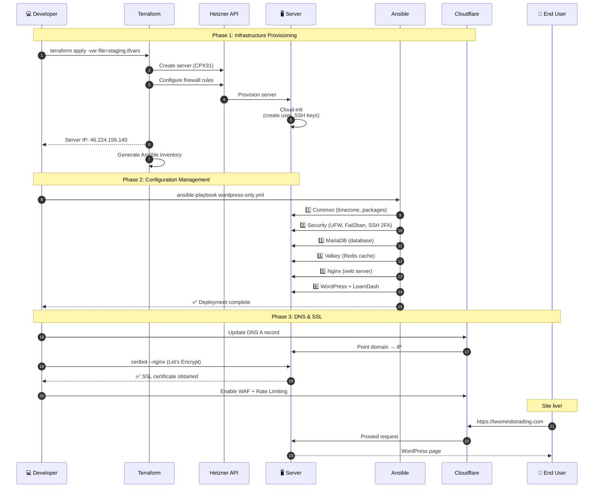
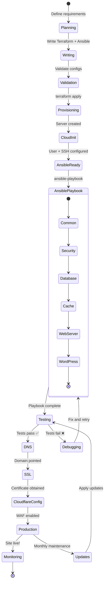
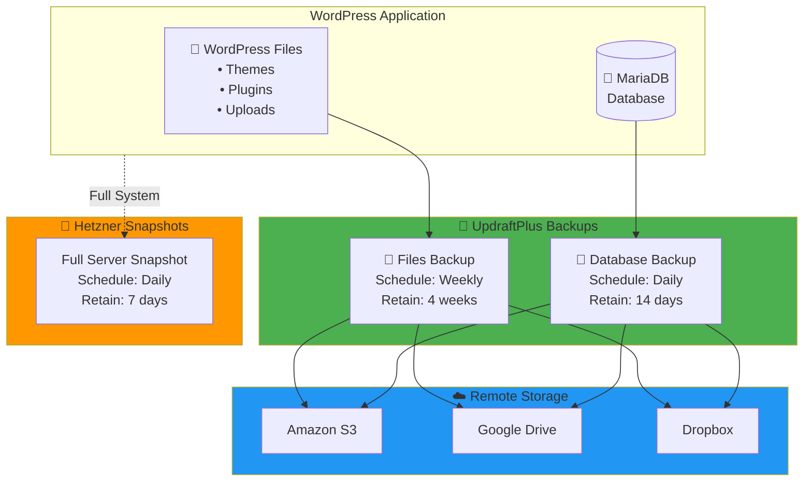
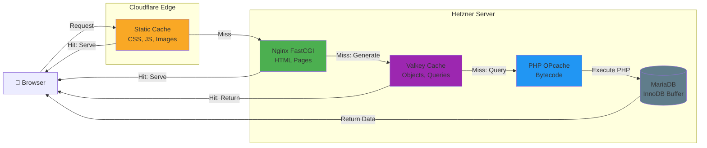
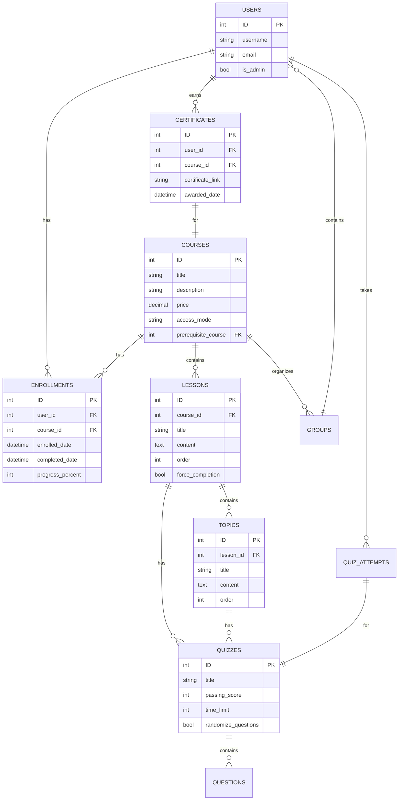
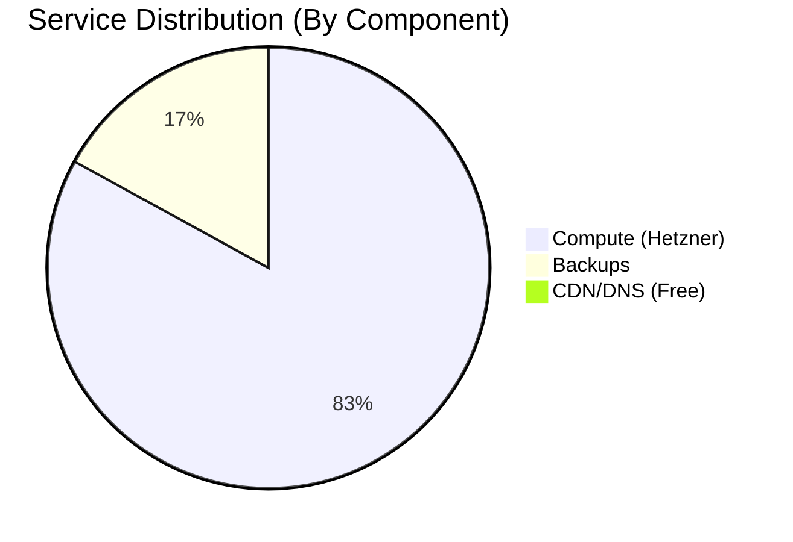
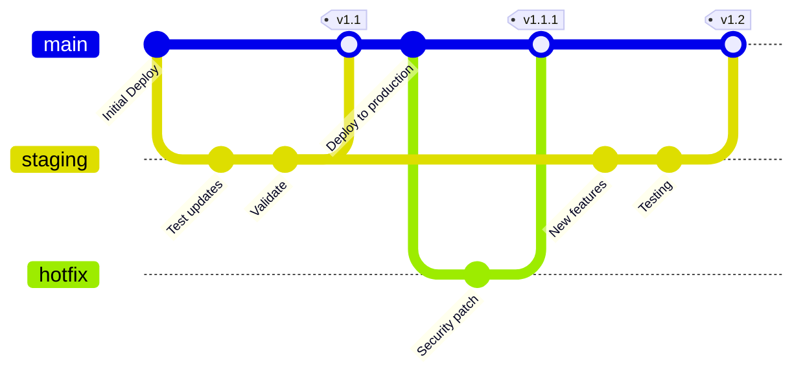

# WordPress Stack Architecture (Diagramas Mermaid)

Este archivo complementa [WORDPRESS-STACK.md](WORDPRESS-STACK.md) con diagramas interactivos en Mermaid.

---

## 🏗️ Diagrama de Arquitectura Completa

```mermaid
graph TB
    subgraph Internet
        Users[👥 Users/Students]
    end

    subgraph Cloudflare["☁️ Cloudflare (Free Plan)"]
        DNS[🌐 DNS Management]
        CDN[📦 CDN & Cache]
        WAF[🛡️ WAF Rules]
        SSL[🔒 SSL/TLS]
        RateLimit[⏱️ Rate Limiting]
    end

    subgraph Hetzner["🖥️ Hetzner Cloud Server"]
        subgraph WebLayer["Web Layer"]
            Nginx[⚡ Nginx<br/>• FastCGI Cache<br/>• Gzip/Brotli<br/>• Security Headers]
        end

        subgraph AppLayer["Application Layer"]
            PHP[🐘 PHP 8.4-FPM<br/>• OPcache<br/>• APCu]
            WP[📝 WordPress 6.x]
            LD[🎓 LearnDash Pro]
            Plugins[🔌 Security Plugins<br/>• Wordfence<br/>• Sucuri<br/>• WP 2FA]
        end

        subgraph DataLayer["Data Layer"]
            MariaDB[(💾 MariaDB 10.11<br/>• InnoDB<br/>• UTF8MB4)]
            Valkey[(⚡ Valkey 8.0<br/>Redis-compatible<br/>Object Cache)]
        end

        subgraph SecurityLayer["🔒 Security Layer"]
            UFW[🧱 UFW Firewall<br/>Ports: 22,80,443]
            Fail2ban[🚫 Fail2ban IDS<br/>• SSH<br/>• Nginx<br/>• WordPress]
            AppArmor[🛡️ AppArmor<br/>• PHP-FPM<br/>• Nginx<br/>• SSH]
            SSH[🔑 SSH 2FA<br/>• Yubikey<br/>• Google Auth]
        end
    end

    subgraph Backups["💾 Backup Storage"]
        S3[☁️ Amazon S3<br/>or Google Drive]
        Hetzner Backup[📸 Hetzner Backups<br/>Daily Snapshots]
    end

    Users -->|HTTPS Request| Cloudflare
    Cloudflare -->|Filtered Request| UFW
    UFW --> Nginx
    Nginx -->|FastCGI| PHP
    PHP --> WP
    WP --> LD
    WP --> Plugins
    WP -->|SQL Queries| MariaDB
    WP -->|Get/Set Cache| Valkey
    PHP -->|Read Cache| Valkey

    WP -.->|Daily DB Backup| S3
    WP -.->|Weekly Files Backup| S3
    Hetzner -.->|Full Snapshots| HetznerBackup

    Fail2ban -.->|Monitor Logs| Nginx
    Fail2ban -.->|Ban IPs| UFW
    AppArmor -.->|Restrict Processes| PHP
    SSH -.->|2FA Auth| Hetzner

    style Users fill:#e1f5ff,stroke:#01579b
    style Cloudflare fill:#f9a825,stroke:#f57f17
    style Hetzner fill:#d84315,stroke:#bf360c
    style WebLayer fill:#4caf50,stroke:#2e7d32
    style AppLayer fill:#2196f3,stroke:#1565c0
    style DataLayer fill:#9c27b0,stroke:#6a1b9a
    style SecurityLayer fill:#f44336,stroke:#c62828
    style Backups fill:#607d8b,stroke:#37474f
```

---

## 📊 Flujo de Deployment



---

## 🔄 Estados del Deployment



---

## 🌐 Request Flow (User → WordPress)


---

## 💾 Backup Strategy



---

## 🔐 Security Layers

```mermaid
graph TD
    Request[🌐 Incoming Request]

    subgraph Layer1["Layer 1: Network Edge"]
        CF_DDoS[Cloudflare DDoS Protection]
        CF_WAF[Cloudflare WAF]
        CF_Rate[Rate Limiting]
    end

    subgraph Layer2["Layer 2: Server Firewall"]
        UFW_Rules[UFW Rules<br/>Allow: 22, 80, 443<br/>Deny: All others]
    end

    subgraph Layer3["Layer 3: Application"]
        Nginx_Limit[Nginx Rate Limiting<br/>wp-login.php: 10/5min]
        Fail2ban_Monitor[Fail2ban Monitoring<br/>Auto-ban: 5 failures]
    end

    subgraph Layer4["Layer 4: WordPress"]
        Wordfence[Wordfence WAF<br/>Malware Scanner]
        WP2FA[WP 2FA<br/>Admin Protection]
    end

    subgraph Layer5["Layer 5: System"]
        AppArmor_Profile[AppArmor Profiles<br/>Process Restriction]
        SSH_2FA[SSH 2FA<br/>Yubikey + TOTP]
    end

    Request --> CF_DDoS
    CF_DDoS --> CF_WAF
    CF_WAF --> CF_Rate
    CF_Rate --> UFW_Rules
    UFW_Rules --> Nginx_Limit
    Nginx_Limit --> Fail2ban_Monitor
    Fail2ban_Monitor --> Wordfence
    Wordfence --> WP2FA
    WP2FA --> AppArmor_Profile
    AppArmor_Profile --> SSH_2FA
    SSH_2FA --> Allowed[✅ Request Allowed]

    CF_DDoS -.->|Block| Blocked1[❌ Blocked]
    CF_WAF -.->|Block| Blocked2[❌ Blocked]
    UFW_Rules -.->|Block| Blocked3[❌ Blocked]
    Fail2ban_Monitor -.->|Ban IP| Blocked4[❌ Blocked]
    Wordfence -.->|Block| Blocked5[❌ Blocked]

    style Layer1 fill:#f9a825
    style Layer2 fill:#ff5722
    style Layer3 fill:#f44336
    style Layer4 fill:#e91e63
    style Layer5 fill:#9c27b0
    style Allowed fill:#4caf50
    style Blocked1 fill:#263238
    style Blocked2 fill:#263238
    style Blocked3 fill:#263238
    style Blocked4 fill:#263238
    style Blocked5 fill:#263238
```



---

## 📈 Performance Optimization Layers



---

## 🎓 LearnDash Data Model



---

## 📊 Cost Breakdown




---

## 🔄 Update & Maintenance Workflow



---

## 📝 Notas Importantes

1. **Mermaid en Codeberg**: Estos diagramas se renderizan automáticamente en Codeberg (Gitea tiene soporte nativo).

2. **Editar diagramas**: Usa [Mermaid Live Editor](https://mermaid.live/) para previsualizar cambios.

3. **Sintaxis alternativa**: Si Codeberg no renderiza, usar:
   ````markdown
   ```mermaid
   graph TD
   ...
   ```
   ````

4. **Exportar**: Mermaid Live Editor permite exportar a SVG/PNG para usar en presentaciones.

---

## 🔗 Referencias

- [Mermaid Documentation](https://mermaid.js.org/)
- [Mermaid Live Editor](https://mermaid.live/)
- [Gitea Mermaid Support](https://docs.gitea.io/en-us/markdown/#diagrams)
