# WordPress Stack Architecture (Diagramas Mermaid)

Este archivo complementa [WORDPRESS-STACK.md](WORDPRESS-STACK.md) con diagramas interactivos en Mermaid.

---

## Arquitectura WordPress Stack

Esta sección muestra la arquitectura completa dividida en 3 diagramas simples para facilitar la comprensión.

### Diagrama 1: Edge Layer (Cloudflare a Servidor)

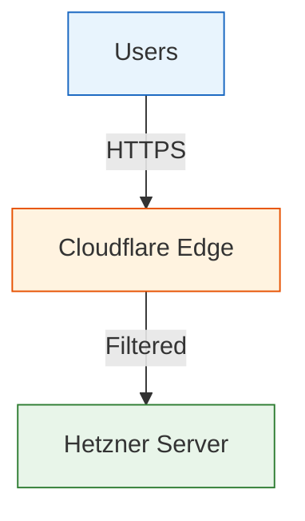

#### Detalles Edge Layer

| Componente | Función | Características |
|------------|---------|-----------------|
| **Users** | Estudiantes y visitantes | Acceso global via HTTPS |
| **Cloudflare Edge** | CDN + Protección | DNS, WAF, Rate Limiting, SSL/TLS |
| **Hetzner Server** | Infraestructura | CAX11, Firewall UFW, 2 vCPU |

### Diagrama 2: Application Stack (Nginx a Base de Datos)

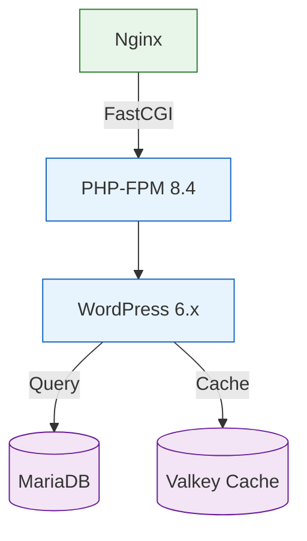

#### Detalles Application Stack

| Componente | Versión | Función |
|------------|---------|---------|
| **Nginx** | Latest | Web server, FastCGI Cache |
| **PHP-FPM** | 8.4 | Application runtime, OPcache |
| **WordPress** | 6.x | CMS + LearnDash LMS |
| **MariaDB** | 10.11 | Base de datos, InnoDB |
| **Valkey** | 8.0 | Object cache, Redis-compatible |

#### Plugins Esenciales

| Plugin | Función |
|--------|---------|
| redis-cache | Integración con Valkey |
| nginx-helper | Purge FastCGI cache |
| wordfence-login-security | 2FA para admin |
| limit-login-attempts-reloaded | Rate limiting login |

### Diagrama 3: Security y Backups

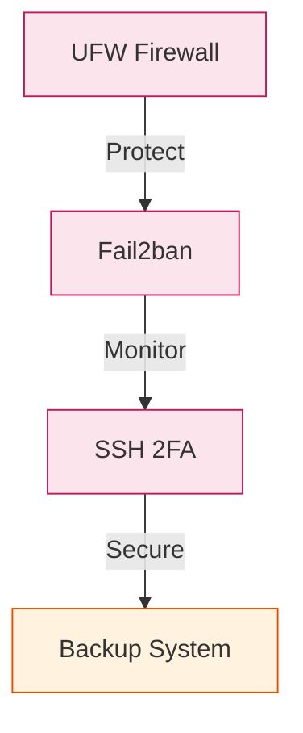

#### Detalles Security Layer

| Componente | Protección | Configuración |
|------------|------------|---------------|
| **UFW Firewall** | Puertos | Solo 22, 80, 443 permitidos |
| **Fail2ban** | IDS | SSH, Nginx, WordPress protegidos |
| **AppArmor** | Process restriction | PHP-FPM, Nginx, SSH |
| **SSH 2FA** | Autenticación | TOTP + opcional Yubikey/FIDO2 |

#### Sistema de Backups

| Tipo | Frecuencia | Destino | Retención |
|------|-----------|---------|-----------|
| **Database** | Diaria | S3/Google Drive | 14 días |
| **Files** | Semanal | S3/Google Drive | 4 semanas |
| **Full Snapshot** | Diaria | Hetzner Backups | 7 días |

---

## 📊 Flujo de Deployment

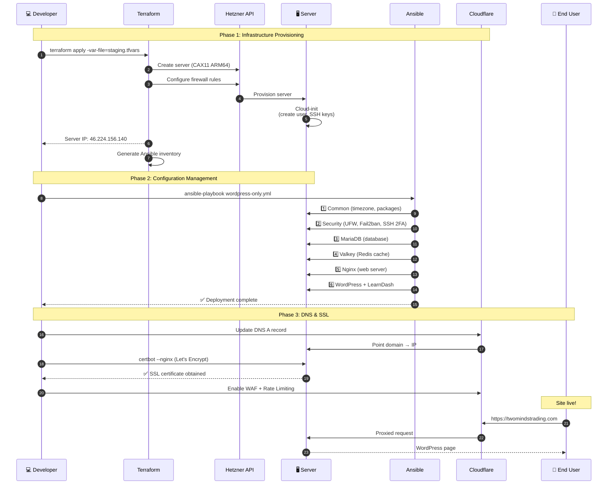

---

## 🔄 Estados del Deployment

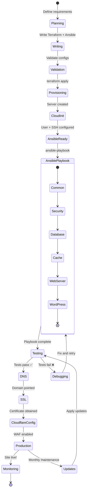

---

## 🌐 Request Flow (User → WordPress)

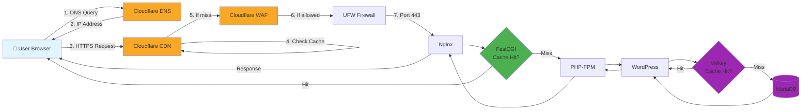

---

## 💾 Backup Strategy

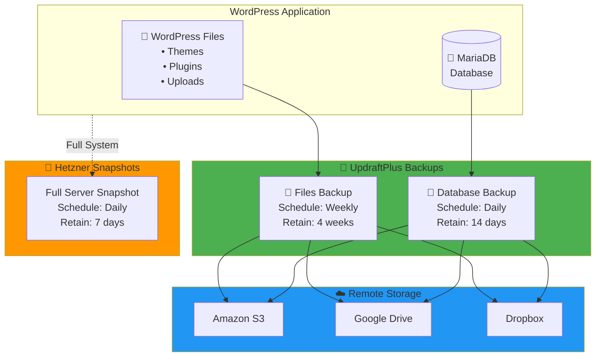

---

## 🔐 Security Layers

```mermaid
graph TD
    Request[🌐 Incoming Request]

    subgraph Layer1["Layer 1: Network Edge"]
        CF_DDoS[Cloudflare DDoS Protection]
        CF_WAF[Cloudflare WAF]
        CF_Rate[Rate Limiting]
    end

    subgraph Layer2["Layer 2: Server Firewall"]
        UFW_Rules[UFW Rules<br/>Allow: 22, 80, 443<br/>Deny: All others]
    end

    subgraph Layer3["Layer 3: Application"]
        Nginx_Limit[Nginx Rate Limiting<br/>wp-login.php: 10/5min]
        Fail2ban_Monitor[Fail2ban Monitoring<br/>Auto-ban: 5 failures]
    end

    subgraph Layer4["Layer 4: WordPress"]
        Wordfence[Wordfence WAF<br/>Malware Scanner]
        WP2FA[WP 2FA<br/>Admin Protection]
    end

    subgraph Layer5["Layer 5: System"]
        AppArmor_Profile[AppArmor Profiles<br/>Process Restriction]
        SSH_2FA[SSH 2FA<br/>Yubikey + TOTP]
    end

    Request --> CF_DDoS
    CF_DDoS --> CF_WAF
    CF_WAF --> CF_Rate
    CF_Rate --> UFW_Rules
    UFW_Rules --> Nginx_Limit
    Nginx_Limit --> Fail2ban_Monitor
    Fail2ban_Monitor --> Wordfence
    Wordfence --> WP2FA
    WP2FA --> AppArmor_Profile
    AppArmor_Profile --> SSH_2FA
    SSH_2FA --> Allowed[✅ Request Allowed]

    CF_DDoS -.->|Block| Blocked1[❌ Blocked]
    CF_WAF -.->|Block| Blocked2[❌ Blocked]
    UFW_Rules -.->|Block| Blocked3[❌ Blocked]
    Fail2ban_Monitor -.->|Ban IP| Blocked4[❌ Blocked]
    Wordfence -.->|Block| Blocked5[❌ Blocked]

    style Layer1 fill:#f9a825
    style Layer2 fill:#ff5722
    style Layer3 fill:#f44336
    style Layer4 fill:#e91e63
    style Layer5 fill:#9c27b0
    style Allowed fill:#4caf50
    style Blocked1 fill:#263238
    style Blocked2 fill:#263238
    style Blocked3 fill:#263238
    style Blocked4 fill:#263238
    style Blocked5 fill:#263238
```

---

## 📈 Performance Optimization Layers

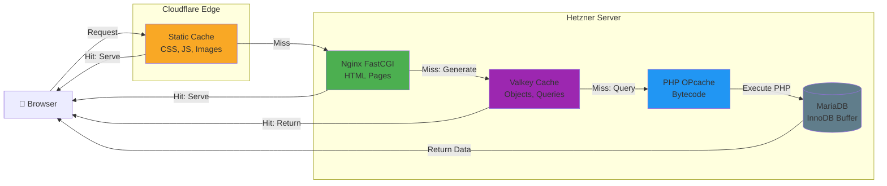

---

## 🎓 LearnDash Data Model

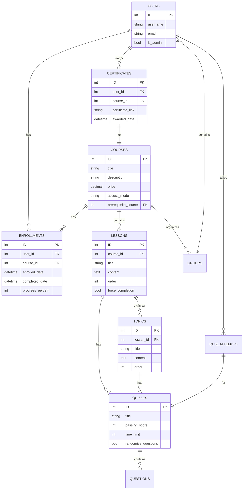

---

## 📊 Cost Breakdown

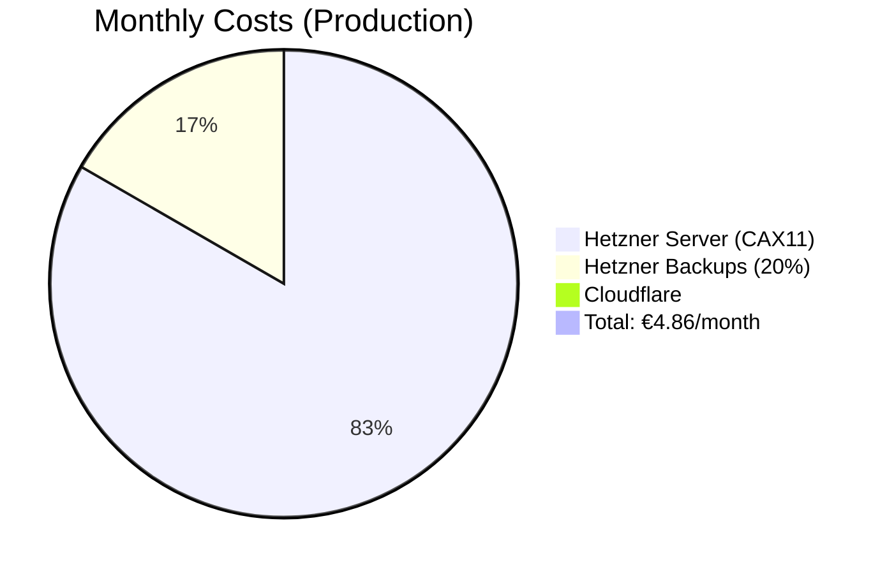

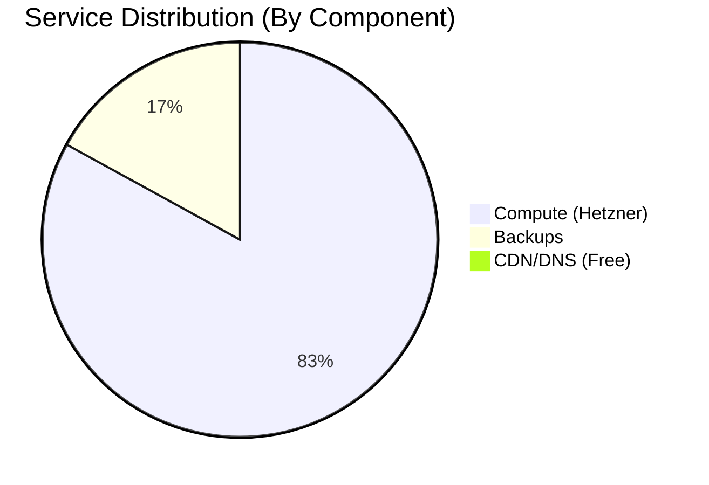

---

## 🔄 Update & Maintenance Workflow

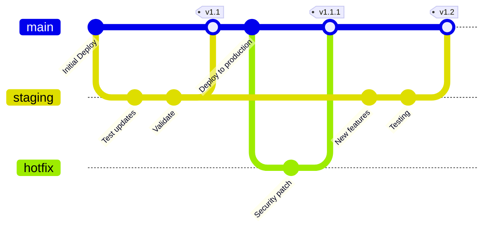

---

## 📝 Notas Importantes

1. **Mermaid en Codeberg**: Estos diagramas se renderizan automáticamente en Codeberg (Gitea tiene soporte nativo).

2. **Editar diagramas**: Usa [Mermaid Live Editor](https://mermaid.live/) para previsualizar cambios.

3. **Sintaxis alternativa**: Si Codeberg no renderiza, usar:

   ````markdown
   ```mermaid
   graph TD
   ...
   ```
   ````

4. **Exportar**: Mermaid Live Editor permite exportar a SVG/PNG para usar en presentaciones.

---

**Última actualización:** 2026-01-09

## 🔗 Referencias

- [Mermaid Documentation](https://mermaid.js.org/)
- [Mermaid Live Editor](https://mermaid.live/)
- [Gitea Mermaid Support](https://docs.gitea.io/en-us/markdown/#diagrams)
