# Trading Course Website - Complete Template

> **Professional website structure for a trading course with WordPress + LearnDash/Tutor LMS**

## Table of Contents

- [Website Structure](#website-structure)
- [Essential Pages](#essential-pages)
- [Course Structure](#course-structure)
- [Recommended Plugins](#recommended-plugins)
- [Design Recommendations](#design-recommendations)
- [Marketing Funnel](#marketing-funnel)
- [Legal Requirements](#legal-requirements)

---

## Website Structure

```
📁 Trading Course Website
│
├── 🏠 Home (Landing Page)
│   ├── Hero Section (Video + CTA)
│   ├── Course Overview
│   ├── Student Testimonials
│   ├── Instructor Bio
│   ├── Course Modules Preview
│   ├── Pricing
│   └── FAQ
│
├── 📚 Courses
│   ├── Course Catalog (if multiple courses)
│   ├── Free Mini-Course (lead magnet)
│   └── Main Trading Course
│       ├── Module 1: Trading Fundamentals
│       ├── Module 2: Technical Analysis
│       ├── Module 3: Risk Management
│       ├── Module 4: Trading Psychology
│       ├── Module 5: Strategy Development
│       ├── Module 6: Live Trading Sessions
│       └── Bonus: Trading Tools & Resources
│
├── 🎓 About
│   ├── Instructor Bio
│   ├── Trading Track Record (verified)
│   ├── Student Success Stories
│   └── Why This Course?
│
├── 📊 Free Resources
│   ├── Blog (trading tips, market analysis)
│   ├── Trading Glossary
│   ├── Free eBook/PDF Guide
│   ├── Webinar Recordings
│   └── TradingView Indicators (free download)
│
├── 💰 Pricing
│   ├── Course Packages
│   │   ├── Basic ($X)
│   │   ├── Pro ($X+coaching)
│   │   └── VIP ($X+1-on-1 mentoring)
│   ├── Payment Plans (3, 6, 12 months)
│   ├── Money-Back Guarantee
│   └── Refund Policy
│
├── 👥 Community
│   ├── Student Dashboard
│   ├── Trading Journal (students)
│   ├── Discussion Forum
│   ├── Live Trading Room Schedule
│   └── Discord/Telegram Link
│
├── 📞 Contact
│   ├── Contact Form
│   ├── FAQ
│   ├── Support (for enrolled students)
│   └── Partnership Inquiries
│
├── ⚖️ Legal
│   ├── Terms & Conditions
│   ├── Privacy Policy
│   ├── Refund Policy
│   ├── Risk Disclaimer (IMPORTANT for trading!)
│   └── Cookie Policy (GDPR)
│
└── 🔒 Members Area
    ├── Student Dashboard
    ├── My Courses
    ├── My Progress
    ├── Certificates
    ├── Trading Resources (downloads)
    ├── Live Session Recordings
    └── 1-on-1 Coaching Calendar (Pro/VIP)
```

---

## Essential Pages

### 1. **Home Page (Landing Page)**

#### Hero Section

```
[BACKGROUND: Trading chart, professional trader]

Headline: "Master Profitable Trading in 90 Days"
Subheadline: "Learn proven strategies from a 10-year veteran trader"

[CTA Button: "Start Learning Today" (scroll to pricing)]
[CTA Button: "Watch Free Preview" (popup video)]

Trust Indicators:
✅ 2,500+ Students
✅ 4.9/5 Rating
✅ 30-Day Money-Back Guarantee
```

#### Course Overview (What You'll Learn)

```
📈 Module 1: Trading Fundamentals
   - Forex, Stocks, Crypto basics
   - How markets work
   - Order types and execution

📊 Module 2: Technical Analysis
   - Chart patterns
   - Indicators (RSI, MACD, Bollinger)
   - Support/Resistance

🛡️ Module 3: Risk Management
   - Position sizing
   - Stop-loss strategies
   - Portfolio management

🧠 Module 4: Trading Psychology
   - Emotional control
   - Discipline
   - Avoiding revenge trading

💡 Module 5: Strategy Development
   - Day trading strategies
   - Swing trading strategies
   - Backtesting your system

📹 Module 6: Live Trading Sessions
   - Weekly live sessions
   - Real trades, real-time
   - Q&A during market hours
```

#### Testimonials (Social Proof)

```
[Student Photo]
"I went from losing $5k to making $2k/month consistently"
- Juan Pérez, Spain
[Link: Read Full Story]

[Student Photo]
"Best trading course I've taken. Finally profitable!"
- Maria García, Mexico
★★★★★

[Video Testimonial]
"Watch how I made my first $1,000 profit"
[Play Button]
```

#### Instructor Bio

```
[Professional Photo]

About Your Instructor: [Your Name]

📈 10+ years trading experience
💰 $500K+ in verified profits
🎓 Certified Financial Analyst
👥 2,500+ students taught
📺 Featured on [Financial News Outlet]

[CTA: "Learn My Strategy"]
```

#### Pricing

```
Choose Your Path:

[BASIC - $297]
✅ Complete course (6 modules)
✅ Lifetime access
✅ Certificate
❌ No live sessions
[Select Plan]

[PRO - $497] ⭐ POPULAR
✅ Everything in Basic
✅ Weekly live trading sessions
✅ Private community
✅ Trading indicators pack
[Select Plan]

[VIP - $997]
✅ Everything in Pro
✅ 4x 1-on-1 coaching calls
✅ Personalized trading plan
✅ Priority support
[Select Plan]

💳 Payment plans available (3, 6, 12 months)
🔒 30-day money-back guarantee
```

#### FAQ (Objection Handling)

```
Q: Do I need previous trading experience?
A: No! We start from absolute basics.

Q: How much capital do I need to start?
A: You can practice with a demo account ($0). For live trading, minimum $500 recommended.

Q: Is this suitable for [my country]?
A: Yes! Strategies work globally. We cover Forex, Stocks, and Crypto.

Q: How long until I'm profitable?
A: Most students see consistent results in 3-6 months with daily practice.

Q: What if I'm not satisfied?
A: 30-day money-back guarantee, no questions asked.
```

---

### 2. **Course Curriculum Page**

```markdown
# Complete Trading Mastery Course

## Course Overview
- ⏱️ Duration: 40 hours of content
- 🎥 Format: Video lessons + PDFs + Live sessions
- 📱 Access: Desktop, Mobile, Tablet
- 🏆 Certificate: Upon completion

---

## Module 1: Trading Fundamentals (4 hours)
Lesson 1.1: What is Trading? (15 min) [FREE PREVIEW]
Lesson 1.2: Markets Overview: Forex, Stocks, Crypto (20 min)
Lesson 1.3: How to Choose a Broker (25 min)
Lesson 1.4: Trading Platform Setup (MT4/MT5/TradingView) (30 min)
Lesson 1.5: Order Types Explained (20 min)
Lesson 1.6: Reading Price Charts (30 min)
Quiz: Module 1 Assessment

## Module 2: Technical Analysis (8 hours)
Lesson 2.1: Candlestick Patterns (45 min) [FREE PREVIEW]
Lesson 2.2: Support and Resistance (60 min)
Lesson 2.3: Trendlines and Channels (45 min)
Lesson 2.4: Moving Averages (50 min)
Lesson 2.5: RSI Indicator (40 min)
Lesson 2.6: MACD Indicator (40 min)
Lesson 2.7: Fibonacci Retracement (50 min)
Lesson 2.8: Volume Analysis (35 min)
Assignment: Find 5 Trading Setups

## Module 3: Risk Management (6 hours)
Lesson 3.1: Why 90% of Traders Lose Money (30 min)
Lesson 3.2: Position Sizing Formula (45 min)
Lesson 3.3: Stop-Loss Strategies (50 min)
Lesson 3.4: Risk/Reward Ratios (40 min)
Lesson 3.5: Money Management Rules (45 min)
Lesson 3.6: Portfolio Diversification (30 min)
Quiz: Risk Management Assessment

## Module 4: Trading Psychology (5 hours)
Lesson 4.1: The Psychology of Winning (30 min)
Lesson 4.2: Emotional Control (40 min)
Lesson 4.3: Avoiding Revenge Trading (35 min)
Lesson 4.4: Building Discipline (45 min)
Lesson 4.5: Trading Journal Best Practices (40 min)
Assignment: Start Your Trading Journal

## Module 5: Strategy Development (10 hours)
Lesson 5.1: Day Trading vs Swing Trading (30 min)
Lesson 5.2: Scalping Strategies (60 min)
Lesson 5.3: Breakout Strategy (75 min)
Lesson 5.4: Trend Following Strategy (80 min)
Lesson 5.5: Mean Reversion Strategy (70 min)
Lesson 5.6: Backtesting Your Strategy (90 min)
Lesson 5.7: Building Your Trading Plan (60 min)
Assignment: Create Your Trading Plan

## Module 6: Live Trading Sessions (7 hours)
Session 1: EUR/USD Live Analysis
Session 2: Stock Market Open Strategy
Session 3: Crypto Trading Setup
Session 4: Managing Losing Trades
Session 5: Scaling Winning Positions
Session 6: Student Q&A Session
Session 7: Monthly Market Outlook

## BONUS Modules
Bonus 1: Top 10 Trading Mistakes to Avoid (45 min)
Bonus 2: Advanced TradingView Indicators (60 min)
Bonus 3: Algorithmic Trading Basics (90 min)
Bonus 4: Tax Implications for Traders (40 min)

---

[ENROLL NOW - $297]
```

---

### 3. **About Page (Build Trust)**

```markdown
# About [Your Name]

[Professional Photo - trading desk setup]

## My Trading Journey

I started trading in 2014 with $5,000. Like most beginners, I lost 70% in the first 6 months.

But I didn't give up.

I studied every strategy, read 50+ books, took 10+ courses, and spent $20k+ on my education.

**The turning point came in 2016** when I developed my own risk management system.

Since then:
- ✅ 8 consecutive profitable years
- ✅ Average 15-25% annual returns
- ✅ Taught 2,500+ students
- ✅ Verified track record on Myfxbook

## Why I Created This Course

I wished someone had taught me these strategies 10 years ago. It would have saved me $15k in losses and 3 years of trial and error.

This course is **everything I wish I knew** when I started.

## My Philosophy

1. **Risk first, profits second** - Preserve capital above all
2. **Quality over quantity** - 5 great trades beat 50 mediocre ones
3. **Psychology matters** - 80% mental game, 20% technical

## Verifiable Track Record

[Link to Myfxbook account] *(public, verified)*

- Win rate: 62%
- Risk/Reward: 1:2.5 average
- Max drawdown: 8%
- Sharpe ratio: 2.1

## Media Features

- 📺 Featured on [Financial News Network]
- 📰 Published in [Trading Magazine]
- 🎙️ Podcast guest on [Trading Podcast]

[CTA: "Learn My Strategy"]
```

---

### 4. **Free Resources Page (Lead Magnet)**

```markdown
# Free Trading Resources

## 📘 Free eBook: "10 Trading Mistakes That Cost Me $10,000"

[Image: eBook cover]

Learn from my costly mistakes:
- Overleveraging
- Ignoring stop-losses
- Revenge trading
- And 7 more...

[Download Free] (email required)

---

## 📊 Free TradingView Indicators

[Download Pack] includes:
- Smart Money Indicator
- Support/Resistance Zones
- Volume Profile
- Trend Strength Meter

---

## 🎥 Free Mini-Course: "Forex Basics in 30 Minutes"

3 video lessons:
1. How Forex Works
2. Reading Charts
3. Your First Trade

[Watch Now] (email required)

---

## 📝 Trading Glossary

[A-Z Trading Terms]
- Pip
- Spread
- Leverage
- Margin
- ...100+ terms

---

## 🎓 Free Webinar: "My $2,000/Month Strategy Revealed"

Next session: [Date, Time]

What you'll learn:
- The exact strategy I use
- How to identify setups
- Risk management rules
- Live Q&A

[Register Free]
```

---

### 5. **Student Dashboard (Members Area)**

```markdown
# Welcome Back, [Student Name]!

## Your Progress

[Progress Bar: 45% Complete]

✅ Completed Modules: 3/6
⏳ Current Module: Risk Management
🏆 Certificates Earned: 1
📈 Trading Journal Entries: 12

---

## Continue Learning

[Module 3: Risk Management]
Lesson 3.4: Risk/Reward Ratios
[Continue]

---

## Upcoming Live Sessions

📅 Wednesday, 9:00 AM EST - Live Trading Session
📅 Friday, 2:00 PM EST - Q&A Session

[View Calendar]

---

## Your Resources

- 📥 Download Course Materials
- 📊 TradingView Indicators
- 📖 Recommended Books
- 🔗 Broker Recommendations

---

## Community

[Discussion Forum] - 142 active discussions
[Discord Channel] - Join 500+ active traders
[Submit Trade for Review]

---

## Need Help?

[Contact Support]
[FAQ]
[Request 1-on-1 Coaching] (VIP members)
```

---

## Recommended WordPress Plugins

### **LMS (Choose One)**

```
✅ LearnDash ($199/year) - RECOMMENDED
   - Professional, feature-rich
   - Best for serious courses

⚠️ Tutor LMS (Free) - Good for MVP
   - Start free, upgrade later
   - Solid free features
```

### **Essential Plugins**

**Security:**

- **Wordfence Security** (Free) - Firewall, malware scan
- **iThemes Security** (Free) - Hardening, brute force protection

**Performance:**

- **WP Rocket** ($49/year) - Caching (best)
- **Smush** (Free) - Image optimization
- **Cloudflare** (Free) - CDN (already covered)

**SEO:**

- **Yoast SEO** (Free) - On-page SEO
- **Rank Math** (Free) - Alternative to Yoast

**Email Marketing:**

- **MailerLite** (Free up to 1,000 subscribers)
- **FluentCRM** (Free) - CRM + automation

**Video Hosting:**

- **Vimeo Pro** ($20/month) - Professional, private videos
- **Wistia** ($99/month) - Best for courses, analytics

**Payment:**

- **WooCommerce** (Free) - E-commerce
- **Stripe/PayPal** - Payment gateways

**Webinars:**

- **WebinarPress** ($97/year) - Host webinars on your site
- **Zoom** ($14.99/month) - Live sessions

**Community:**

- **BuddyPress** (Free) - Social network
- **bbPress** (Free) - Forum

**Analytics:**

- **MonsterInsights** ($99/year) - Google Analytics for WordPress

**Landing Pages:**

- **Elementor** (Free/Pro $49/year) - Page builder
- **Thrive Architect** ($97/year) - Conversion-focused

---

## Design Recommendations

### **Theme Options:**

**1. Astra Theme (FREE/PRO)**

- ✅ Fast, lightweight
- ✅ LearnDash integration
- ✅ Elementor compatible
- 💰 Pro: $59/year

**2. Neve Theme (FREE)**

- ✅ Modern design
- ✅ Fast loading
- ✅ Gutenberg compatible

**3. LearnDash-Specific Themes:**

- **Focus** by Social Learner - $89 (built for LearnDash)

### **Design Elements:**

**Color Scheme (Trust & Success):**

- Primary: #1E88E5 (Blue - trust, stability)
- Secondary: #43A047 (Green - profit, success)
- Accent: #FFA726 (Orange - CTA buttons)
- Background: #F5F5F5 (Light gray)
- Text: #212121 (Dark gray)

**Typography:**

- Headings: Montserrat (bold, modern)
- Body: Open Sans (readable)

**Images:**

- Professional trading charts
- Real student testimonials (photos)
- Your photo at trading desk

---

## Marketing Funnel

```mermaid
graph TD
    A[🌐 Website Visitor] --> B{Lead Magnet}
    B -->|Free eBook| C[📧 Email List]
    B -->|Free Mini-Course| C
    B -->|Free Webinar| C

    C --> D[📨 Email Sequence]
    D --> E[Email 1: Welcome]
    E --> F[Email 2: Success Story]
    F --> G[Email 3: Strategy Preview]
    G --> H[Email 4: Discount Offer]

    H --> I{Purchase Decision}
    I -->|Yes| J[💳 Course Purchase]
    I -->|No| K[Nurture Sequence]

    J --> L[🎓 Onboarding]
    L --> M[Student Success]
    M --> N[📹 Testimonial]
    N --> O[♻️ Referrals]

    K --> D

    style A fill:#e3f2fd
    style J fill:#c8e6c9
    style M fill:#fff9c4
```



**Email Sequence Example:**

```
Email 1 (Immediate):
Subject: Here's your free eBook!
Content: Download link + introduce yourself

Email 2 (Day 2):
Subject: My $10,000 trading mistake
Content: Personal story + lesson learned

Email 3 (Day 4):
Subject: The ONE indicator I use daily
Content: Share valuable tip + soft pitch

Email 4 (Day 7):
Subject: Special offer: 20% off (48 hours only)
Content: Discount code + urgency

Email 5 (Day 10):
Subject: Last chance for discount
Content: Final reminder + testimonials
```

---

## Legal Requirements (IMPORTANT for Trading!)

### **Risk Disclaimer (REQUIRED)**

Place on **every page** (footer):

```
⚠️ RISK DISCLAIMER

Trading involves substantial risk of loss and is not suitable for everyone.
Past performance is not indicative of future results.
The information provided is for educational purposes only and should not be
considered financial advice. You should consult with a licensed financial
advisor before making any investment decisions.
```

### **Required Legal Pages:**

**1. Terms & Conditions**

- User responsibilities
- Course access terms
- Intellectual property
- Liability limitations

**2. Privacy Policy (GDPR Compliant)**

- Data collection
- Cookie usage
- Third-party services (email, analytics)
- User rights (data deletion)

**3. Refund Policy**

- 30-day money-back guarantee (recommended)
- Process for requesting refund
- Conditions

**4. Earnings Disclaimer**

```
EARNINGS DISCLAIMER

The results shown are not typical. Individual results will vary based on effort,
experience, and market conditions. We do not guarantee specific results or profits
from our course. Trading involves risk, and you may lose your entire investment.
```

---

## Pricing Strategy

### **Recommended Pricing Tiers:**

| Tier | Price | What's Included | Target Audience |
|------|-------|----------------|-----------------|
| **Basic** | €297 | Course only, lifetime access | Beginners, budget-conscious |
| **Pro** | €497 | Course + Live sessions + Community | Serious learners |
| **VIP** | €997 | Everything + 1-on-1 coaching | Professionals, fast-trackers |

### **Payment Plans:**

Increase conversion by offering:

- 3 payments of €99 (€297 total)
- 6 payments of €49 (€294 total)
- 12 payments of €25 (€300 total)

### **Launch Discount:**

- **Early Bird**: 30% off (first 50 students)
- **Launch Week**: 20% off
- **Regular Price**: Full price after launch

---

## Content Delivery Strategy

### **Drip Content Schedule:**

**Week 1:**

- Module 1: Fundamentals
- Welcome email
- Introduction video

**Week 2:**

- Module 2: Technical Analysis (Part 1)
- First live Q&A session

**Week 3:**

- Module 2: Technical Analysis (Part 2)

**Week 4:**

- Module 3: Risk Management
- Trading journal template

**Week 5:**

- Module 4: Trading Psychology

**Week 6:**

- Module 5: Strategy Development (Part 1)

**Week 7:**

- Module 5: Strategy Development (Part 2)
- First assignment due

**Week 8:**

- Module 6: Live Trading Session 1

**Weeks 9-12:**

- Weekly live trading sessions
- Final project

**Week 12:**

- Certificate issued
- Alumni community access

---

## Success Metrics to Track

### **Student Engagement:**

- Course completion rate (target: >60%)
- Avg. time in course (target: 30+ days)
- Quiz scores (avg. target: >80%)
- Forum participation

### **Business Metrics:**

- Conversion rate (target: 2-5%)
- Average order value
- Student LTV (lifetime value)
- Refund rate (target: <5%)

### **Marketing Metrics:**

- Email open rate (target: >20%)
- Email click rate (target: >3%)
- Webinar attendance (target: 30%+)
- Social proof (testimonials collected)

---

## Launch Checklist

### Pre-Launch (4 weeks before)

- [ ] Record all course videos
- [ ] Create all PDFs/resources
- [ ] Set up website
- [ ] Install and configure LMS
- [ ] Create sales page
- [ ] Write email sequences
- [ ] Create lead magnet
- [ ] Set up payment processing
- [ ] Legal pages (Terms, Privacy, etc.)
- [ ] Beta test with 5-10 students

### Launch Week

- [ ] Send email to list
- [ ] Post on social media
- [ ] Host launch webinar
- [ ] Offer early bird discount
- [ ] Monitor and fix issues
- [ ] Answer questions promptly

### Post-Launch

- [ ] Collect testimonials
- [ ] Optimize based on feedback
- [ ] Plan content updates
- [ ] Build affiliate program
- [ ] Scale marketing

---

## Tools & Resources Stack

| Category | Tool | Cost | Purpose |
|----------|------|------|---------|
| **Website** | WordPress | Free | CMS |
| **Hosting** | Hetzner | €9/mo | Server |
| **CDN** | Cloudflare | Free | DDoS, CDN |
| **LMS** | LearnDash | €199/yr | Course delivery |
| **Email** | MailerLite | Free | Email marketing |
| **Video** | Vimeo Pro | €20/mo | Video hosting |
| **Analytics** | Google Analytics | Free | Website analytics |
| **Webinar** | Zoom | €15/mo | Live sessions |
| **Community** | Discord | Free | Student community |
| **Payments** | Stripe | 2.9%+€0.30 | Payment processing |

**Total Cost:** ~€50/month (+ transaction fees)

---

This template gives you a **complete blueprint** for a professional trading course website. Let me know if you want me to expand any section!
