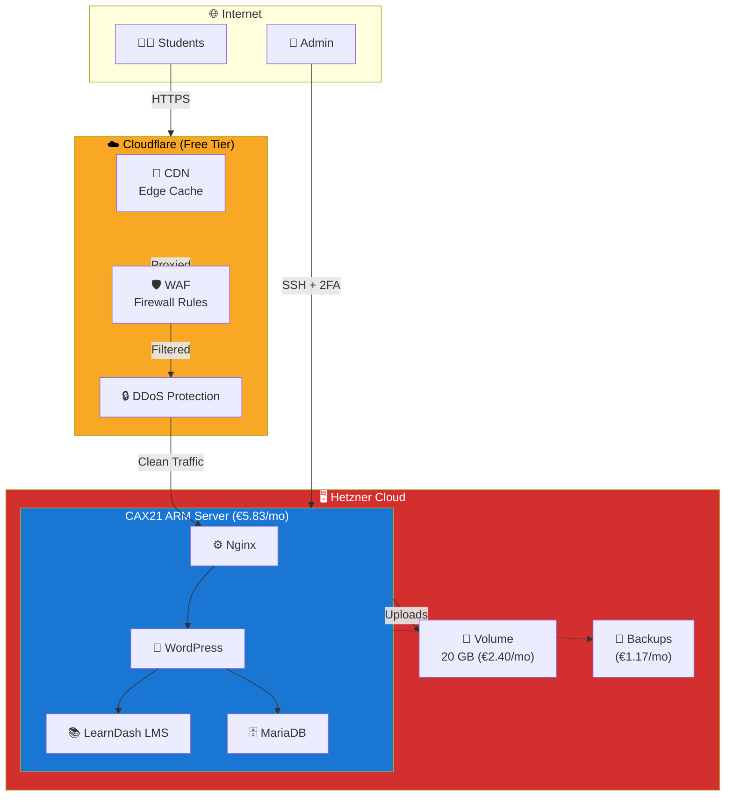

# WordPress + LMS Production Environment

Complete production-ready setup for hosting a WordPress site with an LMS plugin (e.g.,
**LearnDash**). Includes a Hetzner Cloud server with Cloudflare DDoS protection, CDN, and WAF.

> ℹ️ **Generic example.** Exact server size, registrar, and SSL flow are illustrative defaults —
> adapt them to your deployment (e.g., Cloudflare Origin CA instead of certbot, ARM vs x86
> server types, any registrar instead of GoDaddy).

## Architecture


```mermaid
graph TB
    subgraph internet["🌐 Internet"]
        students["👨‍🎓 Students"]
        admin["👤 Admin"]
    end

    subgraph cloudflare["☁️ Cloudflare (Free Tier)"]
        cdn["🚀 CDN<br/>Edge Cache"]
        waf["🛡️ WAF<br/>Firewall Rules"]
        ddos["🔒 DDoS Protection"]
    end

    subgraph hetzner["🖥️ Hetzner Cloud"]
        subgraph server["CAX21 ARM Server (€5.83/mo)"]
            nginx["⚙️ Nginx"]
            wordpress["📝 WordPress"]
            learndash["📚 LearnDash LMS"]
            mysql["🗄️ MariaDB"]
        end

        volume["💾 Volume<br/>20 GB (€2.40/mo)"]
        backup["📸 Backups<br/>(€1.17/mo)"]
    end

    students -->|HTTPS| cloudflare
    admin -->|SSH + 2FA| server

    cloudflare -->|Proxied| waf
    waf -->|Filtered| ddos
    ddos -->|Clean Traffic| nginx

    nginx --> wordpress
    wordpress --> learndash
    wordpress --> mysql

    server -->|Uploads| volume
    server -.->|Daily Backup| backup

    style cloudflare fill:#f9a825,color:#000
    style hetzner fill:#d32f2f,color:#fff
    style server fill:#1976d2,color:#fff
```

## What This Creates

### Infrastructure

- ✅ **Hetzner Cloud Server**: CAX21 ARM (4 vCPU, 8 GB RAM) — example sizing
- ✅ **Additional Volume**: 20 GB for WordPress uploads and backups
- ✅ **Automated Backups**: Weekly snapshots included
- ✅ **Firewall**: Cloud firewall with restricted access

### Cloudflare Protection

- ✅ **DDoS Protection**: Unlimited, automatic
- ✅ **CDN**: Global edge caching
- ✅ **SSL/TLS**: Free SSL certificate
- ✅ **WAF**: WordPress-specific firewall rules:
  - Block XML-RPC attacks
  - Rate limit wp-login.php (3 attempts/minute)
  - Block wp-config.php access
  - Prevent path traversal and XSS
  - Protect course content (require login)
- ✅ **Performance**: HTTP/2, HTTP/3, Brotli compression
- ✅ **Caching**: Aggressive caching for static assets

### Security Features

- 🔐 SSH restricted to admin IPs only
- 🔐 HTTP/HTTPS restricted to Cloudflare IPs (configured via Ansible)
- 🔐 FIDO2 + TOTP 2FA for SSH (optional, via Ansible)
- 🔐 AppArmor mandatory access control
- 🔐 Fail2ban intrusion prevention
- 🔐 UFW host firewall
- 🔐 Automatic security updates

## Prerequisites

1. **Hetzner Cloud Account**
   - Sign up: <https://www.hetzner.com/cloud>
   - Get API token: Cloud Console → Security → API Tokens

2. **Cloudflare Account**
   - Sign up: <https://dash.cloudflare.com/sign-up>
   - Add domain to Cloudflare
   - Get API token: My Profile → API Tokens → Create Token
   - Required permissions: Zone.Zone Settings, Zone.DNS, Zone.Firewall Services

3. **Domain Name**
   - Registered at any registrar
   - Ready to change nameservers to Cloudflare

4. **OpenTofu Installed**

   ```bash
   # macOS
   brew install opentofu

   # Linux
   curl --proto '=https' --tlsv1.2 -fsSL https://get.opentofu.org/install-opentofu.sh | sh
   ```

5. **SSH Key Pair**

   ```bash
   # Generate if you don't have one
   ssh-keygen -t ed25519 -C "your-email@example.com"
   ```

## Quick Start

### 1. Set Environment Variables

```bash
# Hetzner Cloud API token
export TF_VAR_hcloud_token="your-hetzner-api-token"

# Cloudflare API token
export TF_VAR_cloudflare_api_token="your-cloudflare-api-token"

# Your domain name
export TF_VAR_domain_name="example.com"

# SSH public key
export TF_VAR_ssh_public_key="$(cat ~/.ssh/id_ed25519.pub)"

# Your IP address for SSH access (restrict to your IP!)
export TF_VAR_admin_ips='["203.0.113.50/32"]'  # Replace with your IP
```

**Important**: Get your IP address:

```bash
curl ifconfig.me
# Example output: 203.0.113.50
# Then use: export TF_VAR_admin_ips='["203.0.113.50/32"]'
```

### 2. Initialize Terraform

```bash
cd examples/wordpress-production
tofu init
```

### 3. Review the Plan

```bash
tofu plan
```

This will show:

- 1 Hetzner server (cax21, ARM)
- 1 Volume (20 GB)
- Cloudflare DNS records (A, CNAME)
- Cloudflare zone settings (SSL/TLS, security, caching)
- WAF custom rulesets (WordPress protection, course protection)
- Cache, security-header and redirect rulesets

### 4. Apply Configuration

```bash
tofu apply
```

Type `yes` when prompted.

**Time**: ~2 minutes to create infrastructure

### 5. Configure Nameservers at Your Registrar

After `tofu apply`, you'll see nameserver instructions:

```bash
tofu output nameservers
```

**Steps:**

1. Log into your registrar
2. Go to: My Products → Domains → Manage DNS
3. Click "Change" next to Nameservers
4. Select "Custom nameservers"
5. Enter the Cloudflare nameservers shown in output
6. Click "Save"

**⏱️ Wait 24-48 hours** for DNS propagation

### 6. Run Ansible Hardening

```bash
# Navigate to ansible directory
cd ../../ansible

# Run site playbook (full hardening)
ansible-playbook -i ../examples/wordpress-production/inventory.yml playbooks/site.yml

# Or use existing dynamic inventory
ansible-playbook -i inventory/hetzner.hcloud.yml playbooks/site.yml
```

This configures:

- ✅ Security hardening (kernel params, AIDE, auto-updates)
- ✅ AppArmor profiles
- ✅ SSH 2FA (FIDO2 + TOTP)
- ✅ UFW firewall restricted to Cloudflare IPs
- ✅ Fail2ban intrusion prevention
- ✅ Prometheus Node Exporter monitoring

### 7. Install WordPress

```bash
# SSH into server
ssh admin@<server-ip>

# Install WordPress via Ansible (if you have wordpress role)
ansible-playbook -i inventory.yml playbooks/wordpress.yml

# Or install manually
sudo apt update
sudo apt install nginx mariadb-server php-fpm php-mysql
# ... follow WordPress installation guide
```

### 8. Install SSL Certificate

```bash
# On the server
sudo apt install certbot python3-certbot-nginx

# Get certificate from Let's Encrypt
sudo certbot --nginx -d example.com -d www.example.com

# Auto-renewal is configured automatically
```

### 9. Update Cloudflare to Strict SSL

After SSL certificate is installed:

```bash
# In main.tf, change:
# ssl_mode = "strict"  # Change from "full"

# Apply changes
tofu apply
```

### 10. Install LearnDash LMS

1. Log into WordPress admin: `https://example.com/wp-admin`
2. Go to: Plugins → Add New → Upload Plugin
3. Upload the LearnDash `.zip` from your LearnDash account
4. Click: Install Now → Activate
5. Enter your license key under LearnDash LMS → Settings

## Cost Breakdown

| Service | Monthly Cost |
|---------|--------------|
| Hetzner cax21 server (ARM, 4 vCPU, 8 GB RAM) | €5.83 |
| Hetzner 20 GB volume | €2.40 |
| Hetzner automated backups | €1.17 |
| Cloudflare Free tier | €0.00 |
| **TOTAL** | **€9.40/month** |

**Annual**: ~€112.80/year

**Upgrade Options:**

- Hetzner cax31 (ARM, 8 vCPU, 16 GB RAM): higher tier
- Cloudflare Pro (better WAF, more page rules): +€20/month
- Additional volumes: €0.12/GB/month

## Customization

### Change Server Size

For larger WordPress sites:

```hcl
# In main.tf
module "wordpress_server" {
  # ...
  server_type = "cax31"  # larger ARM server
}
```

### Increase Volume Size

For more media storage:

```hcl
# In main.tf
module "wordpress_server" {
  # ...
  volume_size = 50  # 50 GB instead of 20 GB
}
```

### Restrict SSH to Your IP Only

**IMPORTANT for production:**

```bash
# Get your IP
curl ifconfig.me

# Set in variables
export TF_VAR_admin_ips='["203.0.113.50/32"]'  # Replace with YOUR IP

# Apply
tofu apply
```

### Enable Cloudflare Login Challenge

Login protection is a WAF challenge rule (disabled by default — use Nginx rate
limiting + WP 2FA instead, or enable it):

```hcl
# In main.tf
module "cloudflare" {
  # ...
  wp_admin_challenge_enabled = true
}
```

### Disable Course Protection

If not using LearnDash or want courses public:

```hcl
# In main.tf
module "cloudflare" {
  # ...
  enable_course_protection = false
}
```

## Verification

### 1. Check Server is Running

```bash
# Get server status
tofu output server_name
tofu output ipv4_address

# SSH test
ssh admin@<server-ip>
```

### 2. Check DNS Propagation

```bash
# Check A record
dig example.com

# Check nameservers
dig NS example.com

# Should show Cloudflare nameservers
```

### 3. Verify Cloudflare Proxy

```bash
# Check for Cloudflare headers
curl -I https://example.com | grep -i cf-

# Should see: cf-ray, cf-cache-status, etc.
```

### 4. Test Rate Limiting

```bash
# Try multiple login attempts (should get CAPTCHA after 3)
for i in {1..5}; do
  curl -I https://example.com/wp-login.php
  sleep 1
done
```

### 5. Check SSL/TLS

```bash
# Verify SSL certificate
curl -vI https://example.com 2>&1 | grep -i tls

# Should show: TLS 1.2 or TLS 1.3
```

### 6. Test XML-RPC Block

```bash
# Should be blocked by Cloudflare
curl -I https://example.com/xmlrpc.php

# Should return: HTTP 403 Forbidden
```

## Ansible Integration

The Terraform configuration automatically generates an Ansible inventory file: `inventory.yml`

### Use Generated Inventory

```bash
# Full hardening
ansible-playbook -i examples/wordpress-production/inventory.yml playbooks/site.yml

# Just firewall (restrict to Cloudflare IPs)
ansible-playbook -i examples/wordpress-production/inventory.yml playbooks/cloudflare-firewall.yml

# Just monitoring
ansible-playbook -i examples/wordpress-production/inventory.yml playbooks/site.yml --tags monitoring

# Just 2FA setup
ansible-playbook -i examples/wordpress-production/inventory.yml playbooks/site.yml --tags ssh-2fa
```

### Variables Set in Inventory

The generated inventory includes:

```yaml
wordpress_prod:
  ansible_host: 203.0.113.10
  ansible_user: admin
  cloudflare_enabled: true
  cloudflare_ip_ranges:
    - 173.245.48.0/20
    - 103.21.244.0/22
    # ... all Cloudflare IP ranges
  wordpress_domain: example.com
  wordpress_volume_mount: /mnt/wordpress-data
```

## Monitoring

### Cloudflare Dashboard

Monitor at: <https://dash.cloudflare.com/>

**Key Metrics:**

- Requests per second
- Bandwidth saved (caching)
- Threats blocked
- Firewall events

### Prometheus Metrics

If Ansible monitoring role is deployed:

```bash
# Access Node Exporter metrics
curl http://<server-ip>:9100/metrics

# Sample metrics:
# - node_cpu_seconds_total
# - node_memory_MemAvailable_bytes
# - node_disk_io_time_seconds_total
# - node_network_receive_bytes_total
```

## Backup Strategy

### Hetzner Automated Backups

- **Enabled by default** in this configuration
- **Frequency**: Weekly
- **Retention**: 7 backups (rolling)
- **Cost**: +20% of server cost (~€1.17/month)

### Manual Snapshots

```bash
# Create snapshot via CLI
hcloud server create-image wordpress-prod \
  --description "Pre-update snapshot" \
  --type snapshot
```

### Off-site Backups to Hetzner S3 (via Ansible)

> Backups can be **automated** by an Ansible role that ships to Hetzner S3
> (Object Storage). See `docs/security/BACKUP_RECOVERY.md`.

```bash
# Deploy the backup automation
ansible-playbook -i inventory.yml playbooks/setup-backups.yml

# Backups include:
# - WordPress files (/var/www)
# - MySQL database dumps
# - Configuration files
# - Volume data
```

## Security Best Practices

### 1. Restrict SSH Access

✅ **DO**: Restrict to your IP only

```bash
export TF_VAR_admin_ips='["203.0.113.50/32"]'
```

❌ **DON'T**: Allow from anywhere

```bash
export TF_VAR_admin_ips='["0.0.0.0/0"]'  # INSECURE!
```

### 2. Enable 2FA for SSH

```bash
# Run Ansible 2FA setup
ansible-playbook -i inventory.yml playbooks/site.yml --tags ssh-2fa

# Follow Yubikey setup guide
# See: ../../docs/YUBIKEY_SETUP.md
```

### 3. Use Strict SSL Mode

After installing SSL certificate:

```hcl
ssl_mode = "strict"  # Full end-to-end encryption
```

### 4. Restrict HTTP/HTTPS to Cloudflare Only

```bash
# Deploy UFW rules for Cloudflare
ansible-playbook -i inventory.yml playbooks/cloudflare-firewall.yml
```

This ensures all HTTP/HTTPS traffic **must** go through Cloudflare (DDoS protection, WAF).

### 5. Keep WordPress Updated

```bash
# Auto-updates are configured via Ansible
# Manual update:
ssh admin@<server-ip>
sudo -u www-data wp core update
sudo -u www-data wp plugin update --all
sudo -u www-data wp theme update --all
```

### 6. Install Security Plugins

Recommended WordPress plugins:

- **Wordfence** (full free) - 2FA + malware scanner

> Backups are handled at the server level by an **Ansible role shipping to Hetzner S3** — no
> WordPress backup plugin (UpdraftPlus) is used. WordPress-level brute-force/hardening is covered
> by Cloudflare WAF + Fail2ban + Wordfence, so iThemes Security is not needed.

## Troubleshooting

### Issue: DNS not resolving

**Cause**: DNS propagation not complete

**Solution**: Wait 24-48 hours after changing nameservers

```bash
# Check current nameservers
dig NS example.com

# Should show Cloudflare nameservers
```

### Issue: Can't SSH into server

**Cause**: IP not in `admin_ips` list

**Solution**: Add your IP

```bash
# Get your current IP
curl ifconfig.me

# Update admin_ips
export TF_VAR_admin_ips='["YOUR-IP/32"]'
tofu apply
```

### Issue: WordPress shows "Too many redirects"

**Cause**: SSL mode mismatch

**Solution**: Use `ssl_mode = "flexible"` temporarily

```hcl
# In main.tf
module "cloudflare" {
  ssl_mode = "flexible"  # Temporarily
}
```

After WordPress is configured with SSL:

1. Install Let's Encrypt certificate
2. Change to `ssl_mode = "full"` or `"strict"`

### Issue: Login challenge too aggressive

**Cause**: Cloudflare WAF challenge enabled and blocking legitimate logins

**Solution**: Disable the challenge and rely on Nginx rate limiting + WP 2FA

```hcl
wp_admin_challenge_enabled = false
```

### Issue: Course content not protected

**Cause**: LearnDash uses a different URL pattern

**Solution**: Customize filter expression

```hcl
# In terraform/modules/cloudflare-config/main.tf
# Update the filter expression to match your URL structure
expression = "(http.request.uri.path contains \"/your-course-path/\" and not http.cookie contains \"wordpress_logged_in\")"
```

## Scaling

### Vertical Scaling (More Resources)

Upgrade server size:

```bash
# Stop WordPress
ssh admin@<server-ip> "sudo systemctl stop nginx"

# Change server type in main.tf
# server_type = "cax31"  # larger ARM server

# Apply changes
tofu apply

# Start WordPress
ssh admin@<server-ip> "sudo systemctl start nginx"
```

**Downtime**: ~5 minutes during server resize

### Horizontal Scaling (Load Balancing)

For high traffic:

1. Create multiple servers
2. Use Hetzner Load Balancer
3. Configure sticky sessions for WordPress
4. Share volume/database across servers

See advanced examples (coming soon).

## Cleanup

**⚠️ WARNING**: This will **DELETE ALL DATA**

```bash
# Destroy all infrastructure
tofu destroy

# Confirm with: yes
```

**Before destroying:**

1. Export WordPress database
2. Download uploads folder
3. Create Hetzner snapshot (if needed)

## Next Steps

After infrastructure is deployed:

1. ✅ Configure nameservers at your registrar
2. ✅ Run Ansible hardening playbooks
3. ✅ Install WordPress
4. ✅ Install SSL certificate
5. ✅ Switch to strict SSL mode
6. ✅ Install LearnDash LMS
7. ✅ Create course content
8. ✅ Test all security features
9. ✅ Configure backups
10. ✅ Set up monitoring alerts

## Additional Resources

- [WordPress Security Guide](../../SECURITY.md)
- Cloudflare Setup Guide
- Yubikey Configuration
- Troubleshooting Guide
- Backup & Recovery

## Support

- **Hetzner**: <https://docs.hetzner.com/cloud/>
- **Cloudflare**: <https://support.cloudflare.com/>
- **WordPress**: <https://wordpress.org/support/>
- **LearnDash**: <https://www.learndash.com/support/>

## License

Part of the Hetzner Secure Infrastructure project (open source).
