# WordPress + Tutor LMS Production Environment

Complete production-ready setup for hosting a WordPress site with Tutor LMS for trading courses. Includes Hetzner Cloud server with Cloudflare DDoS protection, CDN, and WAF.

## Architecture

```mermaid
graph TB
    subgraph internet["🌐 Internet"]
        students["👨‍🎓 Students"]
        admin["👤 Admin"]
    end

    subgraph cloudflare["☁️ Cloudflare (Free Tier)"]
        cdn["🚀 CDN<br/>Edge Cache"]
        waf["🛡️ WAF<br/>Firewall Rules"]
        ddos["🔒 DDoS Protection"]
    end

    subgraph hetzner["🖥️ Hetzner Cloud"]
        subgraph server["cx21 Server (€5.83/mo)"]
            nginx["⚙️ Nginx"]
            wordpress["📝 WordPress"]
            tutor["📚 Tutor LMS"]
            mysql["🗄️ MySQL"]
        end

        volume["💾 Volume<br/>20 GB (€2.40/mo)"]
        backup["📸 Backups<br/>(€1.17/mo)"]
    end

    students -->|HTTPS| cloudflare
    admin -->|SSH + 2FA| server

    cloudflare -->|Proxied| waf
    waf -->|Filtered| ddos
    ddos -->|Clean Traffic| nginx

    nginx --> wordpress
    wordpress --> tutor
    wordpress --> mysql

    server -->|Uploads| volume
    server -.->|Daily Backup| backup

    style cloudflare fill:#f9a825,color:#000
    style hetzner fill:#d32f2f,color:#fff
    style server fill:#1976d2,color:#fff
```



## What This Creates

### Infrastructure
- ✅ **Hetzner Cloud Server**: cx21 (2 vCPU, 4 GB RAM, 40 GB SSD)
- ✅ **Additional Volume**: 20 GB for WordPress uploads and backups
- ✅ **Automated Backups**: Weekly snapshots included
- ✅ **Firewall**: Cloud firewall with restricted access

### Cloudflare Protection
- ✅ **DDoS Protection**: Unlimited, automatic
- ✅ **CDN**: Global edge caching
- ✅ **SSL/TLS**: Free SSL certificate
- ✅ **WAF**: WordPress-specific firewall rules:
  - Block XML-RPC attacks
  - Rate limit wp-login.php (3 attempts/minute)
  - Block wp-config.php access
  - Prevent path traversal and XSS
  - Protect course content (require login)
- ✅ **Performance**: HTTP/2, HTTP/3, Brotli compression
- ✅ **Caching**: Aggressive caching for static assets

### Security Features
- 🔐 SSH restricted to admin IPs only
- 🔐 HTTP/HTTPS restricted to Cloudflare IPs (configured via Ansible)
- 🔐 FIDO2 + TOTP 2FA for SSH (optional, via Ansible)
- 🔐 AppArmor mandatory access control
- 🔐 Fail2ban intrusion prevention
- 🔐 UFW host firewall
- 🔐 Automatic security updates

## Prerequisites

1. **Hetzner Cloud Account**
   - Sign up: https://www.hetzner.com/cloud
   - Get API token: Cloud Console → Security → API Tokens

2. **Cloudflare Account**
   - Sign up: https://dash.cloudflare.com/sign-up
   - Add domain to Cloudflare
   - Get API token: My Profile → API Tokens → Create Token
   - Required permissions: Zone.Zone Settings, Zone.DNS, Zone.Firewall Services

3. **Domain Name**
   - Registered at GoDaddy (or any registrar)
   - Ready to change nameservers to Cloudflare

4. **OpenTofu Installed**
   ```bash
   # macOS
   brew install opentofu

   # Linux
   curl --proto '=https' --tlsv1.2 -fsSL https://get.opentofu.org/install-opentofu.sh | sh
   ```

5. **SSH Key Pair**
   ```bash
   # Generate if you don't have one
   ssh-keygen -t ed25519 -C "your-email@example.com"
   ```

## Quick Start

### 1. Set Environment Variables

```bash
# Hetzner Cloud API token
export TF_VAR_hcloud_token="your-hetzner-api-token"

# Cloudflare API token
export TF_VAR_cloudflare_api_token="your-cloudflare-api-token"

# Your domain name
export TF_VAR_domain_name="tradingcourse.com"

# SSH public key
export TF_VAR_ssh_public_key="$(cat ~/.ssh/id_ed25519.pub)"

# Your IP address for SSH access (restrict to your IP!)
export TF_VAR_admin_ips='["203.0.113.50/32"]'  # Replace with your IP
```

**Important**: Get your IP address:
```bash
curl ifconfig.me
# Example output: 203.0.113.50
# Then use: export TF_VAR_admin_ips='["203.0.113.50/32"]'
```

### 2. Initialize Terraform

```bash
cd examples/wordpress-production
tofu init
```

### 3. Review the Plan

```bash
tofu plan
```

This will show:
- 1 Hetzner server (cx21)
- 1 Volume (20 GB)
- Cloudflare DNS records (A, AAAA, CNAME)
- Cloudflare security settings
- 5 firewall rules
- 5 page rules
- 1 rate limiting rule

### 4. Apply Configuration

```bash
tofu apply
```

Type `yes` when prompted.

**Time**: ~2 minutes to create infrastructure

### 5. Configure Nameservers at GoDaddy

After `tofu apply`, you'll see nameserver instructions:

```bash
tofu output nameservers
```

**Steps:**
1. Log into GoDaddy
2. Go to: My Products → Domains → Manage DNS
3. Click "Change" next to Nameservers
4. Select "Custom nameservers"
5. Enter the Cloudflare nameservers shown in output
6. Click "Save"

**⏱️ Wait 24-48 hours** for DNS propagation

### 6. Run Ansible Hardening

```bash
# Navigate to ansible directory
cd ../../ansible

# Run site playbook (full hardening)
ansible-playbook -i ../examples/wordpress-production/inventory.yml playbooks/site.yml

# Or use existing inventory
ansible-playbook -i inventory/hetzner.yml playbooks/site.yml
```

This configures:
- ✅ Security hardening (kernel params, AIDE, auto-updates)
- ✅ AppArmor profiles
- ✅ SSH 2FA (FIDO2 + TOTP)
- ✅ UFW firewall restricted to Cloudflare IPs
- ✅ Fail2ban intrusion prevention
- ✅ Prometheus Node Exporter monitoring

### 7. Install WordPress

```bash
# SSH into server
ssh admin@<server-ip>

# Install WordPress via Ansible (if you have wordpress role)
ansible-playbook -i inventory.yml playbooks/wordpress.yml

# Or install manually
sudo apt update
sudo apt install nginx mariadb-server php-fpm php-mysql
# ... follow WordPress installation guide
```

### 8. Install SSL Certificate

```bash
# On the server
sudo apt install certbot python3-certbot-nginx

# Get certificate from Let's Encrypt
sudo certbot --nginx -d tradingcourse.com -d www.tradingcourse.com

# Auto-renewal is configured automatically
```

### 9. Update Cloudflare to Strict SSL

After SSL certificate is installed:

```bash
# In main.tf, change:
# ssl_mode = "strict"  # Change from "full"

# Apply changes
tofu apply
```

### 10. Install Tutor LMS

1. Log into WordPress admin: `https://tradingcourse.com/wp-admin`
2. Go to: Plugins → Add New
3. Search: "Tutor LMS"
4. Click: Install Now → Activate
5. Follow Tutor LMS setup wizard

## Cost Breakdown

| Service | Monthly Cost |
|---------|--------------|
| Hetzner cx21 server (2 vCPU, 4 GB RAM) | €5.83 |
| Hetzner 20 GB volume | €2.40 |
| Hetzner automated backups | €1.17 |
| Cloudflare Free tier | €0.00 |
| **TOTAL** | **€9.40/month** |

**Annual**: ~€112.80/year

**Upgrade Options:**
- Hetzner cx31 (3 vCPU, 8 GB RAM): €11.90/month
- Cloudflare Pro (better WAF, more page rules): +€20/month
- Additional volumes: €0.12/GB/month

## Customization

### Change Server Size

For larger WordPress sites:

```hcl
# In main.tf
module "wordpress_server" {
  # ...
  server_type = "cx31"  # 3 vCPU, 8 GB RAM
}
```

### Increase Volume Size

For more media storage:

```hcl
# In main.tf
module "wordpress_server" {
  # ...
  volume_size = 50  # 50 GB instead of 20 GB
}
```

### Restrict SSH to Your IP Only

**IMPORTANT for production:**

```bash
# Get your IP
curl ifconfig.me

# Set in variables
export TF_VAR_admin_ips='["203.0.113.50/32"]'  # Replace with YOUR IP

# Apply
tofu apply
```

### Adjust Rate Limiting

More strict (recommended for production):

```hcl
# In main.tf
module "cloudflare" {
  # ...
  login_rate_limit_threshold = 3   # 3 attempts instead of 5
  login_rate_limit_period    = 60  # per minute
}
```

### Disable Course Protection

If not using Tutor LMS or want courses public:

```hcl
# In main.tf
module "cloudflare" {
  # ...
  enable_course_protection = false
}
```

## Verification

### 1. Check Server is Running

```bash
# Get server status
tofu output server_name
tofu output ipv4_address

# SSH test
ssh admin@<server-ip>
```

### 2. Check DNS Propagation

```bash
# Check A record
dig tradingcourse.com

# Check nameservers
dig NS tradingcourse.com

# Should show Cloudflare nameservers
```

### 3. Verify Cloudflare Proxy

```bash
# Check for Cloudflare headers
curl -I https://tradingcourse.com | grep -i cf-

# Should see: cf-ray, cf-cache-status, etc.
```

### 4. Test Rate Limiting

```bash
# Try multiple login attempts (should get CAPTCHA after 3)
for i in {1..5}; do
  curl -I https://tradingcourse.com/wp-login.php
  sleep 1
done
```

### 5. Check SSL/TLS

```bash
# Verify SSL certificate
curl -vI https://tradingcourse.com 2>&1 | grep -i tls

# Should show: TLS 1.2 or TLS 1.3
```

### 6. Test XML-RPC Block

```bash
# Should be blocked by Cloudflare
curl -I https://tradingcourse.com/xmlrpc.php

# Should return: HTTP 403 Forbidden
```

## Ansible Integration

The Terraform configuration automatically generates an Ansible inventory file: `inventory.yml`

### Use Generated Inventory

```bash
# Full hardening
ansible-playbook -i examples/wordpress-production/inventory.yml playbooks/site.yml

# Just firewall (restrict to Cloudflare IPs)
ansible-playbook -i examples/wordpress-production/inventory.yml playbooks/cloudflare-firewall.yml

# Just monitoring
ansible-playbook -i examples/wordpress-production/inventory.yml playbooks/site.yml --tags monitoring

# Just 2FA setup
ansible-playbook -i examples/wordpress-production/inventory.yml playbooks/site.yml --tags ssh-2fa
```

### Variables Set in Inventory

The generated inventory includes:

```yaml
wordpress_prod:
  ansible_host: 65.108.1.100
  ansible_user: admin
  cloudflare_enabled: true
  cloudflare_ip_ranges:
    - 173.245.48.0/20
    - 103.21.244.0/22
    # ... all Cloudflare IP ranges
  wordpress_domain: tradingcourse.com
  wordpress_volume_mount: /mnt/wordpress-data
  tutor_lms_enabled: true
```

## Monitoring

### Cloudflare Dashboard

Monitor at: https://dash.cloudflare.com/

**Key Metrics:**
- Requests per second
- Bandwidth saved (caching)
- Threats blocked
- Firewall events

### Prometheus Metrics

If Ansible monitoring role is deployed:

```bash
# Access Node Exporter metrics
curl http://<server-ip>:9100/metrics

# Sample metrics:
# - node_cpu_seconds_total
# - node_memory_MemAvailable_bytes
# - node_disk_io_time_seconds_total
# - node_network_receive_bytes_total
```

## Backup Strategy

### Hetzner Automated Backups

- **Enabled by default** in this configuration
- **Frequency**: Weekly
- **Retention**: 7 backups (rolling)
- **Cost**: +20% of server cost (~€1.17/month)

### Manual Snapshots

```bash
# Create snapshot via CLI
hcloud server create-image wordpress-prod \
  --description "Pre-update snapshot" \
  --type snapshot
```

### Restic Backups (via Ansible)

```bash
# Deploy Restic backup configuration
ansible-playbook -i inventory.yml playbooks/setup-backups.yml

# Backups include:
# - WordPress files (/var/www)
# - MySQL database dumps
# - Configuration files
# - Volume data
```

## Security Best Practices

### 1. Restrict SSH Access

✅ **DO**: Restrict to your IP only
```bash
export TF_VAR_admin_ips='["203.0.113.50/32"]'
```

❌ **DON'T**: Allow from anywhere
```bash
export TF_VAR_admin_ips='["0.0.0.0/0"]'  # INSECURE!
```

### 2. Enable 2FA for SSH

```bash
# Run Ansible 2FA setup
ansible-playbook -i inventory.yml playbooks/site.yml --tags ssh-2fa

# Follow Yubikey setup guide
# See: ../../docs/YUBIKEY_SETUP.md
```

### 3. Use Strict SSL Mode

After installing SSL certificate:

```hcl
ssl_mode = "strict"  # Full end-to-end encryption
```

### 4. Restrict HTTP/HTTPS to Cloudflare Only

```bash
# Deploy UFW rules for Cloudflare
ansible-playbook -i inventory.yml playbooks/cloudflare-firewall.yml
```

This ensures all HTTP/HTTPS traffic **must** go through Cloudflare (DDoS protection, WAF).

### 5. Keep WordPress Updated

```bash
# Auto-updates are configured via Ansible
# Manual update:
ssh admin@<server-ip>
sudo -u www-data wp core update
sudo -u www-data wp plugin update --all
sudo -u www-data wp theme update --all
```

### 6. Install Security Plugins

Recommended WordPress plugins:
- **Wordfence Security** - Firewall, malware scanner
- **iThemes Security** - Hardening, 2FA for WordPress
- **UpdraftPlus** - Automated backups to S3

## Troubleshooting

### Issue: DNS not resolving

**Cause**: DNS propagation not complete

**Solution**: Wait 24-48 hours after changing nameservers

```bash
# Check current nameservers
dig NS tradingcourse.com

# Should show Cloudflare nameservers
```

### Issue: Can't SSH into server

**Cause**: IP not in `admin_ips` list

**Solution**: Add your IP

```bash
# Get your current IP
curl ifconfig.me

# Update admin_ips
export TF_VAR_admin_ips='["YOUR-IP/32"]'
tofu apply
```

### Issue: WordPress shows "Too many redirects"

**Cause**: SSL mode mismatch

**Solution**: Use `ssl_mode = "flexible"` temporarily

```hcl
# In main.tf
module "cloudflare" {
  ssl_mode = "flexible"  # Temporarily
}
```

After WordPress is configured with SSL:
1. Install Let's Encrypt certificate
2. Change to `ssl_mode = "full"` or `"strict"`

### Issue: Rate limiting too aggressive

**Cause**: Threshold too low

**Solution**: Increase threshold

```hcl
login_rate_limit_threshold = 10  # Allow 10 attempts
```

### Issue: Course content not protected

**Cause**: Tutor LMS uses different URL pattern

**Solution**: Customize filter expression

```hcl
# In terraform/modules/cloudflare-config/main.tf
# Update the filter expression to match your URL structure
expression = "(http.request.uri.path contains \"/your-course-path/\" and not http.cookie contains \"wordpress_logged_in\")"
```

## Scaling

### Vertical Scaling (More Resources)

Upgrade server size:

```bash
# Stop WordPress
ssh admin@<server-ip> "sudo systemctl stop nginx"

# Change server type in main.tf
# server_type = "cx31"  # 3 vCPU, 8 GB RAM

# Apply changes
tofu apply

# Start WordPress
ssh admin@<server-ip> "sudo systemctl start nginx"
```

**Downtime**: ~5 minutes during server resize

### Horizontal Scaling (Load Balancing)

For high traffic:

1. Create multiple servers
2. Use Hetzner Load Balancer
3. Configure sticky sessions for WordPress
4. Share volume/database across servers

See advanced examples (coming soon).

## Cleanup

**⚠️ WARNING**: This will **DELETE ALL DATA**

```bash
# Destroy all infrastructure
tofu destroy

# Confirm with: yes
```

**Before destroying:**
1. Export WordPress database
2. Download uploads folder
3. Create Hetzner snapshot (if needed)

## Next Steps

After infrastructure is deployed:

1. ✅ Configure nameservers at GoDaddy
2. ✅ Run Ansible hardening playbooks
3. ✅ Install WordPress
4. ✅ Install SSL certificate
5. ✅ Switch to strict SSL mode
6. ✅ Install Tutor LMS
7. ✅ Create course content
8. ✅ Test all security features
9. ✅ Configure backups
10. ✅ Set up monitoring alerts

## Additional Resources

- [WordPress Security Guide](../../docs/SECURITY.md)
- [Cloudflare Setup Guide](../../docs/CLOUDFLARE_SETUP.md)
- [Yubikey Configuration](../../docs/YUBIKEY_SETUP.md)
- [Troubleshooting Guide](../../docs/TROUBLESHOOTING.md)
- [Backup & Recovery](../../docs/BACKUP_RECOVERY.md)

## Support

- **Hetzner**: https://docs.hetzner.com/cloud/
- **Cloudflare**: https://support.cloudflare.com/
- **WordPress**: https://wordpress.org/support/
- **Tutor LMS**: https://www.themeum.com/support/

## License

Part of the Hetzner Secure Infrastructure project.
